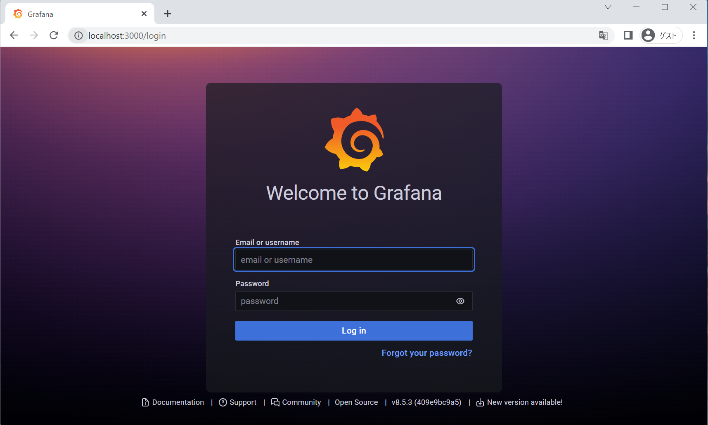
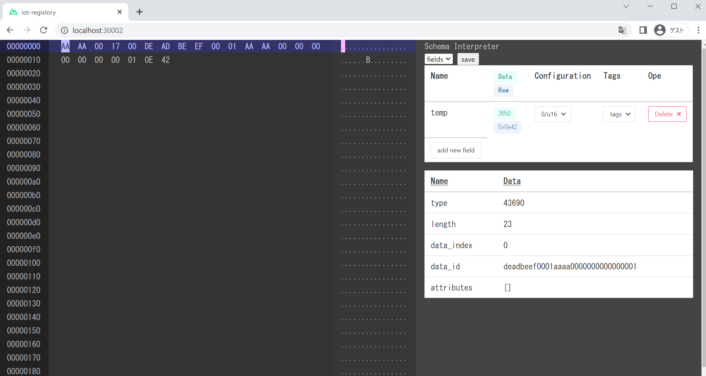

# 動作環境
動作は以下で行っている。
- Docker
- Google Chrome

動作確認や手順の中では以下のコマンドを用いるので事前に導入する事。
- git
- curl

# 起動手順

docker composeでアプリケーションを動かします。
まず、gitで必要なファイルを取得(クローン)します。

```
~$ git clone https://github.com/tech-sketch/container-testlab.git
```

クローンしたら以下の手順で
```
~$ cd container-testlab/
~/container-testlab$ docker compose up -d
...略...
~/container-testlab$ docker compose ps
NAME                                     IMAGE                                                             COMMAND                  SERVICE              CREATED             STATUS               
             PORTS
container-testlab-broker-1               confluentinc/cp-kafka:7.1.0                                       "/etc/confluent/dock…"   broker               11 seconds ago      Up 8 seconds         
             0.0.0.0:9092->9092/tcp, :::9092->9092/tcp, 0.0.0.0:9101->9101/tcp, :::9101->9101/tcp, 0.0.0.0:19092->19092/tcp, :::19092->19092/tcp
container-testlab-connect-1              public.ecr.aws/l1b7e4q9/testlab_connect:0.9.9                     "/etc/confluent/dock…"   connect              11 seconds ago      Up 7 seconds (health: starting)   0.0.0.0:8083->8083/tcp, :::8083->8083/tcp, 9092/tcp
container-testlab-container-consumer-1   public.ecr.aws/l1b7e4q9/iot_container_consumer:0.0.3              "/protoschema"           container-consumer   11 seconds ago      Restarting (0) 1 second ago
container-testlab-grafana-1              grafana/grafana:8.5.3                                             "/run.sh"                grafana              11 seconds ago      Up 8 seconds         
             0.0.0.0:3000->3000/tcp, :::3000->3000/tcp
container-testlab-iot-registry-1         public.ecr.aws/l1b7e4q9/iot_registory:0.0.1                       "docker-entrypoint.s…"   iot-registry         11 seconds ago      Up 8 seconds         
             0.0.0.0:30002->30002/tcp, :::30002->30002/tcp
container-testlab-kafka-ui-1             provectuslabs/kafka-ui:3ee2f87255d2a4beacfb177c4a6bdd9f52fd6a09   "/bin/sh -c 'java $J…"   kafka-ui             10 seconds ago      Up 6 seconds         
             0.0.0.0:8080->8080/tcp, :::8080->8080/tcp
container-testlab-ksqldb-cli-1           confluentinc/cp-ksqldb-cli:7.1.0                                  "/bin/sh"                ksqldb-cli           10 seconds ago      Up 5 seconds         

container-testlab-ksqldb-server-1        confluentinc/cp-ksqldb-server:7.1.0                               "/etc/confluent/dock…"   ksqldb-server        10 seconds ago      Up 6 seconds         
             0.0.0.0:8088->8088/tcp, :::8088->8088/tcp
container-testlab-postgresql-1           postgres:11.13-alpine                                             "docker-entrypoint.s…"   postgresql           11 seconds ago      Up 9 seconds         
             0.0.0.0:5432->5432/tcp, :::5432->5432/tcp
container-testlab-rest-proxy-1           confluentinc/cp-kafka-rest:7.1.0                                  "/etc/confluent/dock…"   rest-proxy           11 seconds ago      Up 7 seconds         
             0.0.0.0:8082->8082/tcp, :::8082->8082/tcp
container-testlab-schema-registry-1      confluentinc/cp-schema-registry:7.1.0                             "/etc/confluent/dock…"   schema-registry      11 seconds ago      Up 7 seconds         
             0.0.0.0:8081->8081/tcp, :::8081->8081/tcp
container-testlab-testlab-edge-1         public.ecr.aws/l1b7e4q9/testlab-edge:0.0.5                        "python main.py"         testlab-edge         11 seconds ago      Up 9 seconds         

container-testlab-websensor-1            public.ecr.aws/l1b7e4q9/websensor:0.0.1                           "docker-entrypoint.s…"   websensor            11 seconds ago      Up 9 seconds         
             0.0.0.0:1080->80/tcp, :::1080->80/tcp
container-testlab-zookeeper-1            confluentinc/cp-zookeeper:7.1.0                                   "/etc/confluent/dock…"   zookeeper            11 seconds ago      Up 8 seconds         
             2888/tcp, 0.0.0.0:2181->2181/tcp, :::2181->2181/tcp, 3888/tcp
~/container-testlab$
```
この時点では iot_container_consumer は  Restartやdown等の異常に見える状態でよいです。

# 起動後の確認
いくつかの画面が開いています。正しく動作していると以下のURLから起動画面が確認できます。
Google Chrome で以下のページを開いてみてください。
- http://localhost:8080/
  
- http://localhost:3000/
  
- http://localhost:30002/
  
- http://localhost:1080/
  

# 操作手順
ここでは、スマートフォンから送信される６軸センサのデータを送る為の手順を示します。
