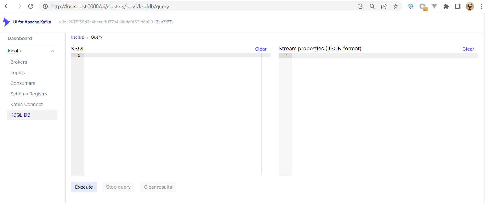
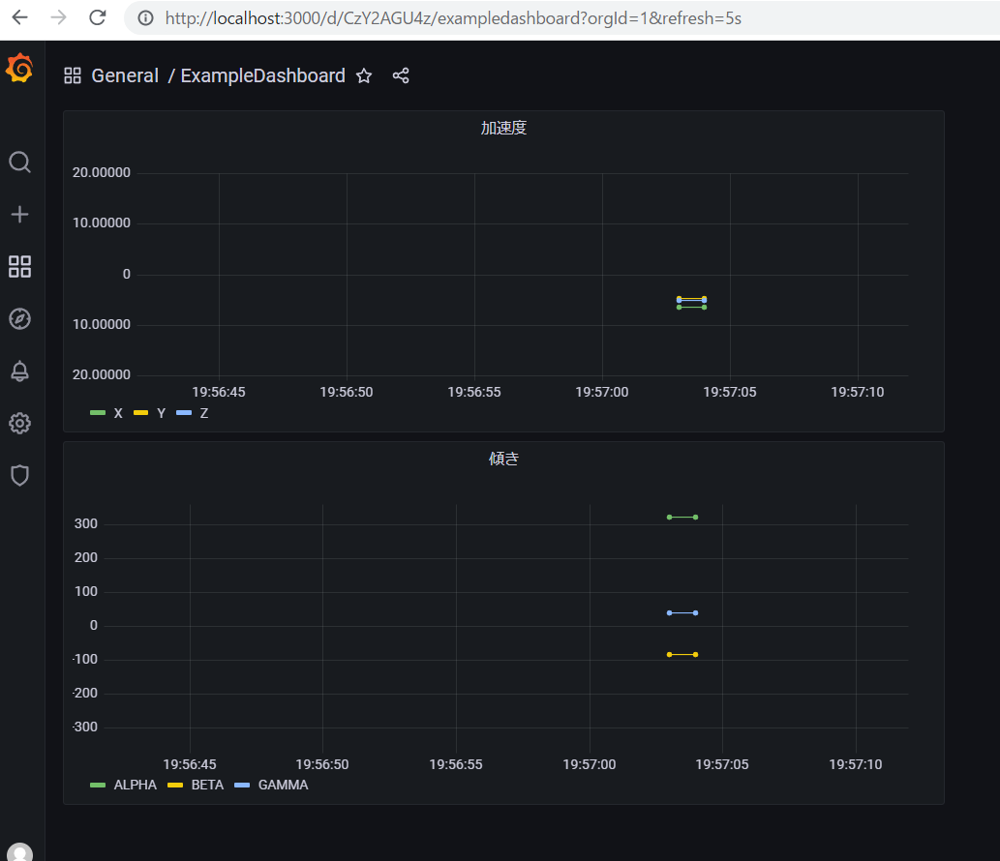
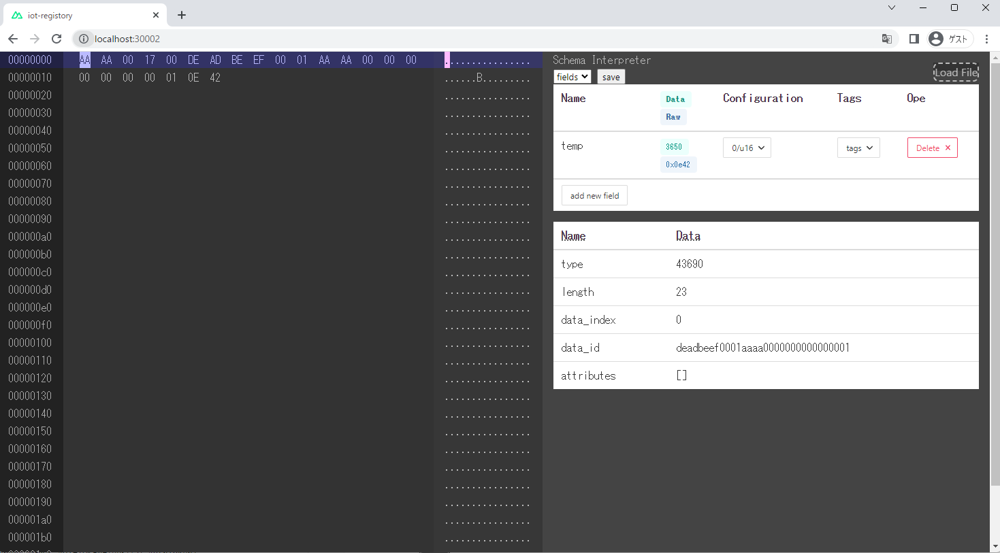

# 環境構築手順

## 動作環境

動作は以下で行っている。

- 基盤の実行環境
  - WSL2(Ubuntu 22.04)
  - Docker
- 接続クライアント
  - Google Chrome
  - Safari(iPhone/iOS16)

動作確認や手順の中では以下のコマンドおよび環境を用いるので事前に導入をする。

- git
- docker

## 全体構成

テストラボシステムで実現できることの最も概要を示した図が以下です。


スマートフォンから送信されるセンサーのデータをコンテナで伝送し、クラウド側に蓄積します。  
蓄積されたデータをブラウザ等のWebシステムで可視化することができます。


## 起動手順

docker compose でアプリケーションを動かします。
まず、git で必要なファイルを取得(クローン)します。

```
~$ git clone https://github.com/tech-sketch/wearable-sensing-data-container-format-for-iot.git
```

以下の手順で動作を確認

```
~$ cd wearable-sensing-data-container-format-for-iot/
~/wearable-sensing-data-container-format-for-iot$ docker compose up -d
```

実行結果の確認

```
~/wearable-sensing-data-container-format-for-iot$ docker compose ps -a
```

で `container-consumer` 以外が `Up` のステータスになっていれば OK です。

<details>
<summary>出力結果の表示</summary>
<pre>
<code>
NAME                                     IMAGE                                                             COMMAND                  SERVICE              CREATED             STATUS               
             PORTS
wearable-sensing-data-container-format-for-iot-broker-1               confluentinc/cp-kafka:7.1.0                                       "/etc/confluent/dock…"   broker               11 seconds ago      Up 8 seconds         
             0.0.0.0:9092->9092/tcp, :::9092->9092/tcp, 0.0.0.0:9101->9101/tcp, :::9101->9101/tcp, 0.0.0.0:19092->19092/tcp, :::19092->19092/tcp
wearable-sensing-data-container-format-for-iot-connect-1              public.ecr.aws/l1b7e4q9/testlab_connect:0.9.9                     "/etc/confluent/dock…"   connect              11 seconds ago      Up 7 seconds (health: starting)   0.0.0.0:8083->8083/tcp, :::8083->8083/tcp, 9092/tcp
wearable-sensing-data-container-format-for-iot-container-consumer-1   public.ecr.aws/l1b7e4q9/iot_container_consumer:0.0.3              "/protoschema"           container-consumer   11 seconds ago      Restarting (0) 1 second ago
wearable-sensing-data-container-format-for-iot-grafana-1              grafana/grafana:8.5.3                                             "/run.sh"                grafana              11 seconds ago      Up 8 seconds         
             0.0.0.0:3000->3000/tcp, :::3000->3000/tcp
wearable-sensing-data-container-format-for-iot-iot-registry-1         public.ecr.aws/l1b7e4q9/iot_registory:0.0.1                       "docker-entrypoint.s…"   iot-registry         11 seconds ago      Up 8 seconds         
             0.0.0.0:30002->30002/tcp, :::30002->30002/tcp
wearable-sensing-data-container-format-for-iot-kafka-ui-1             provectuslabs/kafka-ui:3ee2f87255d2a4beacfb177c4a6bdd9f52fd6a09   "/bin/sh -c 'java $J…"   kafka-ui             10 seconds ago      Up 6 seconds         
             0.0.0.0:8080->8080/tcp, :::8080->8080/tcp
wearable-sensing-data-container-format-for-iot-ksqldb-cli-1           confluentinc/cp-ksqldb-cli:7.1.0                                  "/bin/sh"                ksqldb-cli           10 seconds ago      Up 5 seconds

wearable-sensing-data-container-format-for-iot-ksqldb-server-1 confluentinc/cp-ksqldb-server:7.1.0 "/etc/confluent/dock…" ksqldb-server 10 seconds ago Up 6 seconds  
 0.0.0.0:8088->8088/tcp, :::8088->8088/tcp
wearable-sensing-data-container-format-for-iot-postgres-1 postgres:11.13-alpine "docker-entrypoint.s…" postgres 11 seconds ago Up 9 seconds  
 0.0.0.0:5432->5432/tcp, :::5432->5432/tcp
wearable-sensing-data-container-format-for-iot-rest-proxy-1 confluentinc/cp-kafka-rest:7.1.0 "/etc/confluent/dock…" rest-proxy 11 seconds ago Up 7 seconds  
 0.0.0.0:8082->8082/tcp, :::8082->8082/tcp
wearable-sensing-data-container-format-for-iot-schema-registry-1 confluentinc/cp-schema-registry:7.1.0 "/etc/confluent/dock…" schema-registry 11 seconds ago Up 7 seconds  
 0.0.0.0:8081->8081/tcp, :::8081->8081/tcp
wearable-sensing-data-container-format-for-iot-testlab-edge-1 public.ecr.aws/l1b7e4q9/testlab-edge:0.0.5 "python main.py" testlab-edge 11 seconds ago Up 9 seconds

wearable-sensing-data-container-format-for-iot-websensor-1 public.ecr.aws/l1b7e4q9/websensor:0.0.1 "docker-entrypoint.s…" websensor 11 seconds ago Up 9 seconds  
 0.0.0.0:1080->80/tcp, :::1080->80/tcp
wearable-sensing-data-container-format-for-iot-zookeeper-1 confluentinc/cp-zookeeper:7.1.0 "/etc/confluent/dock…" zookeeper 11 seconds ago Up 8 seconds  
 2888/tcp, 0.0.0.0:2181->2181/tcp, :::2181->2181/tcp, 3888/tcp
~/wearable-sensing-data-container-format-for-iot$
</code>

</pre>
container-consumer が `Restarting` になっているのはこの後の手順で是正するのでこの時点ではOKです。
この後のトピック作成手順の完了後Statusが `Up` になります。

</details>

## 起動後の確認

いくつかの画面が開いています。正しく動作していると以下の URL から起動画面が確認できます。
Google Chrome で以下のページを開いてみてください。

- [http://localhost:8080/](http://localhost:8080/)
  
- [http://localhost:3000/](http://localhost:3000/)
  
- [http://localhost:30002/](http://localhost:30002/)
  
- [http://localhost:1188/](http://localhost:1188/)
  

## 初期設定手順

サンプルアプリのデータを可視化するまでの手順を示します。

### Kafka でトピックを確認

KafSkaUI を用いてトピックの状況を確認します。

### トピックの確認（変更前）

Kafka の設定をします。
Kafka ではトピックに対し、データを提供する Producer とデータを利用する Consumer が存在します。

以下の KafkaUI の画面より、現在存在するトピックを確認します。
ページを開いた後、 `Show Internal Topics` を無効化すると 4 つのトピックが表示されています。

- [http://localhost:8080/ui/clusters/local/topics](http://localhost:8080/ui/clusters/local/topics)
  

### トピックの追加(データの送信)

この Kafka の環境は、未知のトピックを投入された場合、自動的に新たなトピックを追加する設定をしてあります。
そこで、サンプルアプリからデータを送ることでトピックを追加します。

1. データ送信のページを開く  
   [http://localhost:1188/ ](http://localhost:1188/)
2. `値の更新` を押下  
   加速度、傾きなどに適当な値が入る
3. `単発送信` を押下  
   サンプルアプリから Kafka に１つデータを送信


### トピックの作成確認

KafkaUI を開き画面を更新します。  
`json_mb_ctopic` と `mb_ctopic` の二つのトピックが増えていれば期待通りです。
１分程度時間がかかる可能性があります。


```
$ docker compose ps container-consumer
wearable-sensing-data-container-format-for-iot-container-consumer-1   public.ecr.aws/l1b7e4q9/iot_container_consumer:0.0.3   "/protoschema"      container-consumer   40 minutes ago      Up 40 minutes
```

## 可視化画面へのデータを送る

kafka に届いたデータを Avro という Kafka でよく用いられるデータに変換し、可視化画面用の DB に Sink する設定を行う。

### データ変換の登録

コンテナデータを json に変換した `json_mb_topic` から`avro` フォーマットに変換し可視化を行う `Grafana`で用いるデータベースに蓄積をする。

- 以下のページを開く  
  [http://localhost:8080/ui/clusters/local/ksqldb/query](http://localhost:8080/ui/clusters/local/ksqldb/query)

- 画像のようなページが表示される
  

- Stream を作成する（１つ目）  
  以下の ksql クエリをコピーペーストし、`Execute` を押下

```
CREATE STREAM stream_mb_topic
  (
    dt BIGINT,
    x DOUBLE,
    y DOUBLE,
    z DOUBLE,
    alpha DOUBLE,
    beta DOUBLE,
    gamma DOUBLE
  )
  WITH (
    KAFKA_TOPIC = 'json_mb_ctopic',
    VALUE_FORMAT = 'JSON'
  );
```

- 実行結果の確認（１つ目）

画像の下のように `SUCCESS Stream created` と表示される。


- Stream を作成する（２つ目）
  同様にもう一つクエリを実行する。

```
CREATE STREAM stream_mb_topic_avro
WITH (KAFKA_TOPIC = 'avro_mb_jtopic', VALUE_FORMAT='AVRO')
AS SELECT
     ROWTIME as ts,
     s.dt as dt,
     s.x as x,
     s.y as y,
     s.z as z,
     s.alpha as alpha,
     s.beta as beta,
     s.gamma as gamma
FROM stream_mb_topic as s;
```

- 作成した stream を確認する
  同様に以下のクエリを実行する。

```
show streams;
```

  
画像の下部のように`STREAM_MB_CTOPIC` と`AVRO_MB_CTOPIC` が表示されれば成功。

### データの Grafana への転送

Kafka の Connector を設定。

- Connector の設定ページを開く  
  [http://localhost:8080/ui/clusters/local/connectors/create-new](http://localhost:8080/ui/clusters/local/connectors/create-new)
- Connector の設定を入力する  
  Name: `avro_mb_jtopic`  
  Config \*

```
{
  "connector.class": "io.confluent.connect.jdbc.JdbcSinkConnector",
  "tasks.max": "1",
  "key.converter": "io.confluent.connect.avro.AvroConverter",
  "value.converter": "io.confluent.connect.avro.AvroConverter",
  "topics": "avro_mb_jtopic",
  "connection.url": "jdbc:postgresql://postgres:5432/postgres",
  "connection.user": "postgres",
  "connection.password": "postgres",
  "dialect.name": "PostgreSqlDatabaseDialect",
  "table.name.format": "${topic}",
  "pk.mode": "none",
  "pk.fields": "",
  "auto.create": "true",
  "auto.evolve": "true",
  "value.converter.schema.registry.url": "http://schema-registry:8081",
  "key.converter.schema.registry.url": "http://schema-registry:8081"
}
```

- Connector の設定を登録する  
  `Submit` を押して登録するが **正常登録時に画面が何も変わらない**

- Connector の設定登録を確認する  
  以下のページを開く。  
  [http://localhost:8080/ui/clusters/local/connectors](http://localhost:8080/ui/clusters/local/connectors)

`avro_mb_jtopic` という Connector が存在すれば OK

## Grafana の設定

ためたデータを可視化する画面へアクセスする。
改めて設定する項目はないが、アプリケーションの動作確認として以下を実施する。

1. Grafana へアクセス  
   以下の情報で Grafana へアクセスしログインする  
    [http://localhost:3000/](http://localhost:3000/)

   ```
   ID: admin
   Password: admin
   ```

1. DashBoard の確認  
   左端のメニュー Search から `ExampleDashboard` を開く

1. テストデータ送信の確認

   1. データ送信のページを開く  
      [http://localhost:1188/ ](http://localhost:1188/)
   1. `値の更新` を押下  
      加速度、傾きなどに適当な値が入る
   1. `単発送信` を押下  
      サンプルアプリから Kafka に１つデータを送信

1. データの疎通の確認  
   Grafana 上で画面が可視化される。  
   画面は 5 秒に 1 回の更新がされるのでデータ送信後 5 秒以内に表示される。  
   (画面右上から 1s に変更可)
   

## スキーマリポジトリ

スキーマリポジトリには、
デフォルトでいくつかのデータが入っているため、改めて設定する必要がある項目はない。  
しかし、アプリケーションの動作確認として以下を実施する。

1. サンプルデータの取得  
   サンプルアプリから送信されるデータのスキーマ情報をまず定義します。
   以下のバイナリデータはコンテナ化されたタイムスタンプ付きの６軸のデータです。  
   [Download(ExampleContainer)](mobile_acce.bin)  
   このファイルをサンプルコンテナと今後呼びます。

1. スキーマリポジトリの動作確認  
   スキーマリポジトリの確認を行います。  
   [http://localhost:30002/](http://localhost:30002/) にアクセス

1. スキーマリポジトリのスキーマ確認  
   テストラボで準備しているスキーマリポジトリには以下の機能があります。

   1. コンテナデータからのスキーマ定義
   2. コンテナデータへスキーマを適用したデータのプレビュー

1. コンテナデータの読み込み  
   初期起動時には画面の右上ボタンを押下しダウンロードしたファイルを読み込みます。  
   

前述のサンプルコンテナを読み込むと、以下のようにプレビューされます。


サンプルコンテナに対応するスキーマファイルは、リポジトリに内蔵されているため、対応するコンテナを読み込むことでスキーマファイルが読み込まれます。
`dt, x, y, z, alpha, beta, gamma` の７つのフィールドが定義され、サンプルコンテナに適用された結果が `Data` や `Raw` で確認できます。

スキーマリポジトリの確認は以上です。

### センサーとの接続

スマートフォンからジャイロ(傾き)と加速度のセンサーデータを送るための設定をします。

ここまで作った環境にスマートフォンからインターネット経由(要 https)でアクセスする必要があるため、外部のWeb サービスを利用します。

> センサーデータ（ジャイロ、加速度）を取得する際に、ブラウザのセキュリティが要求する事項に対応するための対応です。

#### ngrok によるアクセス

ngrok を利用することで、ローカルで動作しているセンサーデータを送信するためのWebアプリケーションをインターネット経由でアクセスできるようにすることで、スマートフォンからセンサーデータを送信できるようにします。

- ngrok の Free プランのアカウント登録  
  [https://ngrok.com/](https://ngrok.com/) で登録します。

- ngrok の AuthTokens の取得
  [https://dashboard.ngrok.com/tunnels/authtokens](https://dashboard.ngrok.com/tunnels/authtokens)
  で Authtokens を発行する

- AuthTokens を設定  
docker compose を実行するshellで以下を実行し、環境変数に AuthTokens を設定する。
  ```
  export NGROK_AUTHTOKEN={発行したAuthToken}
  ```

  `compose-dev.yaml` から利用する環境変数 NGROK_AUTHTOKEN に AuthTokens を書き込む。

- docker compose で ngrok を実行する  
  `docker compose -f compose-dev.yaml run ngrok` を実行する。  
  実行すると以下のような画面が表示される。
    
  `Forwarding` に表示される URL をスマートフォンで表示する。

#### センサーデータの送信

画面下部のモーションの許可を押下するとセンサーデータ取得のダイアログが表示されます。
許可をするとセンサーデータが取得できるようになります。

センサーデータが取得できるようになった後は

- 送信間隔をデフォルト値の `1000 msec` から `50 msec` に変更
- 送信するデータをデフォルト値 `container` であることを確認
- `定期送信` にチェックを入れる

これによってセンサデータを連続で送信できるようになります。

[Grafana http://localhost:3000/](http://localhost:3000/) に設定してあるダッシュボードから確認できます。  
描画データの更新間隔を画面右上で設定できるので5s(5秒)を 1s(1秒)にするとより体感が良くなります。
