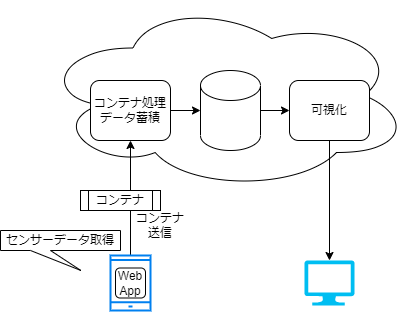

# Test Lab System

## 概要

テストラボシステムとはコンテナフォーマットの処理を実装したテスト環境です。

## 目的

テストラボシステムとは

## 構成要素

テストラボシステムは以下の構成要素から構成されます。

- スマートフォンむけWebアプリケーション
- コンテナ処理基盤
- スキーマリポジトリ
- 可視化機能

## 検証できること

- スマートフォンの加速度/ジャイロセンサのデータをコンテナフォーマット化
- コンテナとスキーマリポジトリの連携確認
- コンテナによって送信されたデータの可視化

## 環境構築
次頁より、環境構築手順を記述します。
