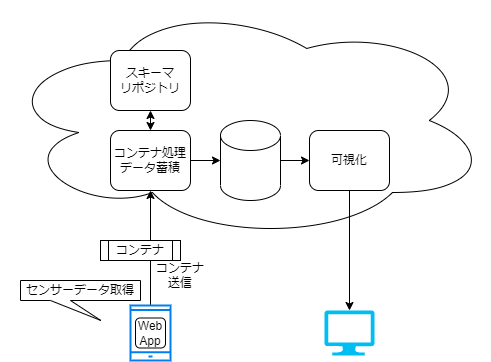
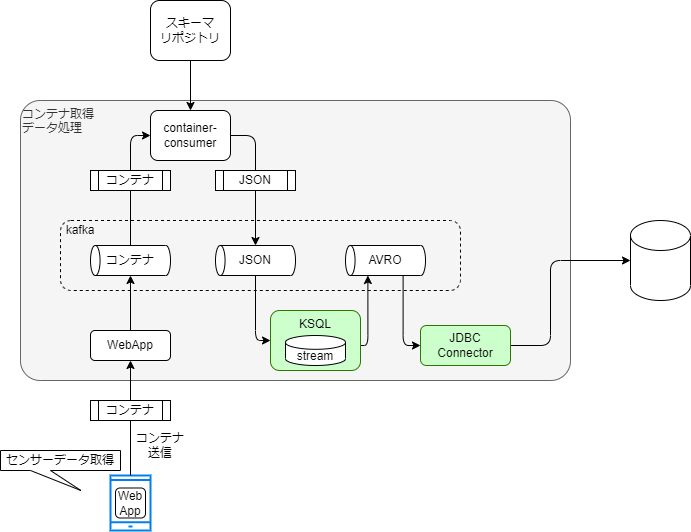

# 検証

## 目的

テストラボシステムを活用してコンテナフォーマット対応の検証を行う方法についてガイドを示す。

## コンテナフォーマット対応の定義

コンテナフォーマットを処理する観点には以下が考えられる。

- コンテナデータを入力に用いるシステム
- コンテナデータを出力に用いるシステム

あるいは、上記の両方を行う。

それぞれについての要件を以下に示す。

### コンテナデータを出力に用いるシステム

コンテナフォーマットを出力に用いるシステムは以下の機能を実現することである。

1. 事前にコンテナデータに対応するスキーマファイルを定義しリポジトリに登録する。
2. コンテナフォーマットに従ってペイロードをコンテナデータとする。
3. コンテナデータを出力（送信）する

### コンテナデータを入力に用いるシステム

コンテナフォーマットを入力に用いるシステムとは以下の機能を実現することである。

1. コンテナデータからコンテナフォーマットの仕様に従い値を取り出す。
2. 取り出した値に従いリポジトリからスキーマファイルを取得する。
3. スキーマファイルを利用してペイロードを処理する。

上記の３機能を実現できればコンテナフォーマットを入力対応したソフトウェアシステムである。
 
## テストラボシステムでの検証ガイド

### テストラボシステムの構成
環境構築で示したように、テストラボシステムは、以下のような構成となっている。


テストラボシステムは検証の目的のため以下の機能を有している。

- コンテナデータを出力に用いるソフトウェア
- コンテナデータを入力に用いるソフトウェア
- スキーマファイルのエディタ 兼 スキーマリポジトリ

それぞれについて解説を行い、コンテナフォーマット対応を行うためのガイドを示す。

### コンテナを出力に使う事例

すでに述べたように、コンテナを出力に使うシステムは以下の３つの機能を実現することである。

1. 事前にコンテナデータに対応するスキーマファイルを定義しリポジトリに登録する。
2. コンテナフォーマットに従ってペイロードをコンテナデータとする。
3. コンテナデータを出力（送信）する


運びたいデータ(Payload)をコンテナに乗せるためには、ヘッダを付与することが必要である。
ヘッダはコンテナフォーマットに従って定義される。
ヘッダは以下である。

|header field name|length| description|
|-|-:|-|
|Container Type| 2 byte | 8種のパターンを持ち、リアルタイムor非リアルタイム/拡張ヘッダ有無/フラグメント有無 を組み合わせている|
|Container Length| 2 byte| コンテナのヘッダからペイロードすべてを含めた長さ|
|Data Index| 1 byte| Data IDの種類|
|Data Id| Nbyte| ペイロードのデータ型に対応する識別子| 

<!--
CDV版では以下のようになっている
|header field name|length| description|
|Container Type| 2byte | 8種のパターンを持ち、リアルタイムor非リアルタイム/拡張ヘッダ有無/フラグメント有無 を組み合わせている|
|Container Length| 2byte| コンテナのヘッダからペイロードすべてを含めた長さ|
|Data Id Type| 1byte| |
|Data Id Length| 1byte| |
|Data Id| {{Data Id length}} byte| ペイロードのデータ型に対応する識別子| 
-->

#### Container Type
Container Typeは以下の８パターンのいずれかである。  
それぞれ、リアルタイム処理、拡張ヘッダの有無、フラグメント有無を示している。
<!-- NP -->
テストラボシステムでは、`0x0000` で実装している。

<!--
CDV版では以下のようになっている
|Container Type Value| Realtime / Non Realtime Process | Extended Attributes | Fragmentation |
|-|-|-|-|
|0x5555|Real time|None|Unfragmented|
|0x3333|Real time|None|Fragmented|
|0x6666|Real time|Yes|Unfragmented|
|0x0F0F|Real time|Yes|Fragmented|
|0xAAAA|Non real time|None|Unfragmented|
|0xCCCC|Non real time|None|Fragmented|
|0x9999|NON real time|Yes|Unfragmented|
|0xF0F0|Non real time|Yes|Fragmented|
-->


#### Extended Header
ヘッダに継続する拡張ヘッダがある場合もある。
テストラボシステムでは拡張ヘッダ部分の処理を実装していないので概要だけ示す。

|header field name|length| description|
|-|-:|-|
|Extended Header Length| 1 byte | 拡張ヘッダ全体のバイト長 |
|Attribute Type| 1 byte | 属性の種類|
|Attribute Length| 1 byte | 属性の長さ |
|Attribute Value| Nbyte | 属性データ。{Attribute Length}の長さ。|

#### 出力コンテナデータの事例

具体的なコンテナデータの作成例は以下である。

[Download(ExampleContainer)](mobile_acce.bin)  

上記のコンテナデータは以下のようになっている。

|header field name| hex value|
|-|-|
|Container Type| `00 00` |
|Container Length| `00 4D` |
|Data Index| `00` |
|Data ID| `00 11 22 33 44 55 66 77 88 99 AA BB CC DD EE FF` |
|Payload|`00 00 01 83 AC 9B 68 82 C0 0C FE 19 BE 8D 35 A8 C0 10 8E 4F 9A 4F 34 D6 C0 16 A0 0D 7A E1 47 AE 40 1C C2 A8 77 EC 15 97 40 40 5A 19 88 95 BC 73 C0 3D D8 31 5C FF D6 1B`|

DataIndexの `00` と DataIDの `00 11 22 33 44 55 66 77 88 99 AA BB CC DD EE FF` は、リポジトリ内で一意になるように任意で設定している。

### コンテナを入力に使う事例

コンテナを入力に使う場合は、コンテナデータをコンテナフォーマットの仕様に従い値を取り出す必要がある。

具体的には以下のようなコンテナデータを入力とする。

`00 00 00 4D 00 00 11 22 33 44 55 66 77 88 99 AA BB CC DD EE FF 00 00 01 83 AC 9B 68 82 C0 0C FE 19 BE 8D 35 A8 C0 10 8E 4F 9A 4F 34 D6 C0 16 A0 0D 7A E1 47 AE 40 1C C2 A8 77 EC 15 97 40 40 5A 19 88 95 BC 73 C0 3D D8 31 5C FF D6 1B`

1. コンテナデータからコンテナフォーマットの仕様に従い値を取り出す。

上記の入力に対しコンテナフォーマットの仕様に従い、ヘッダ部分の値を取り出すと以下のようになる。

|header field name| hex value|
|-|-|
|Container Type| `00 00` |
|Container Length| `00 4D` |
|Data Index| `00` |
|Data ID| `00 11 22 33 44 55 66 77 88 99 AA BB CC DD EE FF` |
|Payload| ...(略) |

2. 取り出した値に従いリポジトリからスキーマファイルを取得する。

Data Index <!-- Data ID Type --> と Data ID によって、スキーマリポジトリからスキーマファイルを取得する。
スキーマリポジトリについては後述する。

3. スキーマファイルを利用してペイロードを処理する。

スキーマファイルに従いペイロードを処理する。
本項ではテーブルの`field name`,`type`,`position`,`length`がスキーマファイル由来の値である。

コンテナデータのペイロードを以下であった場合、スキーマファイルに従って処理をするとは以下の３工程である。

1. `position`と`length` でペイロードを小さいバイト列に分割
2. `type`に従い値を解釈
3. `name`に従って名前を付ける

上記の工程を以下のペイロードに適用した結果が以下のテーブルである。

`00 00 01 83 AC 9B 68 82 C0 0C FE 19 BE 8D 35 A8 C0 10 8E 4F 9A 4F 34 D6 C0 16 A0 0D 7A E1 47 AE 40 1C C2 A8 77 EC 15 97 40 40 5A 19 88 95 BC 73 C0 3D D8 31 5C FF D6 1B`  


|field name| hex value(raw)|type|postion|length| value |
|-|-|-:|-:|-:|-:|
|dt| `00 00 01 83 ac 9b 68 82` |int|0|8| 1665048209538 |
|x| `c0 0c fe 19 be 8d 35 a8` |float|8|8| -3.624072540935874 |
|y| `c0 10 8e 4f 9a 4f 34 d6` |float|16|8| -4.138975535473227 |
|z| `c0 16 a0 0d 7a e1 47 ae` |float|24|8| -5.6563014221191406 |
|alpha| `40 1c c2 a8 77 ec 15 97` |float|32|8| 7.190095781120724 |
|beta | `40 40 5a 19 88 95 bc 73` |float|40|8| 32.70390422164282 |
|gamma| `c0 3d d8 31 5c ff d6 1b` |float|48|8| -29.844503223857924 |

このようにスキーマファイルに従って処理したデータを元に何らかの処理を実現する。
テストラボシステムにおいては、データベースに保存することで可視化するシステムで用いられるようにしている。

### スキーマファイルのエディタ 兼 スキーマリポジトリ

テストラボにおいてスキーマファイルはスキーマリポジトリ上で編集できる。

テストラボではスキーマファイルを以下のようにJSONで表現している。

``` json
  "fields": [
    {
      "name": "dt",
      "type": "u64",
      "pos": 0,
      "length": 8,
      "tags": {
        
      }
    },
    {
      "name": "x",
      "type": "f64",
      "pos": 8,
      "length": 8,
      "tags": {
        
      }
    },
    ...
  ]
```

また、スキーマファイルは、スキーマリポジトリごとにDataIndex<!-- Data Type-->とDataIdの組に対して一意になるように管理されている。

DataIndexとDataIdの組を含む要求に対して、スキーマリポジトリは対応するスキーマファイルを配布しコンテナデータを処理させることができる。


## まとめ

このページでは、コンテナのサンプルデータをどのように解釈し、アプリケーションで利用するかを示した。
ここを参考にコンテナフォーマットの入出力機能を実現することがコンテナフォーマットへの対応の第一歩となる。

<!-- ## コンテナフォーマットを取り扱うシステムの構成

環境構築で示したように、テストラボシステムは、以下のような構成となっている。


コンテナフォーマットを取り扱うシステムの検証のためには以下の検討事項がある


## チュートリアルでの構成例

チュートリアルでの構成について、コンテナ処理データ蓄積部分を詳細化すると以下のような構成要素を持っている。




テストラボシステムの構成要素について、以降に詳細を記述する。

### kafka
kafka はデータ構造に依存しないメッセージキューである。。
トピックと呼ばれる単位でキューを構成し、キューに対してデータを提供する処理と、キューからデータを取得する処理が存在する。
kafkaとは、このようなキューを提供するためのミドルウェアである。

### WebApp
WebAppはセンサデータを取得し、センサデータを格納したコンテナデータをhttp経由によって収集し、kafkaに投入するアプリである。  
コンテナデータはkafkaのキューに格納され、次の処理へ引き渡される。

### container-consumer
container-consumerはkafkaのキューからコンテナデータを取得し、処理するアプリである。
コンテナデータを解析して、対応するスキーマファイルをスキーマリポジトリから取得する。
スキーマファイルを利用して、コンテナデータを処理し利用しやすいフォーマットに変換し、kafkaに投入する。

### スキーマリポジトリ
コンテナに格納されたデータのスキーマを管理するリポジトリである。
スキーマファイルの定義をしておくことで、コンテナデータに対応するスキーマデータを配賦できる。

### KSQL
kafka のキューにあるデータに対して、Streaming SQLと呼ばれるストリームデータにSQLライクなクエリを利用可能にする仕組みである

kafkaのキューに格納されたデータをSQLライクなクエリで処理することができる。
処理方法の定義例は [環境構築手順](./environment#%E3%83%87%E3%83%BC%E3%82%BF%E5%A4%89%E6%8F%9B%E3%81%AE%E7%99%BB%E9%8C%B2) であり、
kafkaのキューに入るデータをストリーミングテーブルとして定義することや、ストリーミングテーブルのデータをkafkaのキューとして出力することができる。

ここでは、JSONのデータをAVROと呼ばれるデータフォーマットに書き換えることと、サーバでのタイムスタンプの付与を行う。

### JDBC Connector  
kafkaのキューにAVRO形式で蓄積したデータをRDBに蓄積するための仕組みである。 -->
