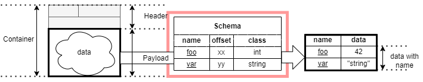
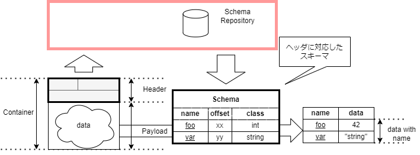

# Features

コンテナフォーマットは、以下の技術的な特徴を有しています。
- ヘッダ情報の追加で製品やサービスのあらゆるデータをコンテナフォーマットに対応
- スキーマ情報を使ってデータの変換手続きを共通化
- リポジトリに蓄積されたスキーマ情報を参照し情報を利用

## コンテナフォーマットにおける3つの特徴

コンテナフォーマットの特徴は以下の3つとその連携になります。

### ヘッダ情報の追加でコンテナフォーマットに対応

コンテナは、ヘッダとペイロードの２つから成り立ちます。

- コンテナヘッダ
- ペイロード

図1. コンテナフォーマットのイメージ

コンテナヘッダに含まれる要素は仕様の中で定義され、
要素の順序、長さなどが決定されています。

一方、ペイロードは要素やデータ構造を特定しません。
センサーの出力値やメモリセクタをそのまま格納できます。

コンテナフォーマットを作ることは、`データに対して決められたヘッダをつけること` であり、
`ヘッダ情報の追加で製品やサービスのあらゆるデータをコンテナフォーマットに対応` することができます。

### スキーマ情報を使ってデータの変換手続きを共通化

スキーマ情報はあるバイト列（データ）から、情報を取り出すためのメタ情報である。

コンテナフォーマットのペイロードは決まった構造を持たないので、
スキーマ情報によって構造を外部から定義します。

図2. スキーマのイメージ

この考え方は、ペイロードのバイト列は何らかの外部で定義可能な構造を持っているので、
ペイロードの構造をスキーマ情報として定義することで、ペイロードから情報を取り出せるようにするというものです。

スキーマ情報を使ってデータから情報を取り出す手続きを共通化できます。

### リポジトリに蓄積されたスキーマ情報を参照し情報を利用

コンテナを活用する際に、コンテナに対応するスキーマ情報を参照するためのスキーマリポジトリがあります。

リポジトリがコンテナヘッダを元に対応するスキーマ情報を提供することで、
コンテナから情報を取り出して処理することができます。

図３. スキーマリポジトリのイメージ

スキーマリポジトリによって、複数の種類のコンテナデータを共通の手段で処理することができます。

## まとめ

コンテナフォーマットに３つの特徴がある。

- シンプルなコンテナフォーマット
- スキーマ情報を使ってデータの変換手続きを共通化
- リポジトリに蓄積されたスキーマ情報を参照し情報を利用

この３つの特徴を組み合わせることでデータレベルの標準インターフェイスとしてコンテナフォーマットを理活用できます。
