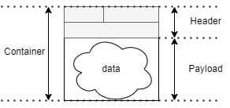

# Features

コンテナフォーマットは、以下の特徴を有しています。
- ヘッダ情報の追加で製品やサービスのあらゆるデータをコンテナフォーマットに対応
- スキーマ情報を使ってデータの変換手続きを共通化
- リポジトリに蓄積されたスキーマ情報を参照しデータを利用

:::NOTE
修正
:::
## コンテナフォーマットにおける 3 つの要素

最も重要な要素は以下の 3 つの構成要素とその連携になります。

### コンテナデータのフォーマット

コンテナは、ヘッダとペイロードの２つから成り立ちます。

- コンテナヘッダ
- ペイロード

図1. コンテナフォーマットのイメージ

コンテナヘッダに含まれる要素は仕様の中で定義され、
要素の順序、長さなどが決定されています。

一方、ペイロードは要素やデータ構造を特定しません。
センサーの出力値やメモリセクタをそのまま格納できます。

コンテナフォーマットを作ることは、`データに対して決められたヘッダをつけること` です。

### データコンテナのスキーマ

ペイロードの構造を外部から定義するスキーマがあります。
スキーマはペイロードを構成するバイト列から、情報を取り出すためのデータである。

図2. スキーマのイメージ

この考え方は、ペイロードのバイト列は何らかの構造を持っているので、
ペイロードの構造をスキーマとして定義することで、スキーマを用いてペイロードから情報を取り出せるようにするというものです。

### スキーマを提供するリポジトリ

コンテナを処理する際に、コンテナと対応するスキーマを取得するためのスキーマリポジトリがあります。

コンテナをヘッダを元にコンテナに対応するスキーマデータを提供することで、
コンテナに格納されたペイロードを情報として解釈し処理することができます。

図３. スキーマリポジトリのイメージ

コンテナヘッダとスキーマリポジトリによって、複数の種類のコンテナデータを処理することができます。

## まとめ

コンテナフォーマットを取り扱うことは以下を取り扱うことである。

- コンテナフォーマット
- スキーマ
- スキーマリポジトリ

この３つの要素を組み合わせることで、コンテナフォーマットを取り扱うことが求められます