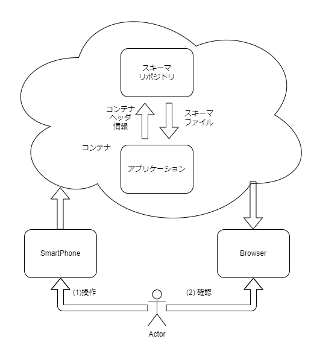
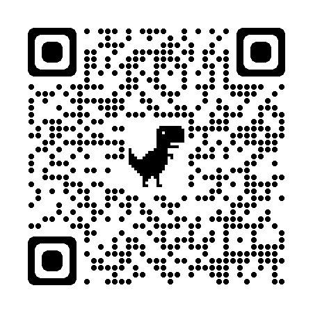

# チュートリアル
スマートフォンのジャイロセンサ情報をコンテナ化してデータ可視化に用いる

# 目的
すでに用意された機能、設定を用いてどのようなことができるかを体験する。

# 概要
スマートフォンのジャイロセンサ情報をコンテナ化してデータ可視化に用いる。

# 説明に利用する構成
以下のような構成でチュートリアルを進めます。
SmartPhoneとBrowserを用います。

SmartPhoneのジャイロセンサーの動きをコンテナにして、Browserで可視化します。

# Tutorial
## データを送信するアプリケーション
### Webアプリケーションの開き方
（インストールを必要としない）Webアプリです。
QRコードリーダー等を用いてスマートフォンから開いてください。

開くと以下の画面が表示されます。

PCからのアクセスは想定していません。

### Webアプリケーションでのセンサ情報の取得
<!-- 文ではなく画像で示すほうがベター -->
画面下部のモーションの許可を押下するとダイアログが表示されます。

"動作と方向"へのアクセスを許可することで、センサーの情報をコンテナに利用できます。

### データの送信について
このアプリには以下の設定項目があります。

- データの送信頻度＆センサからの取得頻度
- 送信データのフォーマット選択
- データを送信の有効化

それぞれの設定項目に対して、

* 送信間隔をデフォルト値の `1000 msec` から `50 msec` に変更
* 送信するデータをデフォルト値の `json&container` から`container` に変更
* `定期送信` にチェックを入れる

この `testlab` 環境にセンサーデータが送信されます。

### 送信されたデータの確認

このアプリから贈られるコンテナについては必要なスキーマ情報や処理が登録されているので、
可視化されたデータを見に行きます。

[Testlab](https://testlab.iotbase.in/d/0vtMo1C7k/tesuto?orgId=1&refresh=1s)

最初のチュートリアルはここまでです。

# まとめ
このページのまとめです。
- 事前準備されサンプルアプリでコンテナを送信した
- コンテナによって収集したデータが可視化できることを確認した。

# 環境について
## SmartPhone
iPhone8 / iPhoneSE3 で動作確認済み。
Safari / Microsoft Edge それぞれで動作確認済

## Browser
GoogleChrome 105.0.5195.127 で動作確認済