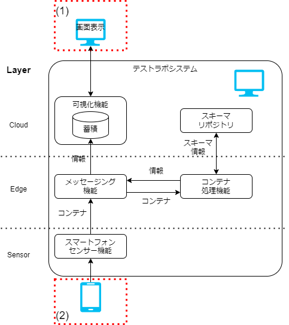
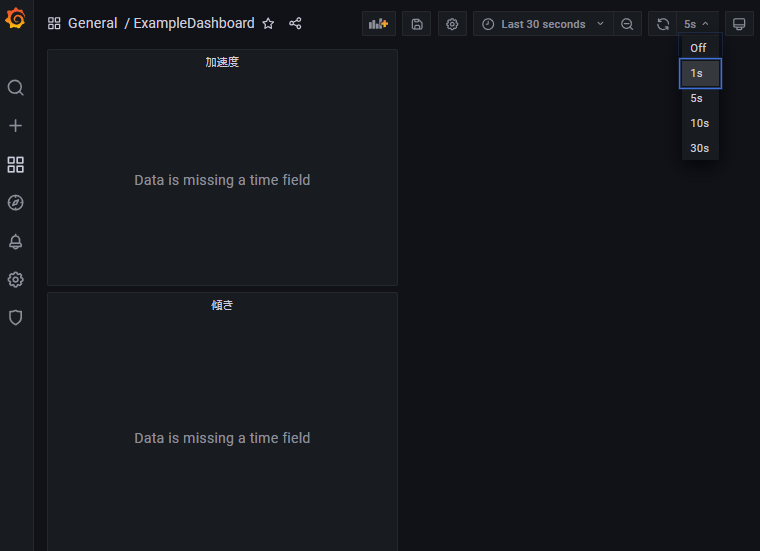
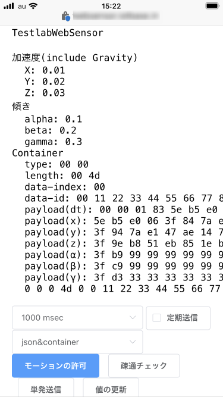
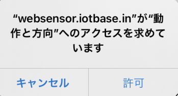
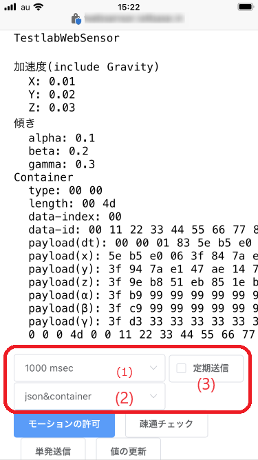
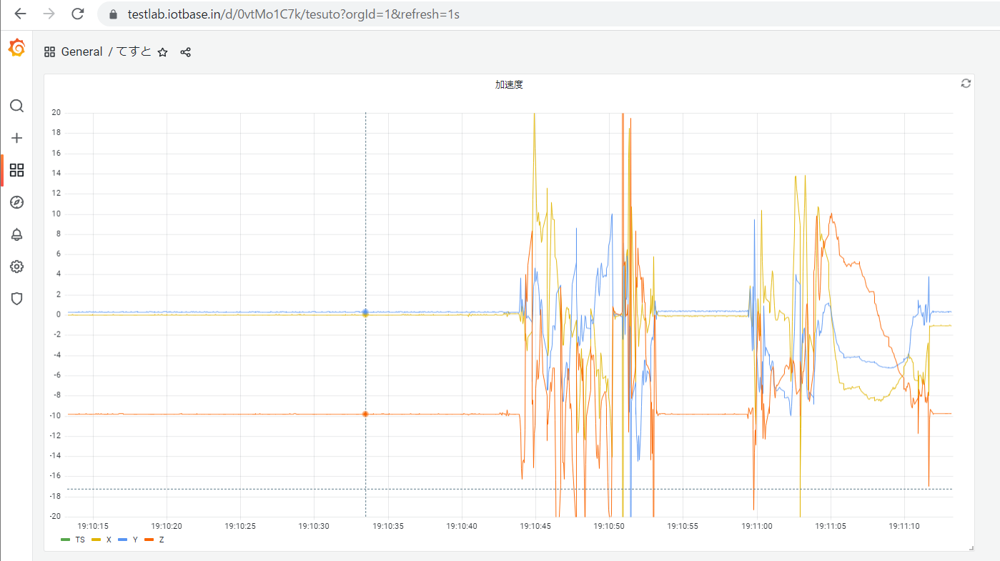
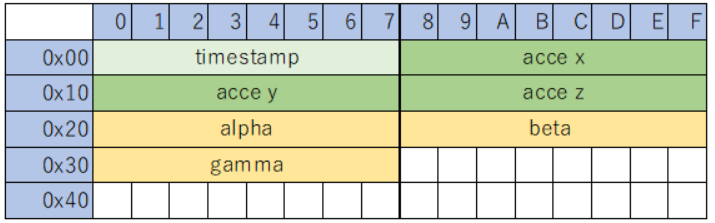
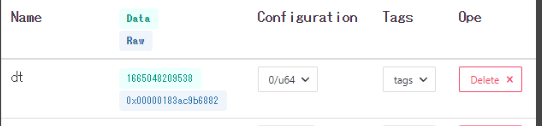

# 動作手順

## テストラボシステムの動作手順

[構築手順](testlab_system/environment)で構築した環境を用いて、テストラボ全体の動作手順を確認します。
そのあと、コンテナフォーマットにおける重要な実装について抜粋し説明をします。

### 構成図に対応する動作手順



_図 1: 動作手順の構成と確認箇所_

この図 1: に対応させながら動作手順を示します。

### センサデータの可視化画面の起動と設定

図 1: 中 (1)で可視化画面を開きます。
センサデータを受信して可視化するための画面をブラウザで表示します。

1. [http://localhost:3000/](http://localhost:3000/) を PC で開きます。
1. ログインを要求された場合、admin/admin でログインします。
1. 左端の虫眼鏡(Search) をクリックし、 `ExampleDashboard` を開く を開いてください。
1. 画面右上のダッシュボードの設定から、画面の更新間隔を 1s(1 秒)に設定してください

   

   _図 2: 可視化画面の更新間隔設定_

このページを開いたままスマートフォンからセンサデータを送信することで、データの可視化を確認します。

### スマートフォンセンサからのデータ送信

[構築手順 - スマートフォンセンサの有効化設定](testlab_system/environment#スマートフォンセンサの有効化設定) で準備した、 `https://` で始まる URL を開くと以下の画面が表示されます。



_図 3: スマートフォンセンサからのデータ送信_

#### Web アプリケーションでのセンサ情報の取得

画面下部の **モーションの許可** を押下するとダイアログが表示されます。



_図 4: スマートフォンのモーション許可ダイアログ (iOS の場合)_

`"動作と方向"へのアクセス` を許可することで、
ジャイロセンサの情報が画面へ反映されるようになり、画面上の加速度/傾きの値が目まぐるしく変化するようになります。

この値をコンテナデータの作成に利用します。

#### データの送信について

このアプリには以下の設定項目があります。

1. データの送信頻度＆センサからの取得頻度
1. 送信データのフォーマット選択
1. データ送信の有効・無効



_図 5: センサーデータ取得及びコンテナ化機能の設定_

それぞれの設定項目に対して、以下を設定します。

1. 送信間隔をデフォルト値の `1000 msec` から `50 msec` に変更
1. 送信するデータを `container` とする(デフォルト値)
1. `定期送信` にチェックを入れる

これによって、センサデータを`50msec`に１回の頻度でコンテナフォーマットを用いて連続的に送信されるようになります。

### 可視化機能によるセンサデータの確認

送信されたデータは[センサデータの可視化画面の起動と設定](#センサデータの可視化画面の起動と設定)の項で開いた画面から確認できます。



_図 6: 可視化されたセンサデータのグラフ_

上のグラフは加速度センサの値、下のグラフは傾きセンサの値を示しています。
静止したセンサからは、重力加速度の値だけが目立つようにでるので、図 6: のようなグラフになります。

ここまででテストラボの動作手順のチュートリアルは終了です。

## テストラボシステムにおける重要な実装の紹介

動作しているシステムの中で、重要な実装を抜粋し説明します。

### コンテナデータの作り方

スマートフォンによるセンサ機能では、以下のようにコンテナデータを作成しています。
JavaScript によるコンテナデータを作る実装です。

```
      const payload = new ArrayBuffer(77);
      const dataview = new DataView(payload);
  /* Header */
      dataview.setUint16(0, 0); // ContainerType
      dataview.setUint16(2, 77); // ContainerLength 52+16+2+2+1
      dataview.setUint8(4, 0); // DataIndex(1byte)
      dataview.setUint32(5, 0x00112233); // DataIDを4回に分けて書く
      dataview.setUint32(9, 0x44556677); // DataIDを4回に分けて書く
      dataview.setUint32(13, 0x8899aabb); // DataIDを4回に分けて書く
      dataview.setUint32(17, 0xccddeeff); // DataIDを4回に分けて書く
  /* Payload */
      dataview.setBigUint64(21, BigInt(Date.now()));
      dataview.setFloat64(29, x);
      dataview.setFloat64(37, y);
      dataview.setFloat64(45, z);
      dataview.setFloat64(53, alpha);
      dataview.setFloat64(61, beta);
      dataview.setFloat64(69, gamma);
      return payload;
```

ソースコード抜粋元 [container-websensor](https://github.com/sensing-iot-standard-consortium-ja/container-websensor/blob/b2c0a1cffbdcaca2ea83f5cb00fc6ea402014908/client/pages/index.vue#L202-L228)

:::caution
ここで作られているコンテナは[Container Format で示された仕様](spec_guide)と差異があります。
[利用上の注意](testlab_system#利用上の注意)を参照のこと。

:::

この抜粋で示すことは、
[コンテナフォーマット 使用例 コンテナデータ作成の具体例](spec_guide/example#コンテナデータ作成の具体例)で記述したように、
**最も基本的な形のコンテナは決まったヘッダをペイロードに付けること**で、コンテナデータになることです。

### コンテナヘッダの扱い方

コンテナ処理機能では、外部から受け取ったコンテナデータを処理するために、以下のようにコンテナデータからヘッダの情報を取り出す。
以下の抜粋はコンテナデータを受取って、ヘッダの各フィールドとペイロードを取り出す処理です。
Python3 による実装です。

```
def parse(data: bytes):
    # コンテナ共通の処理
    # ContainerType
    type = data[0:2]
    # ContainerLength
    length = data[2:4]
    # DataIndex
    data_index = data[4:5]
    # DataId
    data_id_length_b: bytes = get_data_id_length(data_index)
    data_id_offset = 5
    data_id_length = int.from_bytes(data_id_length_b, "big")
    data_id = data[data_id_offset : data_id_offset + data_id_length]
    # Payload
    payload_offset = data_id_offset + data_id_length
    payload = data[payload_offset:]

    return RawContainer(type, length, data_index, data_id_length, data_id, payload)
```

ソースコード抜粋元 [container-python-consumer](https://github.com/sensing-iot-standard-consortium-ja/container-python-consumer/blob/030aa1d36d0e98873ca93533f892a66c81c63e5c/main.py#L40-L60)

この抜粋で示すことは、 [コンテナフォーマット 使用例 ヘッダとペイロードの分割](spec_guide/example#ヘッダとペイロードの分割)で記述した内容が実現されていることです。
コンテナヘッダの仕様に基づいて、決まったバイト位置から決まった幅のバイト列を取り出す方法で、
コンテナヘッダのフィールドやコンテナのペイロードを取り出す実装の 1 つを示しています。

ここでは手続きによってコンテナデータをヘッダのフィールド群やペイロードとして取り出したが、
例えば C 言語であれば構造体へのキャストでも同様の処理が実現可能です。

<!-- textlint-disable -->

:::caution
ここで作られているコンテナは[Container Format で示された仕様](spec_guide)と差異があります。

コンテナヘッダ内の Data ID の長さは Data ID Length で示す仕様です。
しかし、Data ID の長さは Data Index の値に対応した値になるよう取り扱っている。
:::

<!-- textlint-enable -->

### スキーマ情報の確認方法

スキーマリポジトリ機能の設定画面からスキーマ情報を確認します。

[Download(コンテナ例)](mobile_acce.cntr)ファイルがセンサーデータ取得及びコンテナ化機能から出力されるコンテナと同じ構造です。

ダウンロードしたコンテナ例のファイルをスキーマリポジトリ機能の画面で読み込むことで、
コンテナデータに対応するスキーマ情報をサーバから呼び出し、読み込んだコンテナに適用して表示します。

画面左が、コンテナデータのバイナリを Hex 記法(16 進数)で表示した領域です。
画面右が、コンテナデータに対応するスキーマ情報の内容表示およびスキーマの編集をする領域です。


_図 7: スキーマ情報の編集画面_

スキーマ情報はこの画面から更新できます。
後述する編集手順後、画面上部 save ボタンでコンテナの DataID に対応するスキーマ情報を上書き保存します。

### スキーマ情報の編集方法

画面右の Configuration と ~~Tags~~ Properties の列が設定可能な項目です。
１行が１つのフィールドを指し、フィールドは何らかの情報 1 つに対応します。

<!-- textlint-disable -->

:::caution
画面上は Tags だが、IEC63430 に合わせ、Properties と呼ぶ。名称のみで役割は同じ。
:::

<!-- textlint-enable -->

#### Configuration

以下の３つの要素を設定できます。

- Name フィールドの名前
- Position Payload の開始位置からのオフセット値
- Type/Length オフセット位置からのデータ幅とデータ型

この３つの要素によって、スキーマ情報のフィールドが設定される。
データ型は符号なし整数、符号あり整数、浮動小数点数、バイト列の４つから選択できる。
データ幅はデータ型で自動設定され、自動設定できない場合は自由入力ができる。

#### Properties

フィールドに対して付加的な情報を記述する。

テストラボシステムの実装では、`isLittleEndian` があれば、複数バイトで構成される値をリトルエンディアンで解釈します。

実装次第でフィールドのバイト列に対するエンディアンや値の単位や桁、データの信頼性(医療機器認定)などを Properties として付加的情報を定義することで、
スキーマの情報を元にコンテナを処理できます。

#### フィールドの追加、削除方法

`add new field`のボタンを押下することで、スキーマ情報に新しいフィールドを追加します。
フィールドの一番右のボタンでフィールドを削除できます。

### スキーマ情報の例 と 利用のされかた

センサーデータ取得及びコンテナ化機能から出力されるコンテナデータは以下の図表の構造のペイロードが含まれています。



_図 8: センサーデータ取得及びコンテナ化機能のペイロードの構造_

_表 1: センサーデータ取得及びコンテナ化機能のペイロードのフィールドの情報_

| 名称      | 型           | データ幅 | 詳細                          |
| --------- | ------------ | -------- | :---------------------------- |
| timestamp | 符号なし整数 | 8        | 1970/01/01 からの経過ミリ秒数 |
| acce x    | 浮動小数     | 8        | 加速度センサの x 軸方向の値   |
| acce y    | 浮動小数     | 8        | 加速度センサの y 軸方向の値   |
| acce z    | 浮動小数     | 8        | 加速度センサの z 軸方向の値   |
| alpha     | 浮動小数     | 8        | 傾きセンサの x 軸方向の値     |
| beta      | 浮動小数     | 8        | 傾きセンサの y 軸方向の値     |
| gamma     | 浮動小数     | 8        | 傾きセンサの z 軸方向の値     |

上記のペイロードに対応する、スキーマ情報は以下のようになります。

```
{
  "name": "",
  "type": "fields",
  "fields": [
    {"name": "dt",      "type": "u64",      "pos": 0,       "length": 8,      "tags": {}},
    {"name": "x",       "type": "f64",      "pos": 8,       "length": 8,      "tags": {}},
    {"name": "y",       "type": "f64",      "pos": 16,      "length": 8,      "tags": {}},
    {"name": "z",       "type": "f64",      "pos": 24,      "length": 8,      "tags": {}},
    {"name": "alpha",   "type": "f64",      "pos": 32,      "length": 8,      "tags": {}},
    {"name": "beta",    "type": "f64",      "pos": 40,      "length": 8,      "tags": {}},
    {"name": "gamma",   "type": "f64",      "pos": 48,      "length": 8,      "tags": {}}
  ]
}
```

このスキーマ情報は、テストラボシステムのスキーマリポジトリ機能が作るファイルフォーマットです。
fields に含まれる内容が、ペイロード内のフィールドに対応します。

- `type`: データ型
- `pos`: ペイロードの開始位置からのオフセット値
- `length`: オフセット位置からデータ幅
- `tags`: フィールドに対する付加的な情報、Properties

<!-- textlint-disable -->

:::caution
IEC63430 上は、名前とデータ型(幅、型)、データの位置等の情報を記述する事が求められており、フォーマットについては標準化の対象としていません。

テストラボシステムにおいては、スキーマ情報は JSON で表現しています。
しかし、JSON である必然性はなく、JSON でのキー名や値の種類等も標準化の対象としていません。
:::

<!-- textlint-enable -->

このスキーマ情報を構成するフィールド単位で取り出します。

`    {"name": "dt",      "type": "u64",      "pos": 0,       "length": 8,      "tags": {}},`

上記のフィールド定義から、
コンテナペイロードの 0 バイト目の位置から `u64`(8 バイトの符号なし整数)として取り出し、`dt` という名前で取得するということが分かります。

スキーマリポジトリ機能の画面ではフィールド定義に従って、ペイロードの分割および型を設定してプレビューしている、以下がその例です。



_図 9: スキーマリポジトリ機能画面での dt の例_

図 9: において、`0x00000183ac9b6882` というバイト列を、フィールドの `pos`(オフセット)と `length`(データ幅)で取り出して、`type`で 8 バイトの符号なし整数として解釈した結果が `1665048209538`(符号なし整数) です。

このように、スキーマ情報のフィールド定義を基にコンテナのペイロードから名前と型のあるデータを取り出して使うことができます。

以上で、テストラボシステムにおけるスキーマ情報の実装例及びスキーマ情報の利用方法の例、スキーマリポジトリ機能上での表示の説明を示しました。
