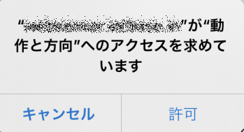
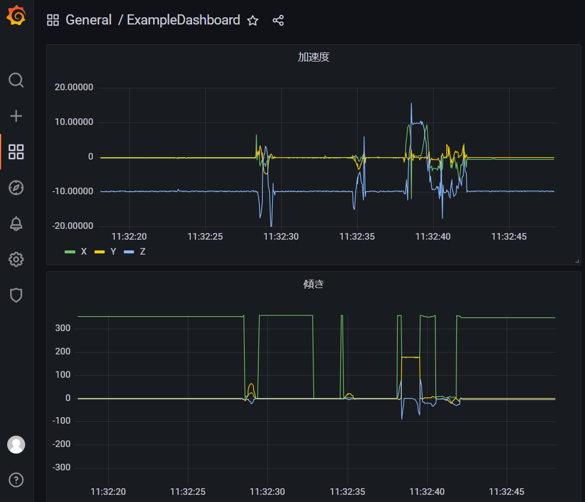

# チュートリアル

## 目的
コンテナフォーマットで動作するアプリケーションを用いて、コンテナフォーマットへの理解を深める。

## 概要
スマートフォンのジャイロセンサ情報をコンテナ化して伝送、蓄積し、データ可視化に用いる。

## テストラボの構成
以下のような構成でチュートリアルを進めます。  
スマホ(iphone等)のジャイロセンサーの値をコンテナデータにして、Webアプリ(PC)で可視化します。

## データを送信するアプリケーション
（アプリのインストールを必要としない）Webアプリです。  
環境構築手順の最後で ngrok を用いて公開したURLをスマートフォンから開きます。

開くと以下の画面が表示されます。

### Webアプリケーションでのセンサ情報の取得
画面下部のモーションの許可を押下するとダイアログが表示されます。  
※iPhoneの場合

"動作と方向"へのアクセスを許可することで、ジャイロセンサーの情報をコンテナに利用できます。

### データの送信について
このアプリには以下の設定項目があります。

- データの送信頻度＆センサからの取得頻度
- 送信データのフォーマット選択
- データを送信の有効化

それぞれの設定項目に対して、

* 送信間隔をデフォルト値の `1000 msec` から `50 msec` に変更
* 送信するデータを `container` とする(デフォルト値)
* `定期送信` にチェックを入れる

これによってコンテナの形でデータが送信されるようになります。

### 送信されたデータを可視化したもの確認

このアプリから送られるコンテナについては必要なスキーマ情報や処理が登録されているので、
可視化されたデータを見に行きます。

[http://localhost:3000/](http://localhost:3000/)

## コンテナデータの例の確認

このアプリには、送信に用いるコンテナデータを可視化している領域が存在します。  

画像内赤枠の Container部分は、実際に送信されるコンテナのHex表記されたものです。
`type:`, `length:` 等は可読性のために記述しているもので、 `:` より右側のhex値だけがコンテナデータです。

アプリ上 `モーションの許可` をしたうえで画面上の動きを見ると理解しやすいですが、
ヘッダ部分である `type:`, `length:` にあたるデータは固定的なヘッダとなります。

対してセンサーデータそのもののデータはセンサーの値を反映するため値が高頻度で更新されます。  
センサーの値群は以下のような形式で送信されます。

### コンテナデータの例でわかること
コンテナデータは以下の要素で構成される。

- 固定的なコンテナヘッダ
- センサの生み出すデータ

この複数の要素を結合したもの、これがコンテナフォーマットによるコンテナデータの一つの例になります。

## スキーマファイルの例の確認

スキーマファイルの設定画面から上記のコンテナに対応するスキーマデータとスキーマデータに対応するデータを確認します。

スキーマリポジトリはこちらです。  
環境構築でも利用した[Download(ExampleContainer)](mobile_acce.bin)が今回のコンテナデータの例と同じ構造です。
読み込むことでコンテナデータに対応するスキーマファイルの内容をロードしコンテナに適用して表示することができます。
スキーマファイルはこの画面から更新する事もできます。

[http://localhost:30002/](http://localhost:30002/)

画面左が、コンテナデータのバイナリをHex記法(16進数)で表示した領域です。
画面右が、コンテナデータに対応するスキーマファイルの内容表示および編集を行う領域です。

e.g. dtに指定されていることを書く（切って、名前を付けて、意味をつける話）
e.g. xに指定されていることを書く（同様に示す）

### スキーマファイルの例でわかること

すきーま

## まとめ

このページのまとめです。

- 事前準備されサンプルアプリでコンテナを送信した
- コンテナによって収集したデータが可視化できることを確認した。
- コンテナの形式について例を確認した
- コンテナに対応するスキーマについて例を確認した 
