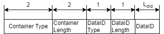
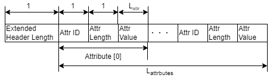

# Handling Container:基礎知識

## コンテナフォーマットの扱い方

コンテナフォーマットを扱う際に入力に使うか、出力に使うかで以下のように整理できる。

- コンテナフォーマットによる出力
  - コンテナの作り方
- コンテナフォーマットによる入力
  - コンテナの読み取り方
  - スキーマリポジトリとの連携
  - スキーマの適用

それぞれについての処理の流れを以下に示す。

## コンテナフォーマットによる出力

コンテナフォーマットを出力に用いるために、コンテナフォーマットに従ったコンテナを作る必要がある。
そのため、本項ではコンテナの作り方を示す。

### コンテナの作り方

コンテナは、仕様に従ったヘッダと自由なペイロードから構成される。
運びたいデータをペイロードとした場合、
コンテナを作るためにはヘッダを付与することが必要である。  

ヘッダは仕様に従って定義され、コモンパートと呼ばれる必須ヘッダと、拡張パートと呼ばれる任意ヘッダに分かれる。
ヘッダの詳細は以下である。

:::note コモンパート

|header field name|length| description|
|-|-:|-|
|Container Type| 2 byte | 詳細は後述|
|Container Length| 2 byte| コンテナのヘッダからペイロードすべてを含めた長さ|
|Data Id Type| 1byte| Data IDの種類を指定 |
|Data Id Length| 1byte| Data IDの長さを設定 |
|Data Id| {{Data Id length}} byte| ペイロードのデータ型に対応する識別子| 
:::

### Data ID Type

Data ID TypeはData IDの内容を示すデータである。

:::note 

コモンパート Data Id Type 一覧

|Field Value| Type of DataID |
|-|-|
|0x00|UUID|
|0x01|GTIN-8|
|0x02|GTIN-12|
|0x03|GTIN-13|
|0x04|GTIN-14|
|0x05|Bluetooth|
|0x06|Proprietary|
|0x07-0xFF|Reserved|

:::

### Container Type
Container Typeは以下の８パターンのいずれかである。  
それぞれ、リアルタイム処理、拡張ヘッダの有無、フラグメント有無を示している。

:::note コモンパート コンテナタイプ一覧
|Container Type Value| Realtime / Non Realtime Process | Extended Attributes | Fragmentation |
|-|-|-|-|
|0x5555|Real time|None|Unfragmented|
|0x3333|Real time|None|Fragmented|
|0x6666|Real time|Yes|Unfragmented|
|0x0F0F|Real time|Yes|Fragmented|
|0xAAAA|Non real time|None|Unfragmented|
|0xCCCC|Non real time|None|Fragmented|
|0x9999|Non real time|Yes|Unfragmented|
|0xF0F0|Non real time|Yes|Fragmented|
:::

### Extended Header
コンテナタイプのうち、Extended Attributesが `YES` の場合は、
コモンパートの後に拡張パートが続く。

拡張パートは以下のような構成である。  

:::note 拡張パート

|header field name|length| description|
|-|-:|-|
|Extended Header Length| 1 byte | 拡張ヘッダ全体のバイト長 |
|Attribute Type| 1 byte | 属性の種類|
|Attribute Length| 1 byte | 属性の長さ |
|Attribute Value| Nbyte | 属性データ。{Attribute Length}の長さ。|
:::

拡張ヘッダは図に示したように、
Extended Header Length の後、Attribute Type, Attribute Length, Attribute Value の3つ組の繰り返しで構成される。

### ペイロードとの結合方法
ここまでで示したヘッダフィールドを基にヘッダを構成し、ペイロードの前方に結合することでコンテナになる。

## コンテナフォーマットによる入力
コンテナフォーマットを入力に用いるために、コンテナからヘッダやペイロードの情報を取り出し、
取り出した情報でリポジトリからスキーマ情報を取得する必要がある。

そのため本項では、以下の順序でコンテナフォーマットによる入力を説明する。

- コンテナからの情報を取り出し。
- スキーマリポジトリとの連携
- スキーマ情報の適用

### コンテナからコンテナフォーマットの仕様に従い情報を取り出す  
コンテナから情報を取り出すためには、ヘッダ出力の逆の手順で情報を取り出す。  
つまり、コンテナヘッダの仕様から各フィールドごとの位置と長さは得られる。
コンテナに対して**位置と長さを元にヘッダの情報を取り出す。**  

これによって各ヘッダの情報と、ペイロードのデータが取得できる。

こちらは、次の[事例ページ](./handling_guide/example)が理解の助けになる
 
### スキーマリポジトリ連携

スキーマリポジトリからスキーマ情報を取得する必要がある。
処理したいコンテナのヘッダから取得したData ID TypeとData IDを用いてスキーマ情報を取得する。

スキーマリポジトリには、仕様上決められた手続きや手順はないのでスキーマリポジトリの実装に合わせて、DataID TypeとData IDを元にスキーマリポジトリからスキーマを取得する。

### スキーマ情報の適用

スキーマ情報はペイロードの持つデータ構造やデータ型を示したものである。  
外部ファイルとして提供され、仕様上決められた情報を持つが、ファイルフォーマットについては定義されていない。  

スキーマ情報をペイロードへの適用することでペイロードの持つ情報が活用できる。

適用によって、名前とプリミティブな型を持つデータが取得できる。
次の[事例ページ](./handling_guide/example)が理解の助けになる。
