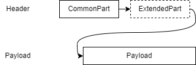

# コンテナフォーマット:基礎知識

## コンテナフォーマット

コンテナは、仕様に従ったヘッダと自由なペイロードから構成されます。
コモンパートと呼ばれる必須部分と、拡張パートと呼ばれる任意部分に分かれます。

  
図 コンテナフォーマットの構成

コンテナを作るためには運びたいデータをペイロードとしてヘッダを付与することが必要です。

## ヘッダのフォーマット

ヘッダの詳細は以下です。
コモンパートと呼ばれる必須部分から示します。

:::note コモンパート

| header field name |                  length | description                                      |
| ----------------- | ----------------------: | ------------------------------------------------ |
| Container Type    |                  2 byte | 詳細は後述                                       |
| Container Length  |                  2 byte | コンテナのヘッダからペイロードすべてを含めた長さ |
| Data Id Type      |                   1byte | Data ID の種類を指定                             |
| Data Id Length    |                   1byte | Data ID の長さを設定                             |
| Data Id           | {{Data Id length}} byte | ペイロードのデータ型に対応する識別子             |

:::

### Data ID Type

Data ID Type は Data ID の内容を示すデータです。

:::note

コモンパート Data Id Type 一覧

| Field Value | Type of DataID |
| ----------- | -------------- |
| 0x00        | UUID           |
| 0x01        | GTIN-8         |
| 0x02        | GTIN-12        |
| 0x03        | GTIN-13        |
| 0x04        | GTIN-14        |
| 0x05        | Bluetooth      |
| 0x06        | Proprietary    |
| 0x07-0xFF   | Reserved       |

:::

### Container Type

Container Type は以下の８パターンのいずれかです。  
それぞれ、リアルタイム処理、拡張パートの有無、フラグメント有無を示している。

:::note コモンパート コンテナタイプ一覧
|Container Type Value| Realtime / Non Realtime Process | Extended Attributes | Fragmentation |
|-|-|-|-|
|0x5555|Real time|None|Unfragmented|
|0x3333|Real time|None|Fragmented|
|0x6666|Real time|Yes|Unfragmented|
|0x0F0F|Real time|Yes|Fragmented|
|0xAAAA|Non real time|None|Unfragmented|
|0xCCCC|Non real time|None|Fragmented|
|0x9999|Non real time|Yes|Unfragmented|
|0xF0F0|Non real time|Yes|Fragmented|
:::

### Extended Header

[コンテナタイプ](#container-type)のうち、Extended Attributes が `YES` の場合は、
コモンパートの後に拡張パートが続きます。  
`No` の場合は、コモンパートの後にペイロードが続きます。

:::note 拡張パート

Extended Header Length の後、Attribute Type, Attribute Length, Attribute Value の 3 つ組の繰り返しで構成される。

| header field name      | length | description                            |
| ---------------------- | -----: | -------------------------------------- |
| Extended Header Length | 1 byte | 拡張パート全体のバイト長               |
| Attribute Type         | 1 byte | 属性の種類                             |
| Attribute Length       | 1 byte | 属性の長さ                             |
| Attribute Value        |  Nbyte | 属性データ。{Attribute Length}の長さ。 |

:::

## ペイロード

ペイロードについては、コンテナフォーマットの仕様上決められた型や構造はありません。
あえて言うなら、バイト列として表現されるものと言えます。

ここまでで示した内容をもとにヘッダを構成し、ペイロードの前方に結合することでコンテナになります。

## コンテナの使い方

コンテナを入力に用いるためには、以下の手順を踏む必要があります。

- コンテナからの情報(ヘッダやペイロード)を取り出す。
- スキーマリポジトリとの連携
- スキーマ情報の適用

### コンテナから情報を取り出す

コンテナの処理方法を説明します。

コンテナから情報を取り出すためには、ヘッダ出力の逆の手順で情報を取り出します。  
つまり、コンテナのデータに対して**バイト位置と長さを元にヘッダの各フィールドの情報を取り出します。**

これによって各ヘッダの情報と、ペイロードのデータが取得できます。

こちらは、次の[事例ページ](./handling_guide/example)が理解の助けになります。

### スキーマリポジトリとの連携

スキーマリポジトリからスキーマ情報を取得する必要があります。
処理したいコンテナのヘッダから取得した Data ID Type と Data ID を用いて、スキーマリポジトリからスキーマ情報を取得します

スキーマリポジトリからスキーマ情報を取得する際に、仕様上決められた手続きや手順はありません。  
そのため、スキーマリポジトリの実装に合わせた方法でスキーマ情報を取得します。

### スキーマ情報の適用

スキーマ情報はペイロードの持つデータ構造やデータ型を示したものです。  
外部ファイルとして提供され、仕様上に決められた情報を持ちます。
しかし、ファイルフォーマットについては定義されていません。

スキーマ情報をコンテナへ適用することでペイロードの持つ情報が活用できます。

適用によって、名前とプリミティブな型を持つデータが取得できます。
次の[事例ページ](./handling_guide/example)が理解の助けになります。
