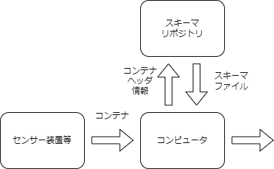

# テストラボの役割と目的

## 目的

「テストラボ」とは、広報普及啓発を目的とした、オンデマンド、ポータブル、インクリメンタルな「コンテナフォーマット標準の体験環境」です。

このドキュメントでは、
テストラボ活動に参加いただく方に対して、
テストラボ運営が用意した環境やアプリケーションを用いて、
IEC63430 として標準化を進めているコンテナフォーマットを用いたシステムを体験することで、
コンテナフォーマットへの理解を深めることを目的としています。

## チュートリアルで目指すこと

テストラボを用いたチュートリアルでは、
対象としてエンジニアを想定し
コンテナフォーマットを利用して作ったシステムを「遊ぶ、使う、作る」体験を通して、
コンテナフォーマットで実現できることをイメージできることがゴールです。

## コンテナフォーマットを用いたシステム構成

コンテナフォーマットの狙いとして、センサー等の装置がつくる原始的なデータ構造を持つデータをペイロードに対して、ヘッダを付与するだけで、受け取った側は決まったやり方で処理することでコンテナで運ばれたデータを利用できる、という形を目指しています。
ここでいう原始的なデータ構造とは、「自己記述的でなく、外部からデータ仕様等を基に読み解かなければ活用できないデータ」のことを指します。

### コンテナフォーマットの利用とスキーマリポジトリ

コンテナヘッダの情報を基に、コンテナペイロードに対応するスキーマファイルをスキーマリポジトリから取得し、コンテナペイロードからスキーマファイルを利用して情報を取得/活用します。

図 1: コンテナフォーマットの利用

このような構造でコンテナを利用するため、コンテナフォーマットの活用にはスキーマリポジトリの役割が必要になります。

## テストラボシステム

前項の一つの実装として、
コンテナフォーマットを用いたデータ蓄積のシステムをインターネット上に準備し体験環境としています。
センサーのデータをコンテナフォーマットを通じてリアルタイムに収集、蓄積し、蓄積したデータをリアルタイムに可視化する仕組みを有しています。

## チュートリアルの段階と難易度

「遊ぶ、使う、作る」というコンテナ利用やシステムの構築の各段階に対して、
難易度を設定しました。
チュートリアルでは「初級」「中級」難易度の手順を用意しています。

|      | 初級 | 中級| 応用|
| ---- | ---- | ----|---- |
| 遊ぶ | [スマートフォンを用いたジャイロセンサのデモ動作](./firststep) |[スキーマファイルの内容確認](./schema)||
| 使う | [コンテナフォーマットの例](./firststep#use)   | スキーマファイルの考え方 | 自社センサの接続     |
| 作る | コンテナのつくりかた| データ収集基盤の構築や可用性セキュリティの検討 |

## おわりに

IEC63430 として、現在標準化を進めているデータフォーマットを用いたシステムの体験を通した解説を終えた。
この文書は標準化プロセスの途中で作成されているので最終的なIEC63430と異なる可能性がある。

# 免責

テストラボシステム環境および　文書はコンテナフォーマットの広報普及啓発の目的のために作成構築されております。
情報及び内容に含まれる誤りによって被害・損害等が発生したとしても、テストラボ運営チームは一切責任を負うものではありません。
