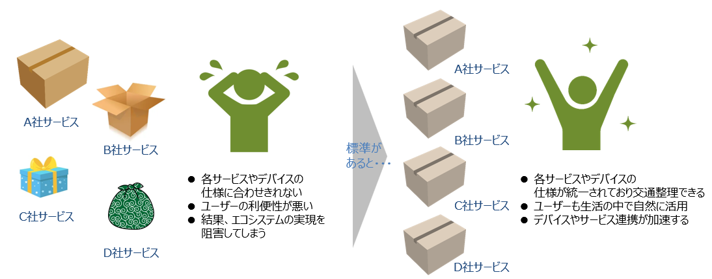

# Introduction

## このサイトの目的

Start Guide of Container Format は、コンテナフォーマットを理解し活用するための初心者向けのガイドです。  
このガイドではコンテナフォーマット（IEC63434)に関心を持つ方が、コンテナフォーマットの目的を理解したうえで、
技術的な基礎知識を獲得し効果的にコンテナフォーマット技術を活用するために、重要な情報と学習素材を提供します。

このガイド内には大きく二つの話題の説明があります。

- コンテナフォーマットの説明:  
  コンテナフォーマット(IEC63430)が解決する課題、コンテナフォーマットの概念や仕組みの理解を深めるためのドキュメントを提供します。

- テストラボシステムの説明:  
  コンテナを利活用するシステムの例として、テストラボシステムを紹介します。
  テストラボシステムを題材にその動作手順をチュートリアルとして提供します。

## コンテナフォーマットの目的

「コンテナフォーマット」(IEC 63430)は、国際団体の IEC(International Electrotechnical Commission)で現在標準化が進められているデータの共通構造の規格です。  
センサデータのようなベンダごとに異なる構造を持つデータに対して、データレベルの標準インターフェイスとなります。

コンテナフォーマットでのデータの標準化（共通化）によって、システム構築に大きなメリットがあります。

以下がコンテナフォーマットのメリットを表したイメージです。

ほかにも以下のようなメリットがあります。

- 多数のベンダーのセンサを組み合わせた柔軟なサービスの実現
- フレキシブルなセンサの増減や変更への対応
- 標準規格による開発コスト削減やベンダロックインの排除
