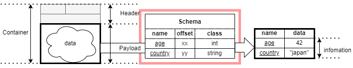
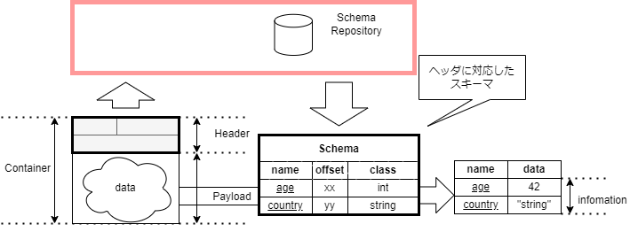

# Introduction

## コンテナフォーマットの目的

「コンテナフォーマット」(IEC 63430)は、国際団体の IEC(International Electrotechnical Commission)で現在標準化が進められているデータの共通構造の規格です。  
センサデータのようなベンダごとに異なる構造を持つデータに対して、データレベルの標準インターフェイスとなります。

コンテナフォーマットによるデータの共通化によって、システム構築に大きなメリットがあります。

- 多数のベンダーのセンサを組み合わせた柔軟なサービスの実現
- フレキシブルなセンサの増減や変更への対応
- 標準規格による開発コスト削減やベンダロックインの排除
  

## コンテナフォーマット規格の要素

コンテナフォーマット規格は以下の３つの要素を有しています。

### コンテナフォーマットの構造

コンテナフォーマットは、ヘッダとペイロードの２つから成り立ちます。

1. ヘッダ
2. ペイロード

図 1. コンテナフォーマットのイメージ

#### ヘッダ

ヘッダの各要素は、要素の要否、順序、長さ、役割の定義がされています。

#### ペイロード

ペイロードは要素やデータ構造を特定しません。  
センサーの出力値やメモリセクタなどをそのまま格納できます。

ペイロードが決まった構造を持たないという特徴は、
`データに対して仕様に沿ったヘッダをつけること` でどのようなデータもコンテナフォーマットに対応できることを意味します。

### スキーマ情報

スキーマ情報はコンテナのペイロードから、情報を取り出すためのメタ情報です。

ペイロードは決まった構造を持たないため、
情報を取り出すためのメタデータ(構造や型)をスキーマ情報としてコンテナの外部に定義します。

コンテナとスキーマ情報を組み合わせることで、コンテナのペイロードから情報を取り出すことができます。

  
図 2. スキーマ情報を利用してペイロードから情報を取り出すイメージ

### スキーマリポジトリ

スキーマリポジトリは、スキーマ情報を管理し提供する機能を持ちます。

コンテナヘッダを元に対応するスキーマ情報を提供し、
コンテナから情報を取り出す手助けをします。

スキーマリポジトリがスキーマ情報を参照することで、
異なる複数のベンダのセンサであっても共通化された処理で利用できるようになります。
これによって、複数ベンダのセンサを組み合わせて、フレキシブルにサービスを実現することができます。
