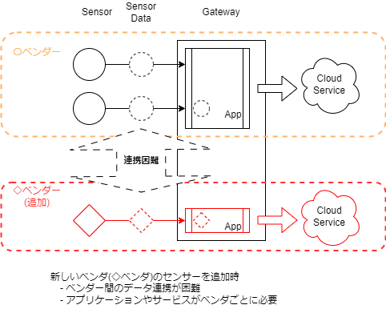

# Introduction

ここではTest Lab Tutorial Pageの全体構成を示します。
すべてのコンテンツはこの構成に従って作成されています。

## Contents

このページ、Tutorial: Test Lab. for Container Format は 以下を提供します。

  - Introduction  
    コンテナフォーマットの概要と目的、解決する課題や解決方法を示します。

  - Features  
    コンテナフォーマット仕様上の重要な３つの特徴を示し、
    その関係を示すことでコンテナフォーマットの理解を深めます。

  - Handling Container  
    コンテナフォーマットの扱い方を示します。
    具体的な仕様を基礎知識として説明したうえで、例を通してコンテナの扱い方を示します。
    - 基礎知識  
    コンテナフォーマットを扱うための基礎知識
    - 事例  
    コンテナフォーマットを扱う具体例

  - Test Lab System  
    コンテナフォーマットを取り扱ったシステムの構成とその再現方法をガイドします。
    - 概要・目的
    - 構成図
    - 構築手順
    - 動作手順
  - Etc  
    ライセンス、バージョン、ソースコード、その他のリンクのご案内です。
    - License
    - Versioning
    - Source Code
    - Links

## Data Format for Wearable
国際団体のIEC(International Electrotechnical Commission)で現在標準化が進められているデータの共通構造の規格です。
IEC63430として規格化がすすめられており、以降はコンテナフォーマットと呼称します。

### Purpose
コンテナフォーマットは、複数のベンダのセンサ製品を組み合わせたサービスを低コストで構築できる国際標準であり、データの共通構造の規格です。

コンテナフォーマットの持つ特徴により、データレベルの標準インターフェイスとして利用できます。

### Features
標準化されるコンテナフォーマットは、以下の特徴を有しています。
- ヘッダ情報の追加で製品やサービスのあらゆるデータをコンテナフォーマットに対応
- スキーマ情報を使ってデータの変換手続きを共通化
- リポジトリに蓄積されたスキーマ情報を参照し情報を利用

この特徴を利用すると、以下のような標準フォーマットがない場合に発生する課題が解決できます。

### Before Standardization

様々なデバイスで発生するデータが標準化されていないため、ベンダーごとに異なるデータフォーマットを利用している。   

そのため、新しいセンサー装置の追加の際に以下の課題がある。

- ベンダーの異なるデバイスを**組み合わせたサービス**の実現が困難
- **ベンダーごとのサービスやアプリケーション**で、デバイスデータを処理。

 

### After Standardization

標準化されたコンテナフォーマットを利用することで、
示した課題を以下のように解決できます。

- ベンダーが異なる多種のデバイスを**組み合わせたサービス**を実現可能
- **共通のアプリケーション**で、データを処理。
- センサーの追加や変更に対し、スキーマ情報の追加等で、**フレキシブルな対応**が可能
 
 
