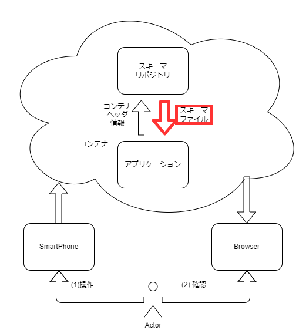

# チュートリアル
準備されているスキーマファイルを読解してみてどのような設定を含むかを見る。

# 目的
スキーマに含まれる情報の確認と用途の理解。

# 概要
[例として用いているスマートフォンのジャイロセンサ](/firststep)で用いているコンテナ情報を確認します。

# 説明に利用する構成
以下のような構成で赤色部分に着目します。

図1: 本記事での注目ポイント

# スキーマファイル
スキーマファイルはコンテナヘッダ情報を基にスキーマリポジトリから取得される。
スキーマファイルはコンテナフォーマットで運ばれたPayload運んでいるデータ構造、データの種類などを示す。

## スキーマファイルの目的

## スキーマファイルの実現
