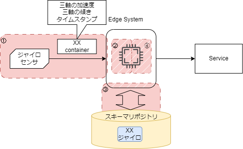

# コンテナフォーマット:事例

## 概要

このページでは、コンテナを取り扱う具体例を示します。

## 全体像

本ページでは以下の全体像のイメージのシステムを例とします。

図: 全体像

EdgeSystem を中心にコンテナの取扱いを事例で示します。  
以下の項目ごとに説明します。

① コンテナの作り方  
② ヘッダとペイロードの分割  
③ スキーマリポジトリからスキーマ情報の取得  
④ コンテナへのスキーマ情報の適用

## ① コンテナの作り方

具体的なコンテナの作成例は以下です。

表の hex value 部分を上から順に結合したバイト列がコンテナフォーマットの仕様を満たした、コンテナです。

表: コンテナフォーマットの例

| header field name | length   | hex value                                                                                                                                                                 |
| ----------------- | -------- | ------------------------------------------------------------------------------------------------------------------------------------------------------------------------- |
| Container Type    | 0x02     | `AA AA`                                                                                                                                                                   |
| Container Length  | 0x02     | `00 4E`                                                                                                                                                                   |
| Data ID Type      | 0x01     | `00`                                                                                                                                                                      |
| Data ID Length    | 0x01     | **`10`**                                                                                                                                                                  |
| Data ID           | **0x10** | `00 11 22 33 44 55 66 77 88 99 AA BB CC DD EE FF`                                                                                                                         |
| Payload           | 0x38     | `00 00 01 83 AC 9B 68 82 C0 0C FE 19 BE 8D 35 A8 C0 10 8E 4F 9A 4F 34 D6 C0 16 A0 0D 7A E1 47 AE 40 1C C2 A8 77 EC 15 97 40 40 5A 19 88 95 BC 73 C0 3D D8 31 5C FF D6 1B` |

このコンテナをどう作るか、順を追って説明します。

1. Payload  
   まずコンテナ化する Payload を決める。  
   コンテナに入れるときに Payload がどのようなデータ構造であるかは問わない。  
   ここではセンサから取得した `0x38` byte のデータがあるものとします。
1. Container Type  
   仕様の中から事前に決めます。
   今回は[コンテナタイプの一覧](../spec_guide#container-type)から「リアルタイム扱いなし、拡張パートなし、コンテナの Fragment なし」の `0xAAAA` を選択します。  
   このヘッダは実現するサービスによって自由に選択するものであり、
   センサの種類や装置のベンダー、作られるデータを根拠に選択するものではありません。

1. Container Length  
   今回は、コモンパート＋ Data ID の長さを 16 とします。  
   コンテナの全体長は表に示した length の和になります。  
   `0x02 + 0x02 + 0x01 + 0x01 + 0x10 + 0x38 = 0x4E` かつ、 Container Length は 2byte 幅なので`0x004E`となります。

1. Data Id Type  
   この例では、Data Id に UUID を利用します。  
   [コンテナタイプの一覧](../spec_guide#data-id-type)
   を参照すると、UUID を DataID として用いる場合は `0x00` とします。

1. Data ID Length  
   Data ID の長さを設定します。  
   長さ 16 バイトの UUID を用いるので 16 を示す、`0x10` の１バイトとします。

1. Data ID  
   スキーマリポジトリ内で他と重複しないよう自由に決めてよいです。
   UUID としたので 16 バイトの値として、  
   `00 11 22 33 44 55 66 77 88 99 AA BB CC DD EE FF` を設定します。

1. Build a Container Data  
   コモンパートをペイロードの前方に結合して、コンテナとして出力を行います。

## ② ヘッダとペイロードの分割

① で作られたデータ列を受取ったシステムは、コンテナフォーマットの仕様（コンテナヘッダの並びや長さ）に従い、ヘッダ部分の値を取り出します。

| header field name | offset       | length                    | hex value(16 進数)                                                                                                                                                        |
| ----------------- | ------------ | ------------------------- | ------------------------------------------------------------------------------------------------------------------------------------------------------------------------- |
| Container Type    | 0            | 2                         | `AA AA`                                                                                                                                                                   |
| Container Length  | 2            | 2                         | _`00 4E`_                                                                                                                                                                 |
| Data Id Type      | 4            | 1                         | `00`                                                                                                                                                                      |
| Data Id Length    | 5            | 1                         | **`10`**                                                                                                                                                                  |
| Data Id           | 6            | **0x10**                  | `00 11 22 33 44 55 66 77 88 99 AA BB CC DD EE FF`                                                                                                                         |
| Payload           | 6 + **0x10** | _0x004E_ - (6 + **0x10**) | `00 00 01 83 AC 9B 68 82 C0 0C FE 19 BE 8D 35 A8 C0 10 8E 4F 9A 4F 34 D6 C0 16 A0 0D 7A E1 47 AE 40 1C C2 A8 77 EC 15 97 40 40 5A 19 88 95 BC 73 C0 3D D8 31 5C FF D6 1B` |

当たり前ですが、コンテナ作成側の意図するコンテナヘッダやペイロードを入力側で復元する事ができます。

この時に参照するコンテナフォーマットの仕様は、コンテナに対して バイト単位での offset や length を使ってデータを分割し名前を割り当てることです。  
例えば、Container Type は 0byte 目から Length(2 バイト)読み取った結果であるということです。

## ③ リポジトリからスキーマ情報を取得する。

② で得られた、Data ID Type と Data ID を用いて、スキーマリポジトリからスキーマ情報を取得します。  
スキーマリポジトリは上記の 2 つの情報に基づいて対応するスキーマ情報を提供します。

この事例では、Data Id Type(`0x00`)と Data Id(`0x00112233445566778899AABBCCDDEEFF`) で得られたスキーマ情報は以下とします。

| field name | type  | offset | length |
| ---------- | ----- | -----: | -----: |
| dt         | int   |      0 |      8 |
| x          | float |      8 |      8 |
| y          | float |     16 |      8 |
| z          | float |     24 |      8 |
| alpha      | float |     32 |      8 |
| beta       | float |     40 |      8 |
| gamma      | float |     48 |      8 |

スキーマ情報は、特定のフォーマット(e.g. json/xml/etc...)と定められていないものの、
上記のテーブルの列に上げられた情報を含んでいます。

フィールド名とそのフィールドの型、フィールドの位置と長さの一覧を含んでおり、ペイロードからの情報の取得に利用します。

## ④ スキーマ情報の適用

③ のスキーマ情報を利用してペイロードから情報を取得します。

ペイロードは以下の `56byte(0x38)` のデータ列です。  
`00 00 01 83 AC 9B 68 82 C0 0C FE 19 BE 8D 35 A8 C0 10 8E 4F 9A 4F 34 D6 C0 16 A0 0D 7A E1 47 AE 40 1C C2 A8 77 EC 15 97 40 40 5A 19 88 95 BC 73 C0 3D D8 31 5C FF D6 1B`

スキーマ情報に従ってペイロードを以下の３工程で分離し各フィールドごとの値にします。

1. field name をリストします。
2. field に対応した `position`と`length` でペイロードを切り分けます。

上記の工程を実施するとこのようなイメージになります。

| field name | postion | length | hex value(raw)            |
| ---------- | ------: | -----: | :------------------------ |
| dt         |       0 |      8 | `00 00 01 83 ac 9b 68 82` |
| x          |       8 |      8 | `c0 0c fe 19 be 8d 35 a8` |
| y          |      16 |      8 | `c0 10 8e 4f 9a 4f 34 d6` |
| z          |      24 |      8 | `c0 16 a0 0d 7a e1 47 ae` |
| alpha      |      32 |      8 | `40 1c c2 a8 77 ec 15 97` |
| beta       |      40 |      8 | `40 40 5a 19 88 95 bc 73` |
| gamma      |      48 |      8 | `c0 3d d8 31 5c ff d6 1b` |

各フィールドに対応するバイト列が取り出せました。

3. `type`に従いデータ列から値を取り出す。

| field name | hex value(raw)            | type  |               value |
| ---------- | :------------------------ | ----- | ------------------: |
| dt         | `00 00 01 83 ac 9b 68 82` | int   |       1665048209538 |
| x          | `c0 0c fe 19 be 8d 35 a8` | float |  -3.624072540935874 |
| y          | `c0 10 8e 4f 9a 4f 34 d6` | float |  -4.138975535473227 |
| z          | `c0 16 a0 0d 7a e1 47 ae` | float | -5.6563014221191406 |
| alpha      | `40 1c c2 a8 77 ec 15 97` | float |   7.190095781120724 |
| beta       | `40 40 5a 19 88 95 bc 73` | float |   32.70390422164282 |
| gamma      | `c0 3d d8 31 5c ff d6 1b` | float | -29.844503223857924 |

上記の表から `dt`と`x`について取り上げて確認します。

`dt` の `hex value` を `int` として解釈すると、 `1665048209538` という値を取り出すことができます。

`x`も`hex value` を `float` として解釈します。  
IEEE 754 形式の 8 バイトの浮動小数点数（倍精度浮動小数点数）として解釈します。  
符号部 1 ビット、指数部 11 ビット、仮数部 52 ビット を適用すると、
`-3.624072540935874` という値を取り出すことができます。

このようにスキーマ情報に従って処理した情報は、
フィールド名に対応した値として整理され、各種処理に利用することができます。

この段階で全体像の右側の Service 等に利用できるデータになります。

## まとめ

- コンテナフォーマットにしたがってコンテナの作成及びコンテナの利用を行いました。
- スキーマ情報について、具体的な内容を、どう利用するか、順を追って示しました。
- スキーマリポジトリの役割について、コンテナに対応するスキーマ情報を提供する事を示しました。
- スキーマ情報を利用してフィールド名に対応した値が取り出せる事を示しました。

ヘッダの拡張パートの例はこの事例には含まれていませんが、コンテナフォーマットの基礎的な部分はこのページに記述されています。
