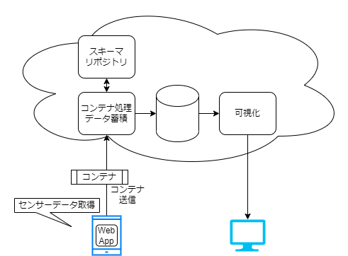
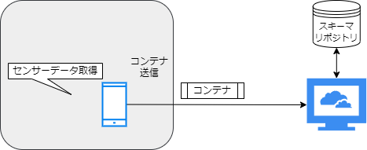
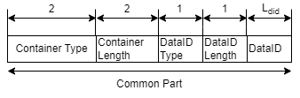
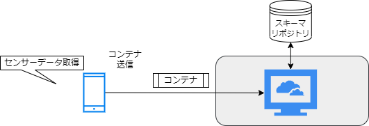
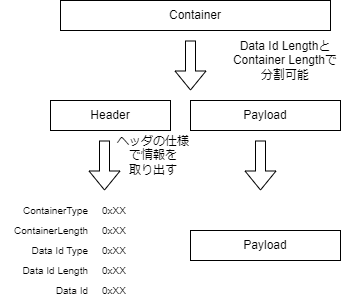
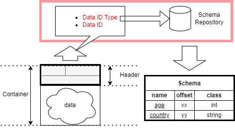
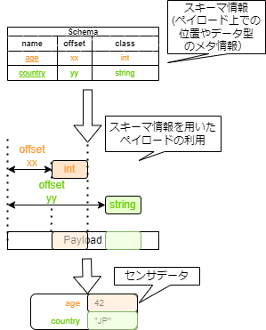

# 使用例

## 構成

ここでは、コンテナデータの取扱いについて、以下のシステム構成を例に説明します。

_図 3-1: 構成図_

以下の項目ごとに説明します。

- コンテナデータの作成方法

  - ヘッダの作り方

- コンテナデータの利用方法

  - ヘッダとペイロードの分割
  - スキーマリポジトリからのスキーマ情報取得
  - スキーマ情報を用いたペイロードの利用

## コンテナデータの作成方法

構成図の左側に注目し、ここでは、センサーデータ取得からコンテナの作成方法を説明します。

_図 3-2: 構成図上での注目ポイント_

コンテナデータは以下の構造です。

_図 3-3: コンテナフォーマット(再掲)_

コンテナは、仕様に従ったヘッダと自由なペイロードから構成されます。
コンテナを作成するためには、格納するデータに適切なヘッダを付加する必要があります。

具体的には、ペイロードの前方に必要なヘッダを作成し、それらを結合することによってコンテナデータを作成します。

ここでは拡張パート(Extended Part)を使用しないコンテナを作ります。

### コンテナデータ作成の具体例

コンテナデータを作成するためには、まず準備が必要です。
ペイロードはセンサーデータをそのまま用いるため、
まずヘッダを構成する複数のフィールドについて、それぞれの必要な値を用意します。

_図 3-4: コモンパートの構成(再掲)_

1. Container Type  
   コンテナタイプを設定します。  
   このフィールドは実現するサービスによって自由に選択するものであり、
   センサの種類や装置のベンダー、作られるデータを根拠に選択するものではありません。

   ここでは、「リアルタイム扱いなし、拡張パートなし、コンテナの Fragment なし」を示す `0xAAAA` を[コンテナタイプの一覧[Link]](../spec_guide#container-type)から選択します。

1. Container Length  
   コンテナの全体長を設定します。  
   コンテナ全体の長さは、図 3-4:コモンパートの構成に示した length の和です。
   Data ID Length は 0x10 とするので以下の計算結果が Container Length です。

   `(0x02 + 0x02 + 0x01 + 0x01 + 0x10) + 0x38 = 0x4E`

   Container Length は 2byte なので、`0x004E`です。

1. Data ID Type  
   Data ID の種類を設定します。

   ここでは Data ID に 16 バイトの UUID を使用するため、 `0x00` を設定します。
   [コンテナタイプの一覧[Link]](../spec_guide#data-id-type)
   を参照すると、`0x00` は UUID を DataID として使用する場合の指定値であることがわかります。

1. Data ID Length  
   Data ID の長さを設定します。

   ここでは、16 バイトの UUID を使用するため Data ID Length は 16 バイト を示す、`0x10` の１バイトとします。

1. Data ID  
   Data ID を設定します。  
   スキーマリポジトリ内で他の Data ID と重複しないように、自由に値を決定します。

   ここでは、UUID を使うため 16 バイトの値が必要です。  
   `00 11 22 33 44 55 66 77 88 99 AA BB CC DD EE FF` を設定します。

1. Payload  
   コンテナデータに設定する Payload です。
   ここでは、センサから取得した `0x38` byte のデータがあるものとします。

ここまでで、ヘッダとペイロードの準備ができたので表 3-1:コンテナデータの例 にまとめます。

_表 3-1: コンテナデータの例_

| header field name | length   | hex value                                                                                                                                                                 |
| ----------------- | -------- | ------------------------------------------------------------------------------------------------------------------------------------------------------------------------- |
| Data ID           | 0x02     | `AA AA`                                                                                                                                                                   |
| Container Length  | 0x02     | `00 4E`                                                                                                                                                                   |
| Data ID Type      | 0x01     | `00`                                                                                                                                                                      |
| Data ID Length    | 0x01     | **`10`**                                                                                                                                                                  |
| Data ID           | **0x10** | `00 11 22 33 44 55 66 77 88 99 AA BB CC DD EE FF`                                                                                                                         |
| (Payload)         | 0x38     | `00 00 01 83 AC 9B 68 82 C0 0C FE 19 BE 8D 35 A8 C0 10 8E 4F 9A 4F 34 D6 C0 16 A0 0D 7A E1 47 AE 40 1C C2 A8 77 EC 15 97 40 40 5A 19 88 95 BC 73 C0 3D D8 31 5C FF D6 1B` |

表の hex value 列に示された値を、順に結合したバイト列が、コンテナフォーマットの仕様を満たしたコンテナデータです。

以上で、ヘッダのコモンパートとペイロードを用いた、コンテナデータの作成手順についての具体例を示しました。

## コンテナデータの利用方法

構成図の右側に注目し、コンテナを受信して必要な情報を利用する手順について説明する。

_図 3-5: 構成図上での注目ポイント_

以下に、コンテナを利用するための大まかな利用の流れを説明します。

- ヘッダとペイロードの分割
- スキーマリポジトリからのスキーマ情報取得
- スキーマ情報を用いたペイロードの利用

その後、コンテナデータを利用するための具体な例についても説明します。

### ヘッダとペイロードの分割

コンテナから情報を取り出すためには、コンテナをヘッダとペイロードに分割し、**ヘッダの各フィールドの情報を取り出します。**  
以下、図 3-6: ヘッダとペイロードの分割 処理のイメージ を参考にしてください。

_図 3-6: ヘッダとペイロードの分割 処理のイメージ_

これによって各ヘッダに含まれる情報と、ペイロードのデータが取得できます。

### スキーマリポジトリからのスキーマ情報取得

スキーマリポジトリからスキーマ情報を取得する手順について説明します。

この手順では、コンテナヘッダの Data ID Type と Data ID を用いて、スキーマリポジトリからスキーマ情報を取得します。

_図 3-7: スキーマリポジトリからのスキーマ情報取得_

スキーマリポジトリからスキーマ情報を取得する際には、仕様上決められた手続きや手順はありません。  
そのため、スキーマリポジトリの実装に合わせた方法でスキーマ情報を取得する必要があります。

### スキーマ情報を用いたペイロードの利用

スキーマ情報はペイロードの持つデータ構造やデータ型を示したもので外部ファイルとして提供されます。
この情報には、コンテナフォーマットの仕様に定められた項目が含まれます。

スキーマ情報を用いてペイロードを読み込むことで情報を利用できます。

下図 3-8:はスキーマ情報を用いて、ペイロードから情報を取り出す手順を示したものです。

_図 3-8: スキーマ情報を用いたペイロードの利用_

スキーマ情報によって、ペイロードの中から、スキーマ情報上で指定された名前や型(数値や文字列型)を持つセンサデータの組が取得できます。

### コンテナデータ利用の具体例

[先程の具体例](#コンテナデータ作成の具体例)で作成したコンテナデータを対象に、以下にコンテナデータの利用方法の一例を示します。

#### ヘッダとペイロードの分割例

コンテナを受取ったシステムは、コンテナフォーマットの仕様に従い、ヘッダフィールドの値を取得します。

例えば、Data ID は 6byte 目から Data ID Length(0x10 バイト)読み取った結果であるということになります。

_表 3-2:コンテナデータの例(ヘッダとペイロード分割済)_

| header field name | offset       | length                    | hex value(16 進数)                                                                                                                                                        |
| ----------------- | ------------ | ------------------------- | ------------------------------------------------------------------------------------------------------------------------------------------------------------------------- |
| Container Type    | 0            | 2                         | `AA AA`                                                                                                                                                                   |
| Container Length  | 2            | 2                         | _`00 4E`_                                                                                                                                                                 |
| Data ID Type      | 4            | 1                         | `00`                                                                                                                                                                      |
| Data ID Length    | 5            | 1                         | **`10`**                                                                                                                                                                  |
| Data ID           | 6            | **0x10**                  | `00 11 22 33 44 55 66 77 88 99 AA BB CC DD EE FF`                                                                                                                         |
| (Payload)         | 6 + **0x10** | _0x004E_ - (6 + **0x10**) | `00 00 01 83 AC 9B 68 82 C0 0C FE 19 BE 8D 35 A8 C0 10 8E 4F 9A 4F 34 D6 C0 16 A0 0D 7A E1 47 AE 40 1C C2 A8 77 EC 15 97 40 40 5A 19 88 95 BC 73 C0 3D D8 31 5C FF D6 1B` |

コンテナ作成側の意図するようにコンテナヘッダやペイロードに分割できます。

#### スキーマリポジトリからのスキーマ情報取得例

Data ID Type と Data ID を用いて、スキーマリポジトリから対応するスキーマ情報を取得します。  
ここで、スキーマリポジトリは上記の 2 つの情報に基づいて対応するスキーマ情報を提供します。

ここでは、Data ID Type(`0x00`)と Data ID(`0x00112233445566778899AABBCCDDEEFF`) で得られたスキーマ情報は以下とします。

_表 3-3: (表 3-2:)のコンテナデータに対応するスキーマ情報_

| field name | type  | offset | length |
| ---------- | ----- | -----: | -----: |
| dt         | int   |      0 |      8 |
| x          | float |      8 |      8 |
| y          | float |     16 |      8 |
| z          | float |     24 |      8 |
| alpha      | float |     32 |      8 |
| beta       | float |     40 |      8 |
| gamma      | float |     48 |      8 |

スキーマ情報は表 3-3:の列の情報で構成されます。

このスキーマ情報を用いてペイロードを利用します。

#### スキーマ情報を用いたペイロードの利用例

スキーマ情報を利用して、ペイロードから情報を読みます。

ペイロードは以下の `56byte(0x38)` のデータ列です。

<!-- textlint-disable -->

`00 00 01 83 AC 9B 68 82 C0 0C FE 19 BE 8D 35 A8 C0 10 8E 4F 9A 4F 34 D6 C0 16 A0 0D 7A E1 47 AE 40 1C C2 A8 77 EC 15 97 40 40 5A 19 88 95 BC 73 C0 3D D8 31 5C FF D6 1B`

<!-- textlint-enable -->

スキーマ情報に従って、以下の手順でペイロードを分割し各フィールドごとの値に変換します。

1. スキーマ情報に対応した `position`(データ位置) と`length`(データ長) でペイロードを切り分けます。
2. `type`(種類)に従い、データ列(hex value)を値にする。

最初の工程を実施すると、以下の表 3-4:になります。

_表 3-4: スキーマ情報を用いたペイロードの切り分け_

| field name | postion | length | hex value(raw)            |
| ---------- | ------: | -----: | :------------------------ |
| dt         |       0 |      8 | `00 00 01 83 ac 9b 68 82` |
| x          |       8 |      8 | `c0 0c fe 19 be 8d 35 a8` |
| y          |      16 |      8 | `c0 10 8e 4f 9a 4f 34 d6` |
| z          |      24 |      8 | `c0 16 a0 0d 7a e1 47 ae` |
| alpha      |      32 |      8 | `40 1c c2 a8 77 ec 15 97` |
| beta       |      40 |      8 | `40 40 5a 19 88 95 bc 73` |
| gamma      |      48 |      8 | `c0 3d d8 31 5c ff d6 1b` |

各フィールドに対応するバイト列が取り出せました。
ここで得られた各フィールドに対応するバイト列を `type` に基づいて値に変換することで以下の表 3-5:が得られます。

_表 3-5: スキーマ情報を用いたペイロードの利用_

| field name | hex value(raw)            | type  |               value |
| ---------- | :------------------------ | ----- | ------------------: |
| dt         | `00 00 01 83 ac 9b 68 82` | int   |       1665048209538 |
| x          | `c0 0c fe 19 be 8d 35 a8` | float |  -3.624072540935874 |
| y          | `c0 10 8e 4f 9a 4f 34 d6` | float |  -4.138975535473227 |
| z          | `c0 16 a0 0d 7a e1 47 ae` | float | -5.6563014221191406 |
| alpha      | `40 1c c2 a8 77 ec 15 97` | float |   7.190095781120724 |
| beta       | `40 40 5a 19 88 95 bc 73` | float |   32.70390422164282 |
| gamma      | `c0 3d d8 31 5c ff d6 1b` | float | -29.844503223857924 |

上記の表から `x`フィールドに着目し、**バイト列を`type` に基づいて値にする手順**を説明します。

<!-- textlint-disable -->

type が float の場合、バイト列は IEEE 754 形式の 8 バイトの浮動小数点数（倍精度浮動小数点数）を示します。

<!-- textlint-enable -->

したがって、**切り分けたバイト列は浮動小数点数として読み取ります**。

ここでは、`c0 0c fe 19 be 8d 35 a8` というバイト列から `-3.624072540935874` という値を利用できます。
この変換は、ほとんどのプログラミング言語で準備されている機能を用いて実現できます。

このように、スキーマ情報に従って整理された情報は、
フィールド名に対応する値として整理され、各種の処理に利用できます。

## まとめ

- コンテナフォーマットに従ってコンテナデータの作成する手順とコンテナデータを利用する方法について示しました。
- スキーマ情報について、その具体的な内容とペイロードの読み込みにおいての利用方法を示しました。
- スキーマリポジトリがコンテナデータに対応するスキーマ情報を提供する役割を示しました。

コンテナヘッダの拡張パートについての具体例は含まれていませんが、コンテナフォーマットの技術的な基礎についての説明が記述されています。
