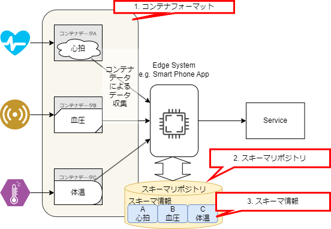

# 基礎知識

## コンテナフォーマット規格の３要素

コンテナフォーマット規格は、以下の３要素で構成されており、それぞれ以下の役割を持っています。

- コンテナフォーマット
  - 標準化された共通のデータ構造（コンテナのデータ構造）の定義
- スキーマリポジトリ
  - コンテナに対応するスキーマ情報を提供
- スキーマ情報
  - コンテナから情報を取り出すためのメタ情報

_図 2-1. コンテナフォーマット規格の全体像_

## コンテナフォーマット

コンテナフォーマットは、ヘッダとペイロードで構成されるデータ構造であり、
このフォーマットに従ったデータをコンテナデータまたはコンテナと呼びます。

_図 2-2. コンテナフォーマットのイメージ_

以下、ヘッダとペイロードのフォーマットについて順に記述する。

### ヘッダのフォーマット

ヘッダには、コモンパート(Common Part)と呼ばれる必須部分と、拡張パート(Extended Part)と呼ばれる任意部分の１つまたは２つのパートが含まれています。

  
_図 2-2 コンテナフォーマットの構成_

ヘッダの必須部分であるコモンパートの構成は図 2-3 で示され、コモンパートに含まれるフィールドの一覧は表 2-1 に示されています。
マルチバイトのフィールドの値は、特段の指定がない限り、ビッグエンディアンで設定されます。

_図 2-3: コモンパートの構成_

:::note _表 2-1: コモンパート フィールド一覧_

| header field name |                  length | description                                                                                                    |
| ----------------- | ----------------------: | -------------------------------------------------------------------------------------------------------------- |
| Container Type    |                  2 byte | コンテナタイプを設定するフィールド。コンテナタイプの詳細については[ Cointainer Type に記述](#container-type)。 |
| Container Length  |                  2 byte | ヘッダとペイロードを合わせたコンテナ全体のバイト長。                                                           |
| Data ID Type      |                  1 byte | Data ID の種類を設定するフィールド。Data ID の種類の詳細については[Data ID Type](#data-id-type)に記述。        |
| Data ID Length    |                  1 byte | Data ID のバイト長を設定                                                                                       |
| Data ID           | {{Data ID length}} byte | ペイロードのデータ構造の識別子。スキーマリポジトリからスキーマ情報を取得する際に利用。                         |

:::

#### Container Type

Container Type はリアルタイム処理、拡張パートの有無、フラグメント有無を示すために、
３軸の組み合わせで８パターンのいずれかを設定します。

コンテナを受取った側で、コンテナタイプを参照し以下の判断をできます。

- リアルタイム型と非リアルタイム型の 2 種類を規格で定めていて、コンテナ処理の優先度制御に使用します。
- 拡張パートの有無のフラグによって、コンテナの拡張ヘッダの有無を判断します。
- フラグメント有無のフラグによって、複数のコンテナをひとつのデータとして扱うかを判断します。

Container Type の一覧は以下の表 2-2: で確認できます。

:::note _表 2-2: コモンパート コンテナタイプ一覧_

コモンパート Container Type 一覧

| Container Type Value | Realtime / Non Realtime Process | Extended Attributes | Fragmentation |
| -------------------- | ------------------------------- | ------------------- | ------------- |
| 0x5555               | Real time                       | None                | Unfragmented  |
| 0x3333               | Real time                       | None                | Fragmented    |
| 0x6666               | Real time                       | Yes                 | Unfragmented  |
| 0x0F0F               | Real time                       | Yes                 | Fragmented    |
| 0xAAAA               | Non real time                   | None                | Unfragmented  |
| 0xCCCC               | Non real time                   | None                | Fragmented    |
| 0x9999               | Non real time                   | Yes                 | Unfragmented  |
| 0xF0F0               | Non real time                   | Yes                 | Fragmented    |

:::

#### Data ID Type

Data ID Type は Data ID の種類を示すデータです。  
例えば、UUID や GTIN 等が Data ID の種類として挙げられます。
Data ID Type に関する詳細は、以下の表 2-3:にまとめられています。

:::note _表 2-3: コモンパート Data ID Type 一覧_

コモンパート Data ID Type 一覧

| Field Value | Type of DataID |
| ----------- | -------------- |
| 0x00        | UUID           |
| 0x01        | GTIN-8         |
| 0x02        | GTIN-12        |
| 0x03        | GTIN-13        |
| 0x04        | GTIN-14        |
| 0x05        | Bluetooth      |
| 0x06        | Proprietary    |
| 0x07-0xFF   | Reserved       |

:::

#### Extended Header

[コンテナタイプ](#container-type)の Extended Attributes が、`YES` の場合は、拡張パートはコモンパートの後に続きます。  
一方、`No` の場合は、拡張パートは省略されます。

以下に拡張パートの構成として図 2-4:、拡張パートのフィールド一覧を表 2-4:で示します。

_図 2-4: 拡張パートの構成_

拡張パートは、Extended Header Length の後、(Attribute Type, Attribute Length, Attribute Value) の 3 つ組が繰り返しで構成される。

:::note _表 2-4: 拡張パート フィールド一覧_

| header field name      | length | description                                            |
| ---------------------- | -----: | ------------------------------------------------------ |
| Extended Header Length | 1 byte | 拡張パート全体のバイト長 (LExtended Header) |
| Attribute Type         | 1 byte | 属性の種類                                             |
| Attribute Length       | 1 byte | 属性のバイト長（Lattr）                     |
| Attribute Value        | N byte | 属性データ。                                           |

:::

### ペイロードのフォーマット

ペイロードは、フリーフォーマットのバイト列で、特定のデータ構造を持ちません。
使用できるデータには、規格に定められた最大データ長を除き、制約はありません。
もしも、規格に定められた最大データ長を超えるデータ取り扱う場合は、複数のコンテナデータに分割して取り扱うフラグメント機能を利用できます。

ペイロードが特定のデータ構造を持たないという特徴は、どのようなデータもコンテナフォーマットに対応できることを意味します。
言い換えると、**データに対して仕様に沿ったヘッダをつけること** で、どんなデータもコンテナデータ化できます。

## スキーマリポジトリ

スキーマリポジトリは、スキーマ情報を管理するための機能であり、
ネットワーク上のサーバや組み込み機器内のメモリなど、アプリケーションに合わせて多様な場所に配置されます。

コンテナを使用するアプリケーション環境にスキーマ情報を提供することで、標準化された処理を実現できます。

コンテナヘッダに対応するスキーマ情報を提供することで、
コンテナを使えるようにします。

_図 2-5: スキーマリポジトリの役割_

スキーマ情報をスキーマリポジトリから参照することで、
異なる複数のベンダのセンサであっても共通処理で扱えるようになります。
これにより、複数のベンダのセンサを組み合わせたサービスを実現や低い開発コストでの開発が可能にできます。

## スキーマ情報

スキーマ情報はコンテナのペイロードから、情報を取り出すためのメタ情報です。

前述のとおり、コンテナのペイロードはデータ構造が決まっていませんが、何らかのデータ構造を持ちます。
ペイロードが持つデータ構造はベンダー等がスキーマ情報として作成および公開します。
スキーマ情報と標準化された手続きによって、コンテナのペイロードから情報を取り出すことができます。

ペイロードのデータ構造が一定の条件を満たす場合、スキーマ情報によって、ペイロードのバイト列を構造体(オブジェクト)に Unmarshal したり、構造体(オブジェクト)をバイト配列に Marshal したりできます。

  
_図 2-6. スキーマ情報を利用してペイロードから情報を取り出すイメージ_
