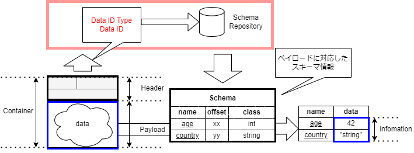

# 基礎知識

## コンテナフォーマット規格の３要素

コンテナフォーマット規格は以下の３要素を持ち、以下の役割を有しています。

- コンテナフォーマット（コンテナデータの構造）
  - 標準化された共通のデータ構造
- スキーマリポジトリ
  - コンテナに対応するスキーマ情報を提供
- スキーマ情報
  - コンテナから情報を取り出すためのメタ情報

もう少し詳しく見ていきましょう。

### コンテナフォーマット（コンテナデータの構造）

コンテナフォーマットは、ヘッダとペイロードの２つで構成されるデータ構造です。
個のフォーマットに従って作ったデータをコンテナデータと呼びます。

1. ヘッダ
2. ペイロード

_図 1. コンテナフォーマットのイメージ_

#### ヘッダ

ヘッダの各フィールドは、フィールドの要否、順序、長さ、役割の定義がされています。

#### ペイロード

ペイロードは要素やデータ構造を特定しません。  
センサーの出力値やメモリセクタなどをそのまま格納できます。

ペイロードが決まった構造を持たないという特徴は、
**データに対して仕様に沿ったヘッダをつけること** でどのようなデータもコンテナフォーマットに対応できることを意味します。

### スキーマ情報

スキーマ情報はコンテナのペイロードから、情報を取り出すためのメタ情報です。

ペイロードは決まった構造を持ちません。  
しかし、コンテナが運ぶペイロードは何らかの構造を持ち情報を持ちます。

ペイロードの構造はデバイスの実装によって異なります。
コンテナを介さない場合は、ペイロードの構造や型をプログラマがドキュメント等から把握し、ペイロードを解析する必要がありました。

一方、コンテナを用いる場合は、ペイロードの構造や型をスキーマ情報と呼び、コンテナの外部に定義します。

コンテナとスキーマ情報を組み合わせ、決まった処理を行うことで、コンテナのペイロードから情報を取り出すことができます。

  
_図 2. スキーマ情報を利用してペイロードから情報を取り出すイメージ_

### スキーマリポジトリ

スキーマリポジトリは、スキーマ情報を管理し提供することでコンテナを扱うための機能を持ちます。

コンテナヘッダを元に対応するスキーマ情報を提供し、
コンテナから情報を取り出す手助けをします。

スキーマリポジトリがスキーマ情報を参照することで、
異なる複数のベンダのセンサであっても共通処理で利用できるようになります。
これによって、複数ベンダのセンサを組み合わせて、フレキシブルにサービスを実現できます。

## コンテナフォーマットの詳細

コンテナは、仕様に従ったヘッダと自由なペイロードから構成されます。
ヘッダは 1 つもしくは 2 つのパートで構成され、コモンパート(Common Part)と呼ばれる必須部分と、拡張パート(Extended Part)と呼ばれる任意部分があります。

  
_図 3 コンテナフォーマットの構成_

コンテナを作るためには運びたいデータをペイロードとしてヘッダを付与することが必要です。

### ヘッダのフォーマット

ヘッダの詳細は以下です。
コモンパートと呼ばれる必須部分から示します。

:::note _コモンパート_

| header field name |                  length | description                                      |
| ----------------- | ----------------------: | ------------------------------------------------ |
| Container Type    |                  2 byte | 詳細は後述                                       |
| Container Length  |                  2 byte | コンテナのヘッダからペイロードすべてを含めた長さ |
| Data Id Type      |                   1byte | Data ID の種類を指定                             |
| Data Id Length    |                   1byte | Data ID の長さを設定                             |
| Data Id           | {{Data Id length}} byte | ペイロードのデータ型に対応する識別子             |

:::

#### Data ID Type

Data ID Type は Data ID の種類を示すデータです。

:::note

コモンパート Data Id Type 一覧

| Field Value | Type of DataID |
| ----------- | -------------- |
| 0x00        | UUID           |
| 0x01        | GTIN-8         |
| 0x02        | GTIN-12        |
| 0x03        | GTIN-13        |
| 0x04        | GTIN-14        |
| 0x05        | Bluetooth      |
| 0x06        | Proprietary    |
| 0x07-0xFF   | Reserved       |

:::

#### Container Type

Container Type は以下の８パターンのいずれかです。  
それぞれ、リアルタイム処理、拡張パートの有無、フラグメント有無を示している。

:::note _コモンパート コンテナタイプ一覧_
|Container Type Value| Realtime / Non Realtime Process | Extended Attributes | Fragmentation |
|-|-|-|-|
|0x5555|Real time|None|Unfragmented|
|0x3333|Real time|None|Fragmented|
|0x6666|Real time|Yes|Unfragmented|
|0x0F0F|Real time|Yes|Fragmented|
|0xAAAA|Non real time|None|Unfragmented|
|0xCCCC|Non real time|None|Fragmented|
|0x9999|Non real time|Yes|Unfragmented|
|0xF0F0|Non real time|Yes|Fragmented|
:::

#### Extended Header

コモンパートの[コンテナタイプ](#container-type)で、Extended Attributes が `YES` の場合は、
コモンパートの後に拡張パートが続きます。  
`No` の場合は、拡張パートは省略されます。

:::note 拡張パート

拡張パートは、Extended Header Length の後、(Attribute Type, Attribute Length, Attribute Value) の 3 つ組の繰り返しで構成される。

| header field name      | length | description                            |
| ---------------------- | -----: | -------------------------------------- |
| Extended Header Length | 1 byte | 拡張パート全体のバイト長               |
| Attribute Type         | 1 byte | 属性の種類                             |
| Attribute Length       | 1 byte | 属性の長さ                             |
| Attribute Value        |  Nbyte | 属性データ。{Attribute Length}の長さ。 |

:::

### ペイロード

ペイロードについては、コンテナフォーマットの仕様上決められた型や構造はありません。
あえて言うなら、バイト列として表現されるものと言えます。

ペイロードには通常何らかの情報を抽出できるバイト列が格納されています。

## コンテナを受取時の処理手順

コンテナの処理手順を説明します。
ここでは、外部からコンテナデータを受け取り、コンテナから情報を取り出すところまでの概要を示します。

センサなどの等、外部から受取ったコンテナを処理に用いるためには、以下の手順を踏む必要があります。

- コンテナから情報を取り出す。
- スキーマリポジトリとの連携
- スキーマ情報の適用

具体的なデータを含めた例は、[使用例ページ](./spec_guide/example)を参照してください。

### コンテナから情報を取り出す

コンテナから情報を取り出すためには、ヘッダ出力の逆の手順で情報を取り出します。  
つまり、コンテナをヘッダとペイロードに分割し、**ヘッダの各フィールドの情報を取り出します。**  
以下のイメージ図を参考にしてください。

これによって各ヘッダの情報と、ペイロードのデータが取得できます。

### スキーマリポジトリとの連携

スキーマリポジトリからスキーマ情報を取得する必要があります。
処理したいコンテナのヘッダから取得した Data ID Type と Data ID を用いて、スキーマリポジトリからスキーマ情報を取得します。

スキーマリポジトリからスキーマ情報を取得する際に、仕様上決められた手続きや手順はありません。  
そのため、スキーマリポジトリの実装に合わせた方法でスキーマ情報を取得します。

### スキーマ情報の適用

スキーマ情報はペイロードの持つデータ構造やデータ型を示したものです。  
外部ファイルとして提供され、仕様に定められた情報を持ちます。

スキーマ情報をペイロードへ適用することでペイロード内の情報が抽出でき活用できます。

適用によって、名前とプリミティブな型を持つデータの組が取得できます。

具体的なデータの使用例として次の[使用例ページ](./spec_guide/example)が理解の助けになります。
