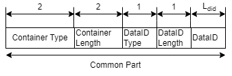
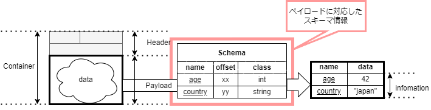

# 基礎知識

## コンテナフォーマット規格の３要素

コンテナフォーマット規格は以下の３要素で構成されていて、以下の役割を有しています。

- コンテナフォーマット
  - 標準化された共通のデータ構造（コンテナのデータ構造）の定義
- スキーマリポジトリ
  - コンテナに対応するスキーマ情報を提供
- スキーマ情報
  - コンテナから情報を取り出すためのメタ情報

_図 2-1. コンテナフォーマットのイメージ_

## コンテナフォーマット

コンテナフォーマットは、ヘッダとペイロードで構成されるデータ構造です。
このフォーマットに従ったデータをコンテナデータまたはコンテナと呼びます。

_図 2-2. コンテナフォーマットのイメージ_

以下、ヘッダのフォーマットについて記述する。

### ヘッダのフォーマット

ヘッダの中身について説明します。
ヘッダは 1 つもしくは 2 つのパートで構成され、コモンパート(Common Part)と呼ばれる必須部分と、拡張パート(Extended Part)と呼ばれる任意部分があります。

  
_図 2-2 コンテナフォーマットの構成_

コンテナは、仕様に従ったヘッダと自由なペイロードから構成されます。
コンテナを作るためには運びたいデータに対してヘッダを付与することが必要です。

ヘッダのコモンパートと呼ばれる必須部分を図 2-3:コモンパートの構成と表 2-1:コモンパート一覧で示します。

_図 2-3: コモンパートの構成_

:::note _表 2-1: コモンパート一覧_

| header field name |                  length | description                                                            |
| ----------------- | ----------------------: | ---------------------------------------------------------------------- |
| Container Type    |                  2 byte | コンテナタイプを設定。[詳細は Cointainer Type に記述](#container-type) |
| Container Length  |                  2 byte | コンテナのヘッダからペイロードすべてを含めた長さ                       |
| Data Id Type      |                   1byte | Data ID の種類を設定。[詳細は Data ID Type](#data-id-type)に記述       |
| Data Id Length    |                   1byte | Data ID の長さを設定                                                   |
| Data Id           | {{Data Id length}} byte | ペイロードのデータ構造の識別子                                         |

:::

#### Container Type

Container Type は以下の８パターンのいずれかです。  
それぞれ、リアルタイム処理、拡張パートの有無、フラグメント有無を示している。  
表 2-2: に Container Type の一覧を示します。

:::note _表 2-2: コモンパート コンテナタイプ一覧_

コモンパート Container Type 一覧

| Container Type Value | Realtime / Non Realtime Process | Extended Attributes | Fragmentation |
| -------------------- | ------------------------------- | ------------------- | ------------- |
| 0x5555               | Real time                       | None                | Unfragmented  |
| 0x3333               | Real time                       | None                | Fragmented    |
| 0x6666               | Real time                       | Yes                 | Unfragmented  |
| 0x0F0F               | Real time                       | Yes                 | Fragmented    |
| 0xAAAA               | Non real time                   | None                | Unfragmented  |
| 0xCCCC               | Non real time                   | None                | Fragmented    |
| 0x9999               | Non real time                   | Yes                 | Unfragmented  |
| 0xF0F0               | Non real time                   | Yes                 | Fragmented    |

:::

#### Data ID Type

Data ID Type は Data ID の種類を示すデータで、Data ID が UUID であるといった情報を持ちます。  
表 2-3: に Data ID Type の一覧を示します。

:::note _表 2-3: コモンパート Data ID Type 一覧_

コモンパート Data Id Type 一覧

| Field Value | Type of DataID |
| ----------- | -------------- |
| 0x00        | UUID           |
| 0x01        | GTIN-8         |
| 0x02        | GTIN-12        |
| 0x03        | GTIN-13        |
| 0x04        | GTIN-14        |
| 0x05        | Bluetooth      |
| 0x06        | Proprietary    |
| 0x07-0xFF   | Reserved       |

:::

#### Extended Header

コモンパートの[コンテナタイプ](#container-type)で、Extended Attributes が `YES` の場合は、
コモンパートの後に拡張パートが続きます。  
`No` の場合は、拡張パートは省略されます。

以下に拡張パートの説明をします。

_図 2-4: 拡張パートの構成_

拡張パートは、Extended Header Length の後、(Attribute Type, Attribute Length, Attribute Value) の 3 つ組の繰り返しで構成される。

:::note _表 2-4: 拡張パート一覧_

| header field name      | length | description                          |
| ---------------------- | -----: | ------------------------------------ |
| Extended Header Length | 1 byte | 拡張パート全体のバイト長             |
| Attribute Type         | 1 byte | 属性の種類                           |
| Attribute Length       | 1 byte | 属性の長さ                           |
| Attribute Value        |  Nbyte | 属性データ。{Attribute Length}の長さ |

:::

### ペイロード

ペイロードは、データ構造を特定しないフリーフォーマットのバイト列です。

ペイロードが決まったデータ構造を持たないという特徴は、
**データに対して仕様に沿ったヘッダをつけること** でどのようなデータもコンテナフォーマットに対応できることを意味します。

## スキーマリポジトリ

スキーマリポジトリは、(後述する)スキーマ情報を管理します。
コンテナを使う環境へスキーマ情報を提供することで、標準化された処理を行う事が出来ます。

コンテナヘッダに対応するスキーマ情報を提供することで、
コンテナを使えるようにします。

_図 2-5: スキーマリポジトリの役割_

スキーマ情報をスキーマリポジトリから参照することで、
異なる複数のベンダのセンサであっても共通処理で利用できるようになります。
これによって、複数ベンダのセンサを組み合わせて、フレキシブルにサービスを実現できます。

## スキーマ情報

スキーマ情報はコンテナのペイロードから、情報を取り出すためのメタ情報です。

前述のとおり、コンテナのペイロードはデータ構造が決まっていませんが、何らかのデータ構造を持ちます。
ペイロードが持つデータ構造はベンダー等がスキーマ情報として作成します。
スキーマ情報と標準化された手続きによって、コンテナのペイロードから情報を取り出すことができます。

  
_図 2-6. スキーマ情報を利用してペイロードから情報を取り出すイメージ_
