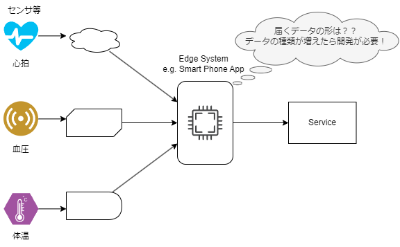

# 目的・課題・解決方法

## コンテナフォーマットの目的

「コンテナフォーマット」(IEC 63430)は、国際団体の IEC(International Electrotechnical Commission)で現在標準化が進められているデータの共通構造の規格です。  
センサデータのようなベンダごとに異なる構造を持つデータに対して、データレベルの標準インターフェイスとなります。

コンテナフォーマットでのデータの標準化（共通化）によって、システム構築に大きなメリットがあります。
すなわち、以下のようなメリットがあります。

以下がコンテナフォーマットのメリットを表したイメージです。

また、このほかにも以下のようなメリットがあります。

- 多数のベンダーのセンサを組み合わせた柔軟なサービスの実現
- フレキシブルなセンサの増減や変更への対応
- 標準規格による開発コスト削減やベンダロックインの排除

## コンテナフォーマットが解決する課題

従来、センサなどのやデバイスから計測値を集める際、
各ベンダーごとの独自のデータフォーマットとなっており、そこに標準化されたデータフォーマットやデータ構造等は存在しませんでした。

_図: コンテナフォーマット標準化以前の状況_

そのため、センサなどのやデバイスからデータを収集する際に以下のような課題がありました。

- 装置ごとに個別にどのようなデータが届くか把握する必要がある。
- 装置の出力するデータをサービスに利用するための変換に開発を要する。
- 個社への対応が多くなりがちなため、開発コストが高くなる。

## コンテナフォーマットによる解決方法

上記のような課題を解決するために、コンテナフォーマットの標準化を行いました。

_図: コンテナフォーマット標準化による解決_

コンテナフォーマットによって、課題が解決され以下のようなメリットを得ることができます。

- 収集されたデータを標準的なフォーマットであるコンテナとして処理をできる。
- コンテナから情報を取り出す方法がスキーマ情報によって一般化されます。
- スキーマリポジトリによって、スキーマ情報を一元化する事で個社対応が少なくなり、開発コストが下がる。
