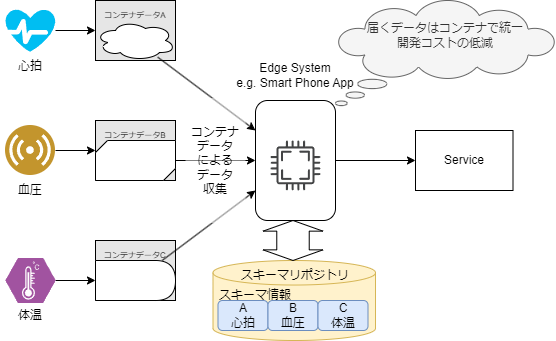

# 目的・課題・解決方法

## コンテナフォーマットの目的

コンテナフォーマット(IEC 63430)は、国際団体の IEC(International Electrotechnical Commission)で現在標準化が進められている IoT システムにおけるデータ構造の規格です。
すなわち、センサデータのようなベンダごとに異なる構造を持つデータに対する、データレベルの標準インターフェイスです。

コンテナフォーマットでのデータの標準化（共通化）によって、システム構築に大きなメリットがあります。

以下は、コンテナフォーマットの標準化によるメリットを表したイメージです。

_図 1-1: コンテナフォーマットの標準化によるメリット_

また、このほかにも以下のようなメリットがあります。

- 複数のベンダーのセンサを組み合わせた柔軟なサービスの実現
- 新しいセンサを追加する際の対応が容易
- 標準規格による開発コスト削減やベンダロックインの排除

## コンテナフォーマットが解決する課題

従来、センサなどのデバイスからデータを集める場合、
各ベンダーごとに独自のデータフォーマットが存在しており、標準化されたデータフォーマットやデータ構造等は存在しませんでした。

_図 1-2: コンテナフォーマット標準化以前の状況_

そのため、センサなどのやデバイスからデータを収集する際に以下のような課題がありました。

- 装置ごとのデータフォーマットを把握する必要がある。
- 開発コストが上がる。

## コンテナフォーマットによる解決方法

上記のような課題を解決するために、コンテナフォーマットの標準化を行いました。

_図 1-3: コンテナフォーマット標準化による解決_

コンテナフォーマットの標準化によって、課題を解決し、以下のようなメリットを得ることができます。

- 装置ごとのデータフォーマットを把握する必要がなくなる。
- 開発コストが下がる。
