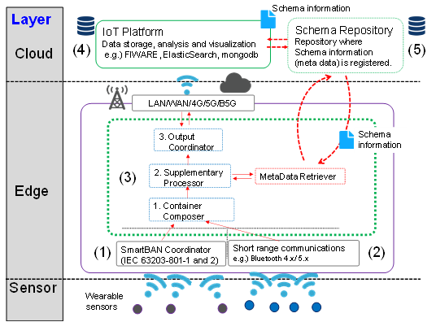

# IEC 63430 Specification Overview

議論が進められている IEC 63430 についての概要を示します。

## IEC 63430 における 3 つの要素

IEC 63430 のもっとも重要な考え方は以下の 3 つの構成要素とその連携になります。

### データコンテナのフォーマット

コンテナヘッダと形式を問わないペイロードで構成されるコンテナフォーマット。
コンテナフォーマットによって、センサ等が生成するデータ信号等に対してヘッダをつけることでそのまま格納することができます。

### データコンテナのスキーマデータ

ペイロードデータの構造を定義するスキーマデータ。
コンテナフォーマットに格納された信号を情報として解釈し処理するための情報です。

### スキーマを提供するリポジトリ

コンテナに対応するスキーマデータを提供するリポジトリ。
コンテナを処理するプロセスに対して、スキーマデータを提供することで、コンテナに格納された信号を情報として解釈し処理することができます。

### システム構成
ウェアラブルセンサー等からエッジコンピューティング装置にデータを伝送します。  
エッジコンピューティング装置において、コンテナ形式によって伝送されたデータを処理する場合に必要に応じて、スキーマリポジトリよりスキーマデータを取得しコンテナ形式のデータの処理に利用します。

