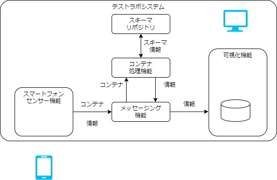
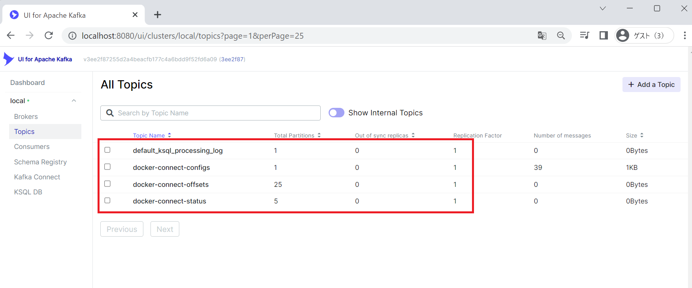

# 構築手順

## 動作環境

テストラボシステムは一般的なWindowsの動作するPC上で動作させることができ、
本手順は一般的なPC上で動作手順である。

動作は以下で行っている。

- 基盤の実行環境
  - Windows11 Pro
  - WSL2(Ubuntu 22.04)
  - Docker
- 接続クライアント
  - Google Chrome
  - Safari(iPhone/iOS16)

動作確認や手順の中では以下のコマンドおよび環境を用いるので事前に導入をする。

- git
- docker

## システム構成

構成図は以下で３つの機能がメッセージング機能を通してやり取りする構成になっています。


この４つの機能をより詳細に示したのが以下です。


## 起動手順

docker compose でアプリケーションを動かします。
まず、git で必要なファイルを取得(クローン)します。

```
~$ git clone --recursive https://github.com/sensing-iot-standard-consortium-ja/test-lab-system.git
```

以下の手順で動作を確認

```
~$ cd test-lab-system/
~/testlab-tutorial$ docker compose up -d
```

実行結果の確認

```
~/testlab-tutorial$ docker compose ps -a
```

で `container-consumer` 以外が `Up` のステータスになっていれば OK です。

<details>
<summary>出力結果の表示</summary>
<pre>
<code>

NAME                                   IMAGE                                                             COMMAND                  SERVICE              CREATED             STATUS                   PORTS
test-lab-system-broker-1               confluentinc/cp-kafka:7.1.0                                       "/etc/confluent/dock…"   broker               3 minutes ago       Up 2 minutes             0.0.0.0:9092->9092/tcp, :::9092->9092/tcp, 0.0.0.0:9101->9101/tcp, :::9101->9101/tcp
test-lab-system-connect-1              test-lab-system-connect                                           "/etc/confluent/dock…"   connect              3 minutes ago       Up 2 minutes (healthy)   0.0.0.0:8083->8083/tcp, :::8083->8083/tcp, 9092/tcp
test-lab-system-container-consumer-1   test-lab-system-container-consumer                                "/protoschema"           container-consumer   3 minutes ago       Up 9 seconds             
test-lab-system-grafana-1              grafana/grafana:8.5.3                                             "/run.sh"                grafana              3 minutes ago       Up 2 minutes             0.0.0.0:3000->3000/tcp, :::3000->3000/tcp
test-lab-system-kafka-ui-1             provectuslabs/kafka-ui:3ee2f87255d2a4beacfb177c4a6bdd9f52fd6a09   "/bin/sh -c 'java $J…"   kafka-ui             3 minutes ago       Up 2 minutes             0.0.0.0:8080->8080/tcp, :::8080->8080/tcp
test-lab-system-ksqldb-cli-1           confluentinc/cp-ksqldb-cli:7.1.0                                  "/bin/sh"                ksqldb-cli           3 minutes ago       Up 2 minutes             
test-lab-system-ksqldb-server-1        confluentinc/cp-ksqldb-server:7.1.0                               "/etc/confluent/dock…"   ksqldb-server        3 minutes ago       Up 2 minutes             0.0.0.0:8088->8088/tcp, :::8088->8088/tcp
test-lab-system-postgres-1             postgres:11.13-alpine                                             "docker-entrypoint.s…"   postgres             3 minutes ago       Up 3 minutes             0.0.0.0:5432->5432/tcp, :::5432->5432/tcp
test-lab-system-rest-proxy-1           confluentinc/cp-kafka-rest:7.1.0                                  "/etc/confluent/dock…"   rest-proxy           3 minutes ago       Up 2 minutes             0.0.0.0:8082->8082/tcp, :::8082-NAME>8082/tcp
test-lab-system-schema-registry-1      confluentinc/cp-schema-registry:7.1.0                             "/etc/confluent/dock…"   schema-registry      3 minutes ago       Up 2 minutes             0.0.0.0:8081->8081/tcp, :::8081->8081/tcp
test-lab-system-schema-repository-1    test-lab-system-schema-repository                                 "docker-entrypoint.s…"   schema-repository    3 minutes ago       Up 3 minutes             0.0.0.0:30002->30002/tcp, :::30002->30002/tcp
test-lab-system-testlab-edge-1         test-lab-system-testlab-edge                                      "python main.py"         testlab-edge         3 minutes ago       Up 3 minutes             
test-lab-system-websensor-1            test-lab-system-websensor                                         "docker-entrypoint.s…"   websensor            3 minutes ago       Up 3 minutes             0.0.0.0:1188->80/tcp, :::1188->80/tcp
test-lab-system-zookeeper-1            confluentinc/cp-zookeeper:7.1.0                                   "/etc/confluent/dock…"   zookeeper            3 minutes ago       Up 3 minutes             2888/tcp, 0.0.0.0:2181->2181/tcp, :::2181->2181/tcp, 3888/tcp


</code>
</pre>

</details>

複数のコンテナが動作していますがこの後の手順に用いるものや画面を持つものを示します。

- スマートフォンセンサー機能
  - test-lab-system-websensor-1: スマートフォンセンサー機能を提供するWebアプリケーション
- コンテナ処理機能
  - test-lab-system-container-consumer-1: コンテナ処理機能。メッセージング機能より受取って、スキーマリポジトリを参照して、jsonに変換しメッセージング機能に戻す
  - test-lab-system-schema-repository-1: スキーマリポジトリ。リクエストに従ってスキーマファイルを応答する
- メッセージング機能
  - test-lab-system-kafka-ui-1: kafkaの管理用のGUI(ksqlやJDBC Sinkの設定はこの画面を経由して行う)
- 可視化機能
  - test-lab-system-grafana-1: 可視化機能を提供するWebアプリケーション
  - test-lab-system-postgres-1: メッセージング機能から受け取ったデータを格納するDB
  
container-consumer が再起動を繰り返すのはこの後の手順で是正するのでこの時点ではOKです。  
この後のトピック作成手順の完了後Statusが `Up` になります。


## 起動後の確認

動作確認のため、ブラウザからWebアプリケーションを開きます。
正しく動作していると以下の URL から確認できます。

Google Chrome で以下のページを開いてみてください。

1. [http://localhost:1188/](http://localhost:1188/)
  
1. [http://localhost:30002/](http://localhost:30002/)
  
1. [http://localhost:3000/](http://localhost:3000/)
  
1. [http://localhost:8080/](http://localhost:8080/)
  

それぞれの添え字は、システム構成(詳細)内の番号と対応しています。

## 初期設定手順

サンプルアプリのデータを可視化するまでの手順を示します。

## メッセージング機能とコンテナ処理機能間の設定

メッセージングに用いるソフトウェアのKafka の設定をします。  
Kafka に複数のプロセス間のデータやり取りのハブになります。
Kafka ではトピックに対し、データを提供する Producer とデータを利用する Consumer が存在します。  
ここでは、準備しているConsumerがコンテナを入力として取り扱えるように、トピックを作成します。
KafkaUI を用いてトピックの状況を確認します。

### 変更前の設定確認

以下の KafkaUI の画面より、現在存在するトピックを確認します。
ページを開いた後、 `Show Internal Topics` を無効化すると 4 つのトピックが表示されています。

- [http://localhost:8080/ui/clusters/local/topics](http://localhost:8080/ui/clusters/local/topics)
  

### 設定変更（トピックの追加)

この環境は、未登録のトピックを投入した場合、自動的に新たなトピックを追加する設定をしてあります。
そこで、サンプルアプリからデータを送ることでトピックを追加します。

1. データ送信のページを開く  
   [http://localhost:1188/ ](http://localhost:1188/)
2. `値の更新` を押下  
   加速度、傾きなどに適当な値が入る
3. `単発送信` を押下  
   サンプルアプリから Kafka に１つデータを送信


### 設定変更結果確認

KafkaUI を開き画面を更新します。  
`json_mb_ctopic` と `mb_ctopic` の二つのトピックが増えていれば期待通りです。
確認できるまで１分程度時間がかかる可能性があります。


ここでは `mb_ctopic` というトピックに発行されたコンテナを、
コンテナ処理基盤(container-consumer)で処理してコンテナをjsonへ変換して `json_mb_ctopic` に投入している。

また、この手順でcontainer-consumerが再起動しないようになります。

## メッセージング機能と可視化機能間の設定

kafka に届いたデータを Avro というデータ形式に変換し、可視化画面用の DB に Sink する設定を行う。

### データ変換の登録

 `json_mb_topic` からフォーマットに変換し可視化を行う `Grafana`で用いるデータベースに蓄積をする。

- 以下のページを開く  
  [http://localhost:8080/ui/clusters/local/ksqldb/query](http://localhost:8080/ui/clusters/local/ksqldb/query)

- 画像のようなページが表示される
  

- ksqlでStream を作成する（１つ目）  
  以下の ksql クエリをコピーペーストし、`Execute` を押下

```
CREATE STREAM stream_mb_topic
  (
    dt BIGINT,
    x DOUBLE,
    y DOUBLE,
    z DOUBLE,
    alpha DOUBLE,
    beta DOUBLE,
    gamma DOUBLE
  )
  WITH (
    KAFKA_TOPIC = 'json_mb_ctopic',
    VALUE_FORMAT = 'JSON'
  );
```

- 実行結果の確認（１つ目）

画像の下のように `SUCCESS Stream created` と表示される。


- Stream を作成する（２つ目）
  同様にもう一つクエリを実行する。

```
CREATE STREAM stream_mb_topic_avro
WITH (KAFKA_TOPIC = 'avro_mb_jtopic', VALUE_FORMAT='AVRO')
AS SELECT
     ROWTIME as ts,
     s.dt as dt,
     s.x as x,
     s.y as y,
     s.z as z,
     s.alpha as alpha,
     s.beta as beta,
     s.gamma as gamma
FROM stream_mb_topic as s;
```

- 作成した stream を確認する
  同様に以下のクエリを実行する。

```
show streams;
```

  
画像の下部のように`STREAM_MB_CTOPIC` と`AVRO_MB_CTOPIC` が表示されれば成功。

### メッセージング機能から可視化機能へのデータ転送

Kafka の Connector を設定。

- Connector の設定ページを開く  
  [http://localhost:8080/ui/clusters/local/connectors/create-new](http://localhost:8080/ui/clusters/local/connectors/create-new)
- Connector の設定を入力する  
  Name: `avro_mb_jtopic`  
  Config \*

```
{
  "connector.class": "io.confluent.connect.jdbc.JdbcSinkConnector",
  "tasks.max": "1",
  "key.converter": "io.confluent.connect.avro.AvroConverter",
  "value.converter": "io.confluent.connect.avro.AvroConverter",
  "topics": "avro_mb_jtopic",
  "connection.url": "jdbc:postgresql://postgres:5432/postgres",
  "connection.user": "postgres",
  "connection.password": "postgres",
  "dialect.name": "PostgreSqlDatabaseDialect",
  "table.name.format": "${topic}",
  "pk.mode": "none",
  "pk.fields": "",
  "auto.create": "true",
  "auto.evolve": "true",
  "value.converter.schema.registry.url": "http://schema-registry:8081",
  "key.converter.schema.registry.url": "http://schema-registry:8081"
}
```

- Connector の設定を登録する  
  `Submit` を押して登録するが **正常登録時に画面が何も変わらない**

- Connector の設定登録を確認する  
  以下のページを開く。  
  [http://localhost:8080/ui/clusters/local/connectors](http://localhost:8080/ui/clusters/local/connectors)

`avro_mb_jtopic` という Connector が存在すれば OK

## 可視化機能の設定

データを可視化する画面へアクセスする。
改めて設定する項目はないが、アプリケーションの動作確認として以下を実施する。

1. Grafana へアクセス  
   以下の情報で Grafana へアクセスしログインする  
    [http://localhost:3000/](http://localhost:3000/)

   ```
   ID: admin
   Password: admin
   ```

1. DashBoard の確認  
   左端のメニュー Search をクリックし、 `ExampleDashboard` を開く

1. テストデータ送信の確認

   1. データ送信のページを開く  
      [http://localhost:1188/ ](http://localhost:1188/)
   1. `値の更新` を押下  
      加速度、傾きなどに適当な値が入る
   1. `単発送信` を押下  
      サンプルアプリから Kafka に１つデータを送信

1. データの疎通の確認  
   Grafana 上で画面が可視化される。  
   画面は 5 秒に 1 回の更新がされるのでデータ送信後 5 秒以内に表示される。  
   (画面右上から 1s に変更可)
   

## コンテナ処理機能の設定

###  スキーマリポジトリの動作確認

スキーマリポジトリには、
デフォルトでいくつかのスキーマが定義されているため、改めて設定する必要がある項目はない。  
しかし、アプリケーションの動作確認として以下を実施する。

1. サンプルデータの取得  
   サンプルアプリから送信されるデータのスキーマ情報をまず定義します。
   以下のバイナリデータはコンテナ化されたタイムスタンプ付きの６軸のデータです。  
   [Download(ExampleContainer)](environment/mobile_acce.cntr)  
   このファイルをサンプルコンテナと呼ぶ。

:::caution
サンプルコンテナは、[Handling Containerで示された仕様](../handling_guide/)と差異がある。  
Data Id Lengthフィールドがない。
Data Id Length は 0x10(16)と扱われるデータである。
:::

1. スキーマリポジトリの動作確認  
   スキーマリポジトリの確認を行います。  
   [http://localhost:30002/](http://localhost:30002/) にアクセス

2. スキーマリポジトリのスキーマ確認  
   テストラボで準備しているスキーマリポジトリには以下の機能があります。

   - コンテナからのスキーマ定義
   - コンテナへスキーマを適用した状態のプレビュー

3. コンテナデータの読み込み  
   初期起動時には画面の右上の[Load File]ボタンを押下しダウンロードしたファイルを読み込みます。  
   

前述のサンプルコンテナを読み込むと、以下のようにプレビューされます。


サンプルコンテナに対応するスキーマファイルは、リポジトリに内蔵されているため、対応するコンテナを読み込むことでスキーマファイルが読み込まれます。
`dt, x, y, z, alpha, beta, gamma` の７つのフィールドが定義され、サンプルコンテナに適用された結果が `Data` や `Raw` で確認できます。

下にスクロールすると、サンプルコンテナのヘッダ情報も確認できます。

:::caution
コンテナヘッダは[Handling Containerで示された仕様](../handling_guide/)と差異があるバージョンで実装している。

- Container Typeに仕様上認められてない値が入っている。
- Data Index フィールドはData Id Typeとリネームされている。
- Data Id Length フィールドがない。
:::

スキーマリポジトリの確認は以上です。

## スマートフォンセンサ機能の設定

スマートフォンからジャイロ(傾き)と加速度のセンサーデータを送るための設定をします。

ここまで作った環境にスマートフォンからhttpsでアクセスする必要があるため、外部のWeb サービスを利用します。

:::note
ブラウザのセキュリティ機能が要求する事項に対応するための対応です。
:::

### ngrok によるhttpsアクセス

ngrok を利用することで、ローカルで動作しているセンサーデータを送信するためのWebアプリケーションをインターネット経由でアクセスできるようにすることで、スマートフォンからセンサーデータを送信できるようにします。

- ngrok の Free プランのアカウント登録  
  [https://ngrok.com/](https://ngrok.com/) で登録します。

- ngrok の AuthTokens の取得
  [https://dashboard.ngrok.com/get-started/your-authtoken](https://dashboard.ngrok.com/get-started/your-authtoken)
  で Authtokens を発行する

- AuthTokens を設定  
docker compose を実行するshellで以下を実行し、環境変数に AuthTokens を設定する。
  ```
  export NGROK_AUTHTOKEN={発行したAuthToken}
  ```

  環境変数 NGROK_AUTHTOKEN に AuthTokens を書き込む。`compose-dev.yaml` からこの環境変数を利用してngrokを利用できる。

- docker compose で ngrok を実行する  
  `docker compose -f compose-dev.yaml run ngrok` を実行する。  
  実行すると以下のような画面が表示される。
    
  `Forwarding` に表示される URL をスマートフォンで表示する。

### センサーデータの送信

画面下部のモーションの許可を押下するとセンサーデータ取得のダイアログが表示されます。
許可をするとセンサーデータが取得できるようになります。

センサーデータが取得できるようになった後は

- 送信間隔をデフォルト値の `1000 msec` から `50 msec` に変更
- 送信するデータをデフォルト値 `container` であることを確認
- `定期送信` にチェックを入れる

これによってセンサデータを連続で送信できるようになる。

[Grafana http://localhost:3000/](http://localhost:3000/) に設定してあるダッシュボードから確認できる。  
描画データの更新間隔を画面右上で設定できるので5s(5秒)を 1s(1秒)にするとよりスムースに表示が可能。
