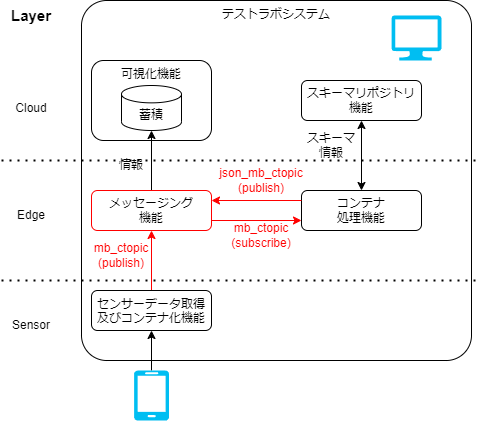
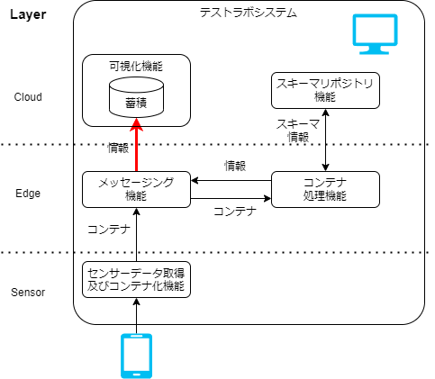

# 構築手順

## 動作環境

テストラボシステムは、一般的な Windows PC 上で動作可能です。
また、Docker が動作する一般的な PC で利用できるように設計されています。
動作確認は以下の環境で行われています。

- 動作確認環境
  - OS: Windows11 Pro
    - CPU: AMD Ryzen 7 PRO 5850U
    - MEM: 48GB
  - WSL2(Ubuntu 22.04)
  - Rancher Desktop(WSL2)
    - Docker 環境として利用
- 接続クライアント
  - PC ブラウザ
    - Google Chrome
  - スマートフォン
    - Safari(iPhoneSE2/iOS16)
- 動作を想定している環境
  - OS: Docker が動作する OS
  - MEM: 16GB 程度

別の動作確認済の環境として、AWS EC2 サービスの c5.xlarge では動作を確認しています。

## 機能とシステム構成

### 機能

テストラボシステムが持つ機能は以下です。

- スマートフォンのジャイロセンサ(加速度、傾き)を入力とします。
- ジャイロセンサのデータをコンテナによって流通させます。
- 流通させたコンテナから値を取り出し可視化した出力をします。

### システム構成

システム構成を改めて示します。


_図 A-1: システム構成_

１つのコンピュータの上でテストラボシステムを動作させます。
テストラボシステム内はメッセージング機能をハブとして、各機能間を接続してシステムを実現しています。

データは以下のようにやり取りされていきます。

1. スマートフォンセンサ機能でスマートフォンのセンサ情報をコンテナで取り込みます。
2. メッセージング機能を介してコンテナ処理機能にコンテナデータを送ります。
3. コンテナ処理機能はスキーマリポジトリと連携して、コンテナから JSON に変換します。
4. メッセージング機能を介して可視化機能に JSON を送り可視化します。

## 起動手順

ここからテストラボシステムを動作させる手順に入ります。

:::info 事前準備
この先の手順では以下のコマンドを用います。
事前にインストールしてください。

- git
- docker

:::

まず、git で必要なファイルを取得(クローン)します。
この手順で複数のリポジトリを取得します。

```
~$ git clone --recursive https://github.com/sensing-iot-standard-consortium-ja/test-lab-system.git
```

複数のリポジトリが取得されます。

docker のサブコマンドである、docker compose でアプリケーションを動かします。
以下の手順を実行します。

```
~$ cd test-lab-system/
~/testlab-tutorial$ docker compose up -d
```

実行結果を確認します。

```
~/testlab-tutorial$ docker compose ps -a
```

で `container-consumer` 以外が `Up` のステータスになっていれば OK です。

<!-- textlint-disable -->

<details>
<summary>出力結果の表示</summary>
<pre>
<code>

NAME IMAGE COMMAND SERVICE CREATED STATUS PORTS
test-lab-system-broker-1 confluentinc/cp-kafka:7.1.0 "/etc/confluent/dock…" broker 3 minutes ago Up 2 minutes 0.0.0.0:9092->9092/tcp, :::9092->9092/tcp, 0.0.0.0:9101->9101/tcp, :::9101->9101/tcp
test-lab-system-connect-1 test-lab-system-connect "/etc/confluent/dock…" connect 3 minutes ago Up 2 minutes (healthy) 0.0.0.0:8083->8083/tcp, :::8083->8083/tcp, 9092/tcp
test-lab-system-container-consumer-1 test-lab-system-container-consumer "/protoschema" container-consumer 3 minutes ago Up 9 seconds  
test-lab-system-grafana-1 grafana/grafana:8.5.3 "/run.sh" grafana 3 minutes ago Up 2 minutes 0.0.0.0:3000->3000/tcp, :::3000->3000/tcp
test-lab-system-kafka-ui-1 provectuslabs/kafka-ui:3ee2f87255d2a4beacfb177c4a6bdd9f52fd6a09 "/bin/sh -c 'java $J…" kafka-ui 3 minutes ago Up 2 minutes 0.0.0.0:8080->8080/tcp, :::8080->8080/tcp
test-lab-system-ksqldb-cli-1 confluentinc/cp-ksqldb-cli:7.1.0 "/bin/sh" ksqldb-cli 3 minutes ago Up 2 minutes  
test-lab-system-ksqldb-server-1 confluentinc/cp-ksqldb-server:7.1.0 "/etc/confluent/dock…" ksqldb-server 3 minutes ago Up 2 minutes 0.0.0.0:8088->8088/tcp, :::8088->8088/tcp
test-lab-system-postgres-1 postgres:11.13-alpine "docker-entrypoint.s…" postgres 3 minutes ago Up 3 minutes 0.0.0.0:5432->5432/tcp, :::5432->5432/tcp
test-lab-system-rest-proxy-1 confluentinc/cp-kafka-rest:7.1.0 "/etc/confluent/dock…" rest-proxy 3 minutes ago Up 2 minutes 0.0.0.0:8082->8082/tcp, :::8082-NAME>8082/tcp
test-lab-system-schema-registry-1 confluentinc/cp-schema-registry:7.1.0 "/etc/confluent/dock…" schema-registry 3 minutes ago Up 2 minutes 0.0.0.0:8081->8081/tcp, :::8081->8081/tcp
test-lab-system-schema-repository-1 test-lab-system-schema-repository "docker-entrypoint.s…" schema-repository 3 minutes ago Up 3 minutes 0.0.0.0:30002->30002/tcp, :::30002->30002/tcp
test-lab-system-testlab-edge-1 test-lab-system-testlab-edge "python main.py" testlab-edge 3 minutes ago Up 3 minutes  
test-lab-system-websensor-1 test-lab-system-websensor "docker-entrypoint.s…" websensor 3 minutes ago Up 3 minutes 0.0.0.0:1188->80/tcp, :::1188->80/tcp
test-lab-system-zookeeper-1 confluentinc/cp-zookeeper:7.1.0 "/etc/confluent/dock…" zookeeper 3 minutes ago Up 3 minutes 2888/tcp, 0.0.0.0:2181->2181/tcp, :::2181->2181/tcp, 3888/tcp

</code>
</pre>

</details>

<!-- textlint-enable -->

この時点でテストラボシステムを構成する複数のアプリケーションが動作しています。
この後の手順上重要なものを示します。

- スマートフォンセンサー機能
  - test-lab-system-websensor-1: スマートフォンセンサー機能を提供する Web アプリケーション
- コンテナ処理機能
  - test-lab-system-container-consumer-1: コンテナ処理機能。メッセージング機能よりコンテナデータを受取り、スキーマリポジトリを参照して、変換しメッセージング機能に戻す
  - test-lab-system-schema-repository-1: スキーマリポジトリ。リクエストに従ってスキーマファイルを応答する
- メッセージング機能
  - test-lab-system-kafka-ui-1: kafka の管理用の GUI(ksql や JDBC Sink の設定はこの画面を経由して行う)
- 可視化機能
  - test-lab-system-grafana-1: 可視化機能を提供する Web アプリケーション
  - test-lab-system-postgres-1: メッセージング機能から受け取ったデータを格納する DB

現時点では container-consumer が再起動を繰り返しますが、
この後の手順で是正するのでこの時点では許容します。

### 起動確認

起動確認のため、ブラウザから Web アプリケーションを開きます。
正しく動作していると以下の URL から確認できます。

Google Chrome で以下のページを開いてみてください。

1. スマートフォンセンサー機能：[http://localhost:1188/](http://localhost:1188/)
   

   _図 A-2: スマートフォンセンサ機能_

1. スキーマリポジトリ：[http://localhost:30002/](http://localhost:30002/)
   

   _図 A-3: スキーマリポジトリ機能_

1. 可視化機能：[http://localhost:3000/](http://localhost:3000/)
   

   _図 A-4: 可視化機能_

1. メッセージング機能(管理画面)[http://localhost:8080/](http://localhost:8080/)
   

   _図 A-5: メッセージング機能(管理画面)_

上記のような画面が出れば、順調に進んでいます。

## 初期設定手順

ここまででテストラボシステムは起動していますが、全体を動作させるためにはいくつか設定が不足しているので設定をします。

スマートフォンセンサ機能からセンサデータを送信し可視化するまでの手順を示します。

### メッセージング機能へのトピック追加

スマートフォンセンサからコンテナ処理機能にデータをやり取りするためのトピックが準備できていないので作成します。
トピックとはデータのやり取りを行うためのチャンネルです。


_図 B-1: システム構成(設定箇所)_

メッセージ基盤は未登録のトピックでデータを投入した場合、自動的にトピックを作成する設定になっています。
ここでは、スマートフォンセンサ機能からデータを送ることでトピックを追加します。

#### 変更前のトピックの確認

以下の [UI for Apache Kafka](http://localhost:8080/) の画面より、現在存在するトピックを確認します。
ページを開いた後、 `Show Internal Topics` を無効化すると 4 つのトピックが表示されています。

- [http://localhost:8080/ui/clusters/local/topics](http://localhost:8080/ui/clusters/local/topics)
  

_図 B-2:メッセージング(UI for Apache Kafka)機能の画面(変更前)_

#### トピックの作成（データの送信)

トピックの作成のために、スマートフォンセンサー機能からメッセージング機能にデータを送ります。

データを送るために、PC から開いてください。

1. データ送信のページを開く  
   [http://localhost:1188/ ](http://localhost:1188/)
2. `値の更新` を押下  
   加速度、傾きなどに適当な値が入ります。
3. `単発送信` を押下  
   スマートフォンセンサ機能から、メッセージ基盤へデータが送信されます。


_図 B-3:スマートフォンセンサ機能の画面_

メッセージ基盤へデータを送ることで、メッセージ基盤上に必要な設定が作られます。

#### 設定変更後の設定状態確認

[UI for Apache Kafka](http://localhost:8080/) を開き画面を更新します。  
`json_mb_ctopic` と `mb_ctopic` の 2 つのトピックが増えていれば期待通りです。
ただし、確認できるまで数分程度かかる可能性があります。


_図 B-4:メッセージング(UI for Apache Kafka)機能の画面(変更後)_

ここでは `mb_ctopic` というトピックに発行されたコンテナをコンテナ処理基盤(container-consumer)で json へ変換し、
`json_mb_ctopic` というトピックで再度メッセージング基盤に投入しています。
システム構成からみると図 A-6: のように



_図 B-5:システム構成と初期設定の対応_

ここまでで、スマートフォンセンサからコンテナデータを受取り、
コンテナ処理機能(container-consumer) によってコンテナデータを json へ変換し、メッセージ機能へ投入する設定が完了します。

### メッセージング機能でのデータ変換

メッセージング基盤内向けのデータ変換とタイムスタンプの付与の設定を行います。


_図 C-1:システム構成(設定箇所)_

図 C-1: で示したように、メッセージング基盤内に閉じた内容の設定になります。

#### データ変換の登録

メッセージング基盤上では、トピック(kafka の topic)と Streaming SQL と呼ばれる機能が結合しています。
これによって、あるトピックに流れてくるデータを SQL におけるテーブル(ストリーム)とみなして、SQL の様に処理ができます。

ここでは、コンテナ処理機能からの、`json_mb_topic` のトピックから取得されるデータに対して、

1. テーブル(ストリーム)を作成する
2. タイムスタンプ付与し、トピックにする

という処理を実現します。

##### テーブル(ストリーム)を作成

以下の手順に従って、`json_mb_topic` のトピックから、テーブル(ストリーム)を作成します。

1. メッセージ基盤の KSQL の実行ページを開く  
   [http://localhost:8080/ui/clusters/local/ksqldb/query](http://localhost:8080/ui/clusters/local/ksqldb/query)

   

   _図 C-2:KSQL の実行ページ_

1. ksql で Stream を作成する  
   以下の ksql の SQL をコピーペーストし、`Execute` を押下

```
CREATE STREAM stream_mb_topic
  (
    dt BIGINT,
    x DOUBLE,
    y DOUBLE,
    z DOUBLE,
    alpha DOUBLE,
    beta DOUBLE,
    gamma DOUBLE
  )
  WITH (
    KAFKA_TOPIC = 'json_mb_ctopic',
    VALUE_FORMAT = 'JSON'
  );
```

- 実行結果の確認

画像の下のように `SUCCESS Stream created` と表示される。


_図 C-2:メッセージング(UI for Apache Kafka)機能の ksql 実行結果の確認_

これで、ストリームが作成できました。

##### タイムスタンプを付与し、トピックにする

ストリームに対して、タイムスタンプを付与して、トピックにするための SQL を実行します。
前項の画面に引き続き以下の SQL を実行します。

```
CREATE STREAM stream_mb_topic_avro
WITH (KAFKA_TOPIC = 'avro_mb_jtopic', VALUE_FORMAT='AVRO')
AS SELECT
     ROWTIME as ts,
     s.dt as dt,
     s.x as x,
     s.y as y,
     s.z as z,
     s.alpha as alpha,
     s.beta as beta,
     s.gamma as gamma
FROM stream_mb_topic as s;
```

作成した stream を確認する為に、以下の SQL を実行します。

```
show streams;
```


_図 C-3:メッセージング(UI for Apache Kafka)機能の ksql 設定画面_

画像の下部のように`STREAM_MB_CTOPIC` と`AVRO_MB_CTOPIC` が表示されれば期待通りです。

### メッセージング機能から可視化機能へのデータ転送

ここまでの設定で、メッセージング機能から可視化機能へデータを転送する前の、タイムスタンプの付与等のデータ変換を行う設定が完了しました。
次に、データを可視化基盤に転送する設定を行います。



_図 D-1:システム構成における設定箇所_

UI for Apache Kafka で Connector を設定することで、メッセージング機能から可視化機能へデータを転送します。

- Kafka Connect > new Connector の設定ページを開く  
  以下の URL を開きます。

  [http://localhost:8080/ui/clusters/local/connectors/create-new](http://localhost:8080/ui/clusters/local/connectors/create-new)

- Connector の設定を入力します

  開いた画面に、以下の内容を入力します。

  Name: `avro_mb_jtopic`

```
{
  "connector.class": "io.confluent.connect.jdbc.JdbcSinkConnector",
  "tasks.max": "1",
  "key.converter": "io.confluent.connect.avro.AvroConverter",
  "value.converter": "io.confluent.connect.avro.AvroConverter",
  "topics": "avro_mb_jtopic",
  "connection.url": "jdbc:postgresql://postgres:5432/postgres",
  "connection.user": "postgres",
  "connection.password": "postgres",
  "dialect.name": "PostgreSqlDatabaseDialect",
  "table.name.format": "${topic}",
  "pk.mode": "none",
  "pk.fields": "",
  "auto.create": "true",
  "auto.evolve": "true",
  "value.converter.schema.registry.url": "http://schema-registry:8081",
  "key.converter.schema.registry.url": "http://schema-registry:8081"
}
```


_図 D-2:UI for Apache Kafka 上での設定_

- Connector の設定を登録する  
  `Submit` を押して登録する。
  UI for Apache Kafka の表示上の不具合で **正常登録時に画面に何も起こりません** が、

  2 回押すと、同名の Connector が存在するというエラーが画面右下へ表示されるので、これをもって登録確認としてください。
  

  _図 D-3: 既に同名の Connector が存在するエラー表示_

- Connector の登録を確認する  
  以下のページを開く。  
  [http://localhost:8080/ui/clusters/local/connectors](http://localhost:8080/ui/clusters/local/connectors)

`avro_mb_jtopic` という Connector が存在すれば OK です。

## 可視化機能の動作確認

可視化機能へアクセスし、動作を確認します。
可視化機能は Grafana という可視化ツールとデータを蓄積する postgres という RDB を利用しています。

Grafana のダッシュボードやクエリの設定は、テストラボシステムで事前に設定しています。

事前に設定されているダッシュボードの設定は以下に存在します。

[test-lab-system / grafana](https://github.com/sensing-iot-standard-consortium-ja/test-lab-system/tree/main/grafana)


_図 E-1:システム構成における設定箇所_

改めて設定する項目がないので、アプリケーションの動作確認を実施する。

1. Grafana へアクセス  
   以下の情報で Grafana へアクセスしログインする  
    [http://localhost:3000/](http://localhost:3000/)

   ```
   ID: admin
   Password: admin
   ```

1. DashBoard の確認  
   左端のメニュー Search をクリックし、 `ExampleDashboard` を開く

1. テストデータ送信の確認

   1. PC でスマートフォンセンサー機能のページを開く  
      [http://localhost:1188/ ](http://localhost:1188/)
   1. `値の更新` を押下  
      加速度、傾きなどに適当な値が入る
   1. `単発送信` を押下  
      サンプルアプリからメッセージング機能を通じ、適当な値が入ったデータを１つ送信

1. データの疎通の確認  
   送信した１つのデータを確認します。
   データ送信後 5 秒以内に画面が更新され表示されます。  
   

   _図 E-2:可視化機能 ExampleDashboard_

データの疎通を確認できれば、可視化機能の動作確認は完了です。

## コンテナ処理機能の設定

### スキーマリポジトリの動作確認

最期にスキーマリポジトリの動作確認を行います。


_図 F-1:システム構成における設定箇所_

スキーマリポジトリには、
デフォルトでいくつかのスキーマが定義されているため、改めて設定する必要がある項目はないです。

事前に設定されているスキーマの設定は以下に存在します。

[container-repository / registry / repo](https://github.com/sensing-iot-standard-consortium-ja/container-repository/tree/29d6d9107245baa390bd30192c5952daba168752/registry/repo)

上記リンクの`0_00112233445566778899aabbccddeeff.json` というファイルが、スマートフォンが送信するコンテナデータのスキーマ定義になります。

アプリケーションの動作確認として以下を実施します。

1. コンテナサンプルのダウンロード  
   スマートフォンセンサ機能から送信されるデータのスキーマ情報をまず定義します。
   以下から取得できる `mobile_acce.cntr` はコンテナデータです。  
   [Download(ExampleContainer)](environment/mobile_acce.cntr)  
   このファイルをコンテナサンプルと呼びます。

1. スキーマリポジトリの動作確認  
   スキーマリポジトリの動作を確認します。  
   [http://localhost:30002/](http://localhost:30002/) にアクセスします。
   以下のような画面が表示されます。

   
   _図 F-2:スキーマリポジトリの画面表示_

1. スキーマリポジトリでのスキーマ確認  
   テストラボで準備しているスキーマリポジトリには以下の機能があります。

   - コンテナデータからのスキーマ定義
   - コンテナデータへスキーマを適用するプレビュー

1. コンテナデータの読み込み  
   初期起動時には画面の右上の[Load File]ボタンを押下しダウンロードしたファイルを読み込みます。  
   
   _図 F-3: コンテナデータの読み込み_

1. 読み込み結果のプレビュー

   
   _図 F-4:スキーマリポジトリでのコンテナ読み込み時の画面表示_

   サンプルコンテナに対応するスキーマファイルは、リポジトリ内で事前に定義されているため、対応するサンプルコンテナを読み込むことで、スキーマリポジトリの動作確認ができます。
   `dt, x, y, z, alpha, beta, gamma` の７つのフィールドが定義され、サンプルコンテナに適用された結果が `Data` や `Raw` で確認できます。
   [コンテナデータの利用方法ページで紹介した内容](/docs/spec_guide/example#コンテナデータの利用方法)と対応しています。

   :::caution
   サンプルコンテナは、[Container Format で示された仕様](../spec_guide/)と異なります。  
   テストラボシステムの実装には、[利用上の注意](../testlab_system#利用上の注意) に示した差異があります。
   :::

スキーマリポジトリの確認は以上です。

## スマートフォンセンサの有効化設定

スマートフォンからジャイロ(傾き)と加速度のセンサーデータを送るための設定をします。


_図 G-1:システム構成における設定箇所_

スマートフォンセンサー機能はブラウザでアクセスする機能です。
スマートフォンのブラウザから https でアクセスすることでセンサーのデータを送信できるようになります。

<!-- textlint-disable -->

:::note
ブラウザのセキュリティ機能によって、
非 https 環境で接続した場合、ジャイロセンサへのアクセスがブロックされます。
:::

また、スマートフォンがない場合、Google Chrome のもつジャイロセンサをエミュレーションする機能を用いて、可視化機能を試すことができます。以下の Google Chrome の開発者ツールの使い方のガイドを参考にしてください。

https://developer.chrome.com/docs/devtools/sensors/#orientation

<!-- textlint-enable -->

### ngrok によるセンサーデータの取得

ngrok は、ローカルネットワークのサーバを公開し外部からアクセス可能にする SaaS のサービスです。
これを利用することで、スマートフォンセンサーの情報を利用できるようにします。

- ngrok の Free プランのアカウント登録  
  [https://ngrok.com/](https://ngrok.com/) で登録します。

- ngrok の AuthTokens の取得
  [https://dashboard.ngrok.com/get-started/your-authtoken](https://dashboard.ngrok.com/get-started/your-authtoken)
  で Authtokens を発行する

- AuthTokens を設定  
  docker compose を実行する shell で以下を実行し、環境変数に AuthTokens を設定する。

  ```
  export NGROK_AUTHTOKEN={発行したAuthToken}
  ```

  環境変数 NGROK_AUTHTOKEN に AuthTokens を書き込む。`compose-dev.yaml` からこの環境変数を利用して ngrok を利用できる。
  環境変数の値を利用して ngrok を実行するための設定は、[compose-dev.yaml](https://github.com/sensing-iot-standard-consortium-ja/test-lab-system/blob/main/compose-dev.yaml)に存在する。

- docker compose で ngrok を実行する  
  `docker compose -f compose-dev.yaml run ngrok` を実行する。  
  実行すると以下のような画面が表示される。
  

  _図 G-2:ngrok の動作時の画面_

  `Forwarding` に表示される ngrok のサービスの URL をスマートフォンで開くことで、センサーデータを送る準備ができます。

### センサーデータの送信

スマートフォンセンサ機能について、センサーデータを**連続的に**送信するための設定を行います。


_図 G-3:システム構成における設定箇所_

ここでは、センサーデータへブラウザからアクセスできるものとして手順を進めます。

まず、サービスの URL をスマートフォンで開くことで以下の画面が表示されます。
[直前の手順(ngrok によるセンサーデータの取得)で取得した Forwarding の URL](./environment#ngrok-によるセンサーデータの取得)を、開いてください。


_図 G-4:スマートフォンセンサ機能の画面_

開いた画面下部の **モーションの許可** ボタンを押下すると、次の図で示した、"動作と方向"へのアクセスを求めている旨のダイアログが表示されます。


_図 G-5:スマートフォンセンサ機能の画面_

ダイアログで許可をすると、画面上の加速度や傾きがセンサーから取得されるデータになります。

センサーデータが取得できるようになった後は、以下の設定を行います。

- 送信間隔をデフォルト値の `1000 msec` から `50 msec` に変更
- 送信するデータをデフォルト値 `container` であることを確認
- `定期送信` にチェックを入れる

これによって、`50msec`に１回の頻度でセンサデータをコンテナフォーマットを用いて連続的に送信されるようになります。
送信されたデータは[可視化機能の動作確認](environment#可視化機能の動作確認)の項で示した手順で確認できます。

描画データの更新間隔を画面右上で設定できるので 更新感覚を 1s(1 秒)にするとよりスムースに表示できます。

ここまでで動作に必要な設定や、確認手順を完了しました。
