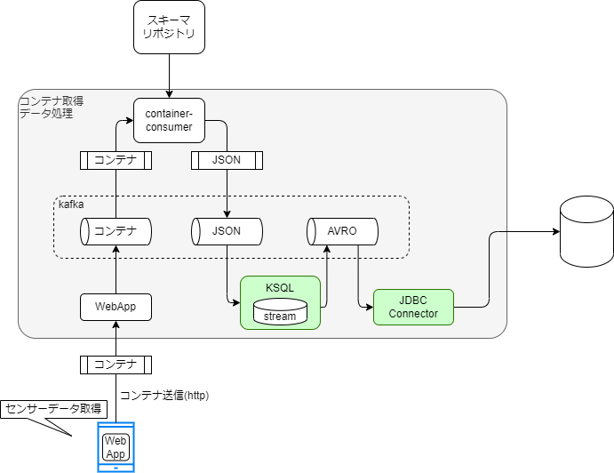

# Handling Container Example

## 概要
このページでは、コンテナデータを取り扱う具体例を示す。

前ページにあわせコンテナフォーマットについて、以下の構成で事例を示す。

- コンテナフォーマットによる出力
  - コンテナデータの作り方
- コンテナフォーマットによる入力
  - コンテナデータの読み取り方
  - スキーマリポジトリとの連携
  - スキーマの適用

### コンテナデータ出力の事例

具体的なコンテナデータの作成例は以下である。

<!-- [Download(ExampleContainer)](mobile_acce.cntr)   -->

上記のコンテナデータは以下のようになっている。

|header field name|length| hex value|
|-|-|-|
|Container Type|0x02| `00 00` |
|Container Length|0x02| `00 4D` |
|Data Index|0x01| `00` |
|Data ID|0x10| `00 11 22 33 44 55 66 77 88 99 AA BB CC DD EE FF` |
|Payload|0x38|`00 00 01 83 AC 9B 68 82 C0 0C FE 19 BE 8D 35 A8 C0 10 8E 4F 9A 4F 34 D6 C0 16 A0 0D 7A E1 47 AE 40 1C C2 A8 77 EC 15 97 40 40 5A 19 88 95 BC 73 C0 3D D8 31 5C FF D6 1B`|

このコンテナデータをどう作るか、順を追って説明する。

:::caution
上記の例は[概要で示された仕様](./)と一部差異がある。  
コンテナフォーマット仕様は国際標準化の過程の中で更新された内容に追随できていないためである。

<details>
<summary>
差異の一覧
</summary>
<div>

|項目|詳細|
|-|-|
|名称変更|Data Index -> Data ID Type|
|フィールド追加|Data ID Length|
|仕様|Container Typeに認められてない値(`0x0000`)が入っている|

</div>
</details>

:::
1. Payload  
まずコンテナデータにしたいPayloadがある。  
Payload長 をチェックして、`0x38` byteのデータがあるものとする。  
`00 00 01 83 AC 9B 68 82 C0 0C FE 19 BE 8D 35 A8 C0 10 8E 4F 9A 4F 34 D6 C0 16 A0 0D 7A E1 47 AE 40 1C C2 A8 77 EC 15 97 40 40 5A 19 88 95 BC 73 C0 3D D8 31 5C FF D6 1B` 

1. Container Type  
事前に決めてよい。今回は `0x0000` とする

1. Container Length  
今回は、コモンヘッダ＋Data IDの長さを16とする。  
コンテナの全体長はヘッダ＋ペイロード長のため   
`(0x02 + 0x02 + 0x01) + 0x10 + 0x38 = 0x4D` かつ 2byte幅なので`0x004D`とする。

1. Data Index  
Data IDにUUIDを利用する、仕様に合わせて `0` とする。

1. Data ID  
事前に決めてよい。  
`00 11 22 33 44 55 66 77 88 99 AA BB CC DD EE FF` を設定する。

これらを結合して、当初のコンテナのデータを作る。

#### コンテナデータの作り方

この事例で示す通り、コンテナデータの作り方はPayloadに対してヘッダを作ってつけるだけ。である。

この事例ではContainer Lengthを計算しているが、Payloadが固定長であれば固定値とすることもできる。

Data Indexの `00` と DataIDの `00 11 22 33 44 55 66 77 88 99 AA BB CC DD EE FF` は、リポジトリ内で一意になるように任意で設定している。

### コンテナを入力に使う事例

コンテナを入力に使う場合は、コンテナデータをコンテナフォーマットの仕様に従い値を取り出す必要がある。

具体的には以下のようなコンテナデータを入力とする。

`00 00 00 4D 00 00 11 22 33 44 55 66 77 88 99 AA BB CC DD EE FF 00 00 01 83 AC 9B 68 82 C0 0C FE 19 BE 8D 35 A8 C0 10 8E 4F 9A 4F 34 D6 C0 16 A0 0D 7A E1 47 AE 40 1C C2 A8 77 EC 15 97 40 40 5A 19 88 95 BC 73 C0 3D D8 31 5C FF D6 1B`

1. コンテナデータからコンテナフォーマットの仕様に従い値を取り出す。

上記の入力に対しコンテナフォーマットの仕様に従い、ヘッダ部分の値を取り出すと以下のようになる。

|header field name|begin:end| hex value|
|-|-|-|
|Container Type|0:2| `00 00` |
|Container Length|2:4| `00 4D` |
|Data Index|4:5| `00` |
|Data ID| 5:21|`00 11 22 33 44 55 66 77 88 99 AA BB CC DD EE FF` |
|Payload| 21: | ...(略) |

:::caution
コンテナフォーマット仕様は国際標準化の過程の中で更新されている。
そのため、上記の例は[概要で示された仕様](./)と一部差異がある。

<details>
<summary>
差異の一覧
</summary>
<div>

|項目|詳細|
|-|-|
|名称変更|Data Index -> Data ID Type|
|フィールド追加|Data ID Lengthの追加|
|仕様違反|Container Typeに認められてない値(`0x0000`)が入っている|
|仕様削除|Data Indexの値に対応する形でData Idの長さが決まる仕様
|仕様追加|Data Id LengthがDataIdの長さとなる|

</div>
</details>

:::

1. 取り出した値に従いリポジトリからスキーマファイルを取得する。

Data Index <!-- Data ID Type --> と Data ID によって、スキーマリポジトリからスキーマファイルを取得する。
スキーマリポジトリについては後述する。

3. スキーマファイルを利用してペイロードを処理する。

スキーマファイルに従いペイロードを処理する。
本項ではテーブルの`field name`,`type`,`position`,`length`がスキーマファイル由来の値である。

コンテナデータのペイロードを以下であった場合、スキーマファイルに従って処理をするとは以下の３工程である。

1. `position`と`length` でペイロードを小さいバイト列に分割
2. `type`に従い値を解釈
3. `name`に従って名前を付ける

上記の工程を以下のペイロードに適用した結果が以下のテーブルである。

`00 00 01 83 AC 9B 68 82 C0 0C FE 19 BE 8D 35 A8 C0 10 8E 4F 9A 4F 34 D6 C0 16 A0 0D 7A E1 47 AE 40 1C C2 A8 77 EC 15 97 40 40 5A 19 88 95 BC 73 C0 3D D8 31 5C FF D6 1B`  


|field name| hex value(raw)|type|postion|length| value |
|-|-|-:|-:|-:|-:|
|dt| `00 00 01 83 ac 9b 68 82` |int|0|8| 1665048209538 |
|x| `c0 0c fe 19 be 8d 35 a8` |float|8|8| -3.624072540935874 |
|y| `c0 10 8e 4f 9a 4f 34 d6` |float|16|8| -4.138975535473227 |
|z| `c0 16 a0 0d 7a e1 47 ae` |float|24|8| -5.6563014221191406 |
|alpha| `40 1c c2 a8 77 ec 15 97` |float|32|8| 7.190095781120724 |
|beta | `40 40 5a 19 88 95 bc 73` |float|40|8| 32.70390422164282 |
|gamma| `c0 3d d8 31 5c ff d6 1b` |float|48|8| -29.844503223857924 |

このようにスキーマファイルに従って処理したデータを元に何らかの処理を実現する。
テストラボシステムにおいては、データベースに保存することで可視化するシステムで用いられるようにしている。

### スキーマファイルのエディタ 兼 スキーマリポジトリ

テストラボにおいてスキーマファイルはスキーマリポジトリ上で編集できる。

テストラボではスキーマファイルを以下のようにJSONで表現している。

``` json
  "fields": [
    {
      "name": "dt",
      "type": "u64",
      "pos": 0,
      "length": 8,
      "tags": {
        
      }
    },
    {
      "name": "x",
      "type": "f64",
      "pos": 8,
      "length": 8,
      "tags": {
        
      }
    },
    ...
  ]
```

また、スキーマファイルは、スキーマリポジトリごとにDataIndex<!-- Data Type-->とDataIdの組に対して一意になるように管理されている。

DataIndexとDataIdの組を含む要求に対して、スキーマリポジトリは対応するスキーマファイルを配布しコンテナデータを処理させることができる。


## まとめ

このページでは、コンテナのサンプルデータをどのように解釈し、アプリケーションで利用するかを示した。
ここを参考にコンテナフォーマットの入出力機能を実現することがコンテナフォーマットへの対応の第一歩となる。

<!-- ## コンテナフォーマットを取り扱うシステムの構成

環境構築で示したように、テストラボシステムは、以下のような構成となっている。


コンテナフォーマットを取り扱うシステムの検証のためには以下の検討事項がある


## チュートリアルでの構成例

チュートリアルでの構成について、コンテナ処理データ蓄積部分を詳細化すると以下のような構成要素を持っている。




テストラボシステムの構成要素について、以降に詳細を記述する。

### kafka
kafka はデータ構造に依存しないメッセージキューである。。
トピックと呼ばれる単位でキューを構成し、キューに対してデータを提供する処理と、キューからデータを取得する処理が存在する。
kafkaとは、このようなキューを提供するためのミドルウェアである。

### WebApp
WebAppはセンサデータを取得し、センサデータを格納したコンテナデータをhttp経由によって収集し、kafkaに投入するアプリである。  
コンテナデータはkafkaのキューに格納され、次の処理へ引き渡される。

### container-consumer
container-consumerはkafkaのキューからコンテナデータを取得し、処理するアプリである。
コンテナデータを解析して、対応するスキーマファイルをスキーマリポジトリから取得する。
スキーマファイルを利用して、コンテナデータを処理し利用しやすいフォーマットに変換し、kafkaに投入する。

### スキーマリポジトリ
コンテナに格納されたデータのスキーマを管理するリポジトリである。
スキーマファイルの定義をしておくことで、コンテナデータに対応するスキーマデータを配賦できる。

### KSQL
kafka のキューにあるデータに対して、Streaming SQLと呼ばれるストリームデータにSQLライクなクエリを利用可能にする仕組みである

kafkaのキューに格納されたデータをSQLライクなクエリで処理することができる。
処理方法の定義例は [環境構築手順](./environment#%E3%83%87%E3%83%BC%E3%82%BF%E5%A4%89%E6%8F%9B%E3%81%AE%E7%99%BB%E9%8C%B2) であり、
kafkaのキューに入るデータをストリーミングテーブルとして定義することや、ストリーミングテーブルのデータをkafkaのキューとして出力することができる。

ここでは、JSONのデータをAVROと呼ばれるデータフォーマットに書き換えることと、サーバでのタイムスタンプの付与を行う。

### JDBC Connector  
kafkaのキューにAVRO形式で蓄積したデータをRDBに蓄積するための仕組みである。 -->
