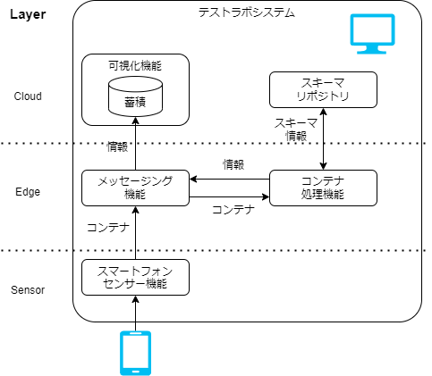

# テストラボシステム

## 目的

コンテナフォーマットに対応したシステムの例として、テストラボシステムを紹介します。  
テストラボシステムという動作可能なソフトウェアを一例としてコンテナフォーマットを体験し、
コンテナフォーマット技術を活用することを目的としています。

## 機能概要

実験的な用途で利用できる動作可能なソフトウェアと動作手順を合わせて提供しています。
テストラボシステムで実現している機能の概要は以下です。

1. スマートフォンのジャイロセンサ(加速度、傾き)を入力とします。
2. ジャイロセンサのデータをコンテナによって流通させます。
3. 流通させたコンテナから値を取り出し可視化します。

上記の機能を実現するために、コンテナフォーマットに関わる実装をしています。

- スマートフォンセンサー機能(スマートフォンのセンサを利用したコンテナフォーマット出力機能)
- スキーマリポジトリの実装
- コンテナ処理機能の実装（スキーマリポジトリと連携）

## システム構成

テストラボシステムの構成を示します。

_図 1: システム構成_

コンテナフォーマットを扱うシステムは多くの場合、図 1: の様に３層の構造です。
それぞれの層は、センサーによるデータの収集、センサーのデータを集めて処理をするエッジ層、サービスやリポジトリが置かれるクラウド層になります。

テストラボシステムでは、１つの PC 上ですべての機能を動作させるため１つのコンピュータ上で動作しています。
しかし、実際のシステムでは各機能を分散して動作させることや、他の層の機能を別の層で動作させることも可能です。

テストラボシステムは１つの PC の上で機能を動作させることができます。
スマートフォンからブラウザを通してスマートフォンセンサー機能を利用できます。

また、メッセージング機能をハブとして、各機能間を接続してシステムを実現しています。

- スマートフォンセンサ機能
  - アクセスしてきたスマートフォンのジャイロセンサ(加速度、傾き)をコンテナにして送信します。
- メッセージング機能
  - PubSub と呼ばれる形式でデータのメッセージングを行う機能です。
    - チャンネルにデータを Publish(発行)する機能を持ちます。
    - チャンネルに流れてきたデータを Subscribe(購読)して処理に用います。
    - チャンネルには任意の文字列を使います。
  - チャンネルに流れたデータを外部のデータソースに蓄積する。
  - SQL を用いた演算やタイムスタンプの付与。
- コンテナ処理機能
  - コンテナを受信し、可視化のためのデータを送信します。
  - スキーマリポジトリを参照し、コンテナの構造に従ってデータを取り出します。
- スキーマリポジトリ
  - コンテナの構造を定義したファイルを管理、配布します。
  - コンテナの構造を定義するための画面も提供します。
- 可視化機能
  - コンテナ処理機能が処理したデータを DB に格納します。
  - DB に格納されたデータを可視化します。
    より送られてきたデータがメッセージング機能を通じてコンテナ処理機能に渡されます。

## 利用上の注意

テストラボシステムと呼称するソフトウェア群は以下の注意事項があります。

:::caution
[Container Format で示された仕様](./spec_guide)と差異があります。  
国際標準化の過程で内容が更新されたためです。

_表： テストラボシステム実装と IEC63430 の差異の一覧_

| 項目     | 仕様                                                      | テストラボシステム実装                                  |
| -------- | --------------------------------------------------------- | ------------------------------------------------------- |
| 名称変更 | Data ID Type                                              | Data Index                                              |
| 仕様変更 | コンテナヘッダ内の Data ID の長さは Data ID Length で示す | Data ID の長さは Data Index の値に対応した値            |
| 仕様変更 | Data ID Length をヘッダに持つ                             | Data ID Length がヘッダにない                           |
| 仕様違反 | Container Type として決められた値群がある                 | Container Type に認められてない値(`0x0000`)を入れている |

標準化の検討中に Data Index(Data ID Type) の値から仕様で決められた長さの Data ID になる設計が検討されていました。
しかし、Data ID の長さを可変にするため、コンテナヘッダに Data ID Length フィールドを追加されています。

:::
