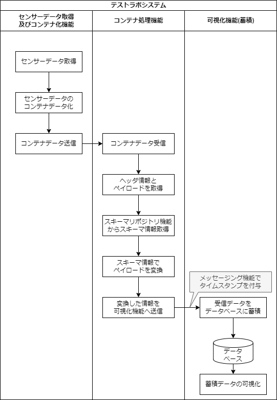

# テストラボシステム

## 目的

コンテナフォーマットに対応したシステムの一例として、テストラボシステムを紹介します。
テストラボシステムは、コンテナフォーマットを活用してセンサーからデータを取得し、その結果を表示することができるシステムです。
ここでは、システムの構成、構築手順、および動作手順について説明しています。

テストラボシステムを例としてコンテナフォーマットを体験することで、
コンテナフォーマット標準化の価値を体感することを目的としています。

## 機能概要

テストラボシステムは、
スマートフォンのセンサの情報をコンテナフォーマットで収集し可視化する事ができます。

以下のような処理フローを実現しています。

_図 1: 処理フロー_

メッセージング機能を通じてデータを交換しながら、各機能が連携することで、センサーデータを取得して、可視化するシステムを構成しています。

## システム構成

テストラボシステムの構成を示します。

_図 2: システム構成_

処理フローを実現するために図 2: のように機能を分割したシステム構成としています。
メッセージング機能をハブとして、分割した機能間を接続してシステムを実現しています。

コンテナフォーマットを扱うシステムは多くの場合、図 2: の様に３層の構造を持ちます。
それぞれの層はセンサによるデータの収集を行うセンサ層、センサのデータを集めて処理をするエッジ層、データの蓄積やスキーマリポジトリが置かれるクラウド層になります。

テストラボシステムでは、すべての機能を１つのコンピュータ上で動作させることが可能です。
しかしながら、実際のシステムでは各機能を分散して動作させることや、他の層の機能を別の層で動作させることも可能です。

システム構成を構成する機能群とその役割を以下に示します。

- センサーデータ取得及びコンテナ化機能
  - スマートフォンのジャイロセンサ(加速度、傾き)の情報を取得します
  - センサデータをコンテナにして送信します。
- メッセージング機能
  - テストラボシステムの機能間でデータ送受信をします。
    - 論理チャネル（トピック）を提供します。
    - トピックへデータを送信する機能(Publish)を提供します。
    - トピックのデータを受信する機能(Subscribe)を提供します。
  - トピックに流れたデータを外部のデータソースに蓄積します。
  - SQL を用いた演算やタイムスタンプの付与します。
- コンテナ処理機能
  - コンテナを受信し、可視化のためのデータを送信します。
  - スキーマリポジトリ機能を参照し、コンテナの構造に従ってデータを取り出します。
- スキーマリポジトリ機能
  - コンテナの構造を定義したファイルを管理、配布します。
  - コンテナの構造を定義するための画面も提供します。
- 可視化機能
  - コンテナ処理機能が処理したデータを DB に格納します。
  - DB に格納されたデータを可視化します。
  

## 利用上の注意

テストラボシステムと呼称するソフトウェア群は以下の注意事項があります。

:::caution
[Container Format で示された仕様](./spec_guide)と差異があります。  
国際標準化の過程で内容が更新されたためです。

_表： テストラボシステム実装と IEC63430 の差異の一覧_

| 項目     | 仕様                                                      | テストラボシステム実装                                  |
| -------- | --------------------------------------------------------- | ------------------------------------------------------- |
| 名称変更 | Data ID Type                                              | Data Index                                              |
| 仕様変更 | コンテナヘッダ内の Data ID の長さは Data ID Length で示す | Data ID の長さは Data Index の値に対応した値            |
| 仕様変更 | Data ID Length をヘッダに持つ                             | Data ID Length がヘッダにない                           |
| 仕様違反 | Container Type として決められた値群がある                 | Container Type に認められてない値(`0x0000`)を入れている |

標準化の検討中に Data Index(Data ID Type) の値から仕様で決められた長さの Data ID になる設計が検討されていました。
しかし、Data ID の長さを可変にするため、コンテナヘッダに Data ID Length フィールドを追加されています。

:::
