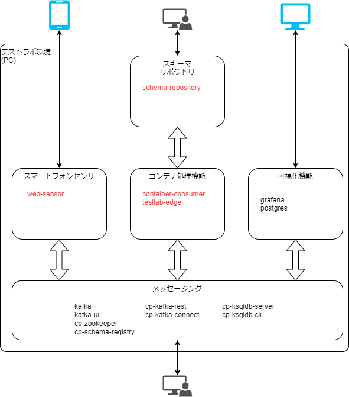

# 構成

## ソフトウェア構成

テストラボシステムは OSS のソフトウェアと、このために作成されたコンテナフォーマットを処理する複数のソフトウェアで構成されています。

システム構成の機能ごとに、利用しているソフトウェア群を整理します。

_図 1: ソフトウェアの構成_

- 図中の赤文字は、テストラボのために作ったソフトウェアです。

テストラボのために作成されたソフトウェアについては、このページで概要を説明します。

## ソフトウェアの紹介

構成の要素ごとに説明をします。
説明は、機能とどのように動作しているかを中心に行います。
利用方法は次項の構築手順に任せます。

共通する内容としては、DockerContainer で動作させたアプリケーションを Docker Compose で連携させてシステム全体を実現しています。

### スマートフォンセンサ機能

#### 所在

container-websensor  
https://github.com/sensing-iot-standard-consortium-ja/container-websensor

#### 機能

スマートフォンのジャイロセンサ(加速度、傾き)をコンテナデータにしてメッセージング機能を通じて送信します。

#### 動作

Docker コンテナで動作する Web アプリケーションです。
アプリケーションを使うためにはブラウザでアクセスします。

加速度やジャイロのセンサから取得したデータを、コンテナや JSON でメッセージング機能を通じて送信しています。
コンテナは XHR でサーバに送って、そこから kafka へ送信しています。

#### 制約

スマートフォンのセキュリティ上の制約のため、加速度やジャイロセンサはアプリのページに https でアクセスしないと利用できません。
構築手順に ngrok という外部サービスを利用した回避方法を記載しています。

### コンテナ処理機能

#### 所在

container-consumer  
https://github.com/sensing-iot-standard-consortium-ja/container-consumer

container-python-consumer  
https://github.com/sensing-iot-standard-consortium-ja/container-python-consumer

#### 機能

- メッセージング機能からコンテナを受信
- スキーマリポジトリからスキーマ情報を取得
- スキーマ情報に従って情報を取り出す
- 取り出した情報を json 化してメッセージング機能に送信
- 上記を繰り返す

#### 設定

環境変数でメッセージング機能のトピックを設定できます。
実行時に設定しています。

### スキーマリポジトリ

container-repository  
https://github.com/sensing-iot-standard-consortium-ja/container-repository

#### 機能

- ブラウザで動作する Web アプリケーションです。
- コンテナを読み込み、16 進値でプレビューします。
  - スキーマ情報を定義し保存できます。
  - スキーマ情報により読み込まれているコンテナから取り出される情報がプレビューできます。
- 保存しているスキーマ情報を要求に応じて配布します。

#### 制約

- スキーマ情報の記述をする為に、読み込ませるコンテナファイルが必要です。

### メッセージング機能

#### 所在

OSS のソフトウェア(kafka)を利用しています。

https://hub.docker.com/u/confluentinc

#### 機能

- kafka とそのファミリーのソフトウェアを利用して、メッセージング機能を実現しています。
- kafka-ui の機能でブラウザを通してメッセージングの状況を確認できます。
- kafka-rest で REST API を利用して REST インターフェイスによるメッセージングを行えます。
- kafka-connect で 外部 DB とのデータ連携を行えます。
- ksql によってメッセージングされるデータの加工や集計を行えます。

#### 動作

テストラボシステムでは、このメッセージング機能をハブとして機能間のデータを連携しています。

### 可視化機能

#### 所在

OSS のソフトウェア群を利用しています。

- grafana
  - https://grafana.com/
  - データを可視化するソフトウェア
  - テストラボシステムでは、grafana のダッシュボードのプロファイルを用意しています。
    - https://github.com/sensing-iot-standard-consortium-ja/test-lab-system/tree/main/grafana
- Postgres
  - https://www.postgresql.org/
  - オープンソースのリレーショナルデータベース(RDB)

#### 機能

メッセージング機能から連携されるセンサデータをデータベースに蓄積する。
蓄積したデータを基にグラフで可視化を行う。
ダッシュボードや、ダッシュボードに含まれるクエリやグラフの設定が必要なため、
テストラボシステムではソフトウェア以外にテストラボシステム向けのプロファイルを提供しています。

#### 動作

- メッセージング機能の DB 連携機能を利用して、コンテナで運ばれたセンサデータを格納します。
- 格納したデータを Grafana によって可視化します。
