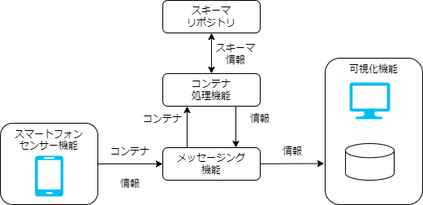

# 構成
## システム構成要素

テストラボシステムは以下の構成要素から構成されます。

1. スマートフォンセンサー機能  
スマートフォンをセンサーとして利用し、コンテナでデータを送信するWebアプリケーションです。

1. コンテナ処理機能  
コンテナデータを処理する機能群です。
スキーマリポジトリと連携するコンテナ処理基盤を実装しています。

1. 可視化機能  
溜まったデータを可視化する機能です。

1. メッセージング機能  
上記の機能間でデータをやり取りするための機能です。
