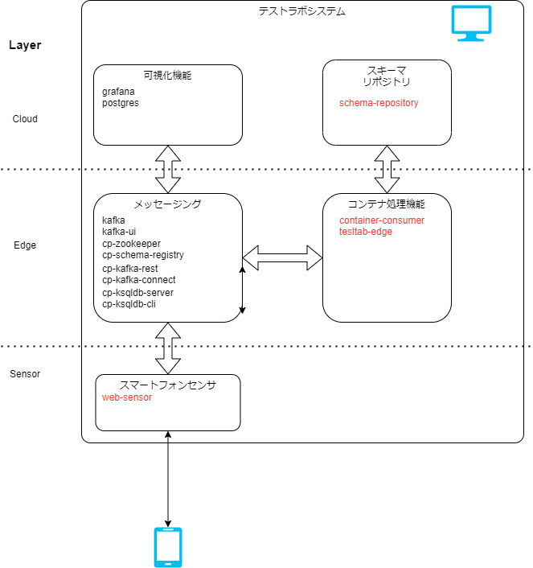

# 構成

## ソフトウェア構成

テストラボシステムは OSS のソフトウェアと、このために作成されたコンテナフォーマットを処理するソフトウェアで構成されています。  
また、システム構成で示した機能単位でも１つのソフトウェアで実現しているわけではありません。

システム構成の分類に合わせて、利用しているソフトウェア群を整理します。

図: ソフトウェアの構成

図中の赤文字は、テストラボのために作ったソフトウェアです。
青いアイコンはシステムの動作時に使うハードウェア、黒い PC と人のアイコンは設定を行う画面があることを示しています。

## ソフトウェアの紹介

構成の要素ごとに説明をします。
説明は、機能とどのように動作しているかを中心に行います。
利用方法は次項の構築手順に任せます。

共通する内容としては、DockerContainer で動作させたアプリケーションを Docker Compose で連携させてシステム全体を実現しています。

### スマートフォンセンサ機能

#### 所在

container-websensor  
https://github.com/sensing-iot-standard-consortium-ja/container-websensor

#### 機能

スマートフォンのジャイロセンサ(加速度、傾き)をコンテナにして kafka へメッセージング機能を通じて送信します。

#### 動作

Docker コンテナで動作する Web アプリケーションです。
アプリケーションを使うためにはブラウザでアクセスします。

加速度やジャイロのセンサーから取得したデータを、コンテナや JSON でメッセージング機能を通じて送信しています。
コンテナは XHR でサーバに送って、そこから kafka へ送信しています。

#### 制約

スマートフォンのセキュリティ上の制約のため、加速度やジャイロセンサは https でアクセスしないと利用できません。
構築手順に ngrok という外部サービスを利用した回避方法を記載しています。

### コンテナ処理機能

**TODO**

- コンテナを受信し、可視化のためのデータを送信します。
- スキーマリポジトリと連携しコンテナへ標準的な処理を行います

### スキーマリポジトリ

**TODO**

- コンテナの構造を定義したファイルを管理、配布します。
- コンテナの構造を定義するための画面も提供します。

### メッセージング機能

#### 所在

OSS のソフトウェアを利用しています。

https://hub.docker.com/u/confluentinc

#### 機能

- kafka とそのファミリーのソフトウェアを利用して、メッセージング機能を実現しています。
- kafka-ui の機能でブラウザでメッセージングの状況を確認できます。
- kafka-rest で REST API を利用してメッセージングを行えます。
- kafka-connect で 外部 DB とのデータ連携を行えます。
- ksql によってメッセージングされるデータの加工や集計を行えます。

#### 動作

テストラボシステムでは、このメッセージング機能をハブとして機能間のデータを連携しています。

### 可視化機能

#### 所在

OSS のソフトウェア群を利用しています。
設定が必要なため、プロファイルを作成してあります。

- grafana
  - https://grafana.com/
  - データを可視化するソフトウェア
  - テストラボシステムでは、grafana のダッシュボードのプロファイルを用意しています。
    - https://github.com/sensing-iot-standard-consortium-ja/test-lab-system/tree/main/grafana
- Postgres
  - https://www.postgresql.org/
  - オープンソースデータベース

#### 動作

- メッセージング機能の DB 連携機能を利用して、コンテナで運ばれたデータを格納します。
- 格納したデータを Grafana によって可視化します。
