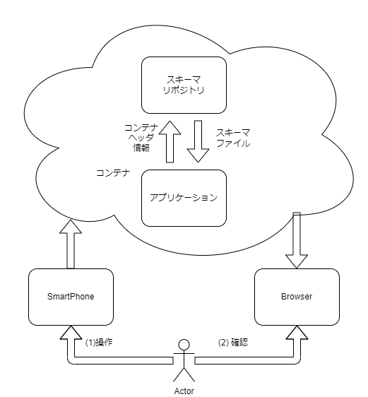
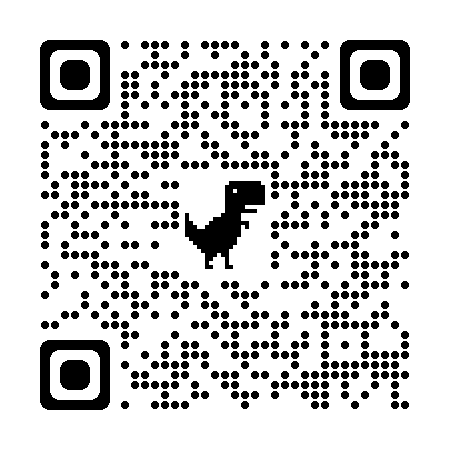
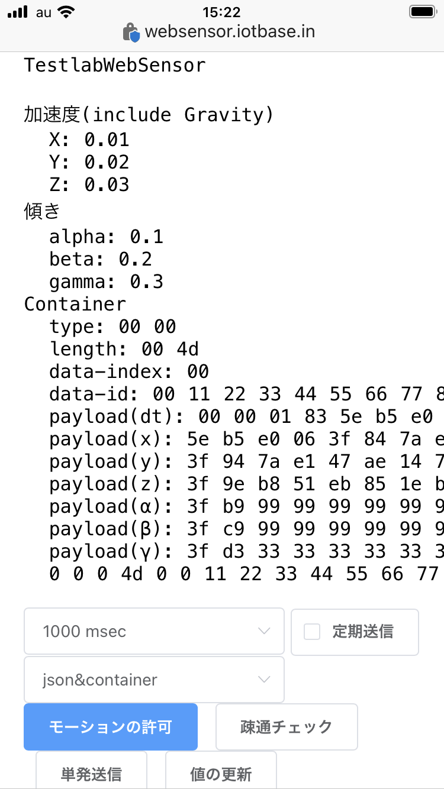

# チュートリアル
スマートフォンのジャイロセンサ情報をコンテナ化してデータ可視化に用いる

# 目的
すでに用意された機能、設定を用いてどのようなことができるかを体験する。

# 概要
スマートフォンのジャイロセンサ情報をコンテナ化してデータ可視化に用いる。

# 説明に利用する構成
以下のような構成でチュートリアルを進めます。
SmartPhoneとBrowserを用います。

SmartPhoneのジャイロセンサーの動きをコンテナにして、Browserで可視化します。

# Tutorial
## データを送信するアプリケーション
### Webアプリケーションの開き方
（インストールを必要としない）Webアプリです。
QRコードリーダー等を用いてスマートフォンから開いてください。

開くと以下の画面が表示されます。

PCからのアクセスは想定していません。

### Webアプリケーションでのセンサ情報の取得
<!-- 文ではなく画像で示すほうがベター -->
画面下部のモーションの許可を押下するとダイアログが表示されます。

wip...

# 環境について
## SmartPhone
iPhone8 / iPhoneSE3 で動作確認済み。
Safari / Microsoft Edge それぞれで動作確認済

## Browser
GoogleChrome 105.0.5195.127 で動作確認済